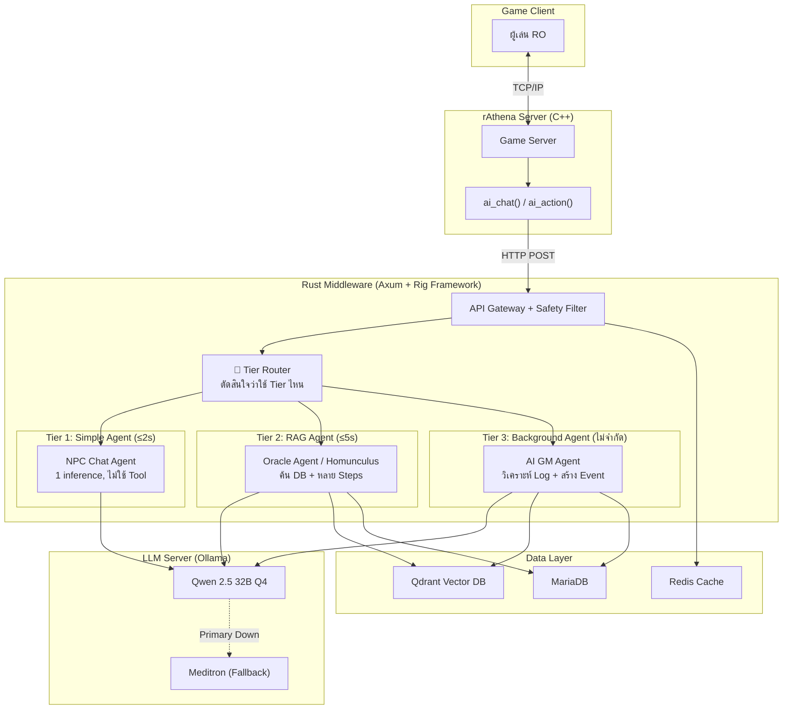
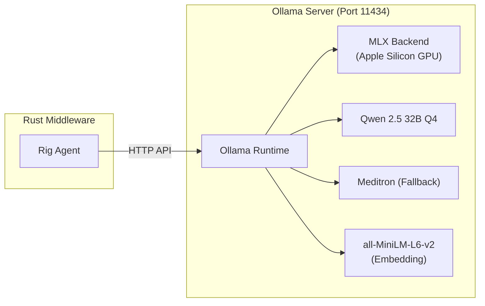
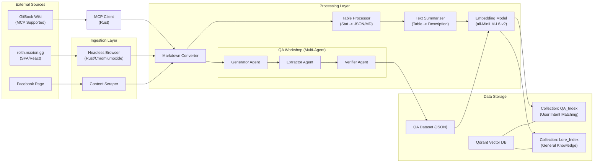

# 📖 Technical Requirement Document (TRD) — ฉบับภาษาไทย
## โปรเจกต์ Project-Mimir (Ragnarok Online: AI-Native Evolution)

| ฟิลด์              | ค่า                                                                                                                                                                                                                                                      |
| ---------------- | ------------------------------------------------------------------------------------------------------------------------------------------------------------------------------------------------------------------------------------------------------- |
| **เวอร์ชัน**       | 2.0 (Hybrid Agent Architecture)                                                                                                                                                                                                                         |
| **วันที่**          | 2026-02-16                                                                                                                                                                                                                                              |
| **Framework**    | Rig (rig.rs) + Axum                                                                                                                                                                                                                                     |
| **เอกสารประกอบ** | [Framework Analysis](file:///Volumes/T7%20Shield/Project-Mimir/docs/Framework_Analysis_Project-Mimir.md), [Monitoring Plan](file:///Volumes/T7%20Shield/Development/Active_Projects/project/Project-Mimir/docs/Monitoring_System_Plan_Project-Mimir.md) |

> เอกสารฉบับนี้เป็น **TRD ฉบับเต็มภาษาไทย** สำหรับ Project-Mimir ปรับปรุงให้รองรับ **Hybrid Agent Architecture** ที่ใช้ AI Agent 3 ระดับ (Tier) ตาม Use Case

---

## 1. สถาปัตยกรรมระบบ (System Architecture)

### ภาพรวม: Hybrid Agent Architecture

> [!IMPORTANT]
> **การเปลี่ยนแปลงหลักจาก v1.0:** ใช้ **AI Agent 3 ระดับ (Tier)** แทน LLM Call แบบเดียว เพราะแต่ละ Use Case ต้องการความสามารถต่างกัน



### 🔑 Hybrid Agent Tiers — หัวใจของสถาปัตยกรรมใหม่

| Tier                         | ใช้กับ                                     | วิธีทำงาน                                     | Latency      | ตัวอย่าง                               |
| ---------------------------- | ---------------------------------------- | ------------------------------------------ | ------------ | ------------------------------------ |
| **Tier 1: Simple Agent**     | NPC Chat ทั่วไป, Fortune Teller            | LLM Call 1 รอบ + Persona Prompt (ไม่มี Tool) | **≤ 2 วินาที** | "สวัสดี ท่านผู้กล้า..."                    |
| **Tier 2: RAG Agent**        | Oracle Bot, Smart Homunculus, AI Support | Agent Loop: คิด → เรียก Tool → ดูผล → ตอบ     | **≤ 5 วินาที** | "การ์ด Hydra เหมาะกับ Knight เพราะ..." |
| **Tier 3: Background Agent** | AI GM, Bot Detection                     | Agent Loop แบบไม่จำกัดเวลา (ทำเบื้องหลัง)         | **ไม่จำกัด**    | "ตรวจพบ Bot 3 ตัว, เสนอ Ban"          |

**ทำไมต้องแบ่ง 3 Tier?**

```
❌ ถ้าใช้ Agent ทุกอย่าง:
   NPC Chat = 3-5 inferences × 1.5s = 4.5-7.5 วินาที → ผู้เล่นเห็นเกมค้าง!

✅ Hybrid Approach:
   NPC Chat (Tier 1) = 1 inference = 1.5 วินาที → เร็ว ✓
   Oracle (Tier 2)   = 3 inferences = 4.5 วินาที → ผู้เล่นรอได้ เพราะกำลังหาข้อมูล ✓
   AI GM (Tier 3)    = 5+ inferences → ทำเบื้องหลัง ไม่มีใครรอ ✓
```

### Tier Router — ตัดสินใจอัตโนมัติ

```rust
// Pseudocode: Tier Router Logic
fn route_request(req: &ChatRequest) -> AgentTier {
    match req.npc_type {
        // NPC ทั่วไป → Tier 1 (เร็ว)
        NpcType::Merchant | NpcType::Guard | NpcType::Sage 
            => AgentTier::Simple,

        // Oracle / Homunculus → Tier 2 (ค้น DB)
        NpcType::Oracle | NpcType::Homunculus | NpcType::Support 
            => AgentTier::Rag,

        // GM Agent → Tier 3 (Background)
        NpcType::GameMaster 
            => AgentTier::Background,
    }
}
```

---

## 2. AI Agent Framework: Rig (rig.rs)

> ดูรายละเอียดการวิเคราะห์ Framework: [Framework_Analysis_RO-AI.md](file:///Volumes/T7%20Shield/Project-Mimir/Framework_Analysis_RO-AI.md)

### ทำไมเลือก Rig?

| ความต้องการ      | Rig รองรับ          | รายละเอียด                                  |
| --------------- | ------------------ | ------------------------------------------ |
| ค้น Qdrant       | ✅ `rig-qdrant`     | Vector Store Integration สำเร็จรูป            |
| LLM Local       | ✅ Ollama Provider  | รัน Qwen 2.5 ผ่าน Ollama บน Mac mini         |
| Tool Calling    | ✅ `Tool` trait     | สร้าง Custom Tool (Heal, Buff, GiveItem)    |
| RAG Pipeline    | ✅ Built-in         | Query → Embed → Search → Inject → Generate |
| Agent Loop      | ✅ Agentic Workflow | ReAct: Think → Act → Observe → Repeat      |
| Axum Compatible | ✅ Tokio-based      | ทำงานร่วมกับ Axum ได้เลย                       |

### 📐 สถาปัตยกรรม LLM: Ollama (แทน Candle/MLX โดยตรง)

> [!IMPORTANT]
> **เปลี่ยนจาก TRD v1.0:** ใช้ **Ollama** เป็น LLM Server แทน Candle/MLX โดยตรง
> เหตุผล: Rig มี Ollama Provider สมบูรณ์ + Ollama ใช้ MLX ภายในบน Apple Silicon อยู่แล้ว



**ข้อดีของ Ollama:**
- จัดการ Model Loading/Unloading อัตโนมัติ
- ใช้ MLX ภายในสำหรับ Apple Silicon → ได้ GPU Acceleration เต็มที่
- Hot-swap Model ได้ (เปลี่ยน Qwen → Meditron ทันที)
- มี API มาตรฐาน → Rig integrate ได้เลย

### 🔧 ตัวอย่างโค้ด: Tier 1 — NPC Chat Agent

```rust
use rig::providers::ollama;

// สร้าง Ollama Client เชื่อมกับ Local Server
let client = ollama::Client::new("http://localhost:11434");
let model = client.model("qwen2.5:32b-q4");

// สร้าง NPC Agent (Tier 1: ไม่มี Tool, แค่ Chat)
let npc_agent = model
    .agent()
    .preamble(&persona.system_prompt)  // โหลดจาก YAML Persona
    .build();

// ผู้เล่นถาม → NPC ตอบ (1 inference, ≤2s)
let response = npc_agent.chat(&player_message).await?;
```

### 🔧 ตัวอย่างโค้ด: Tier 2 — Oracle RAG Agent

```rust
use rig::providers::ollama;
use rig_qdrant::QdrantVectorStore;

// เชื่อม Qdrant Vector DB
let qdrant = QdrantVectorStore::new(
    "http://localhost:6333", 
    "ro_items"
).await?;

// สร้าง Oracle Agent (Tier 2: มี RAG + Tools)
let oracle_agent = model
    .agent()
    .preamble("You are the Oracle. Answer ONLY from provided context...")
    .dynamic_context(qdrant.index(5))  // ค้น Top-5 จาก Qdrant
    .tool(QueryMobDbTool)             // Tool ค้น Monster DB
    .tool(QueryItemDbTool)            // Tool ค้น Item DB
    .build();

// ผู้เล่นถาม → Agent ค้น DB → Agent คิด → ตอบ (≤5s)
let answer = oracle_agent.chat("การ์ดอะไรดีสำหรับ Knight?").await?;
```

### 🔧 ตัวอย่างโค้ด: Custom Game Tool

```rust
use rig::tool::Tool;
use serde::{Deserialize, Serialize};

#[derive(Deserialize)]
struct HealInput {
    target_player: String,
}

#[derive(Serialize)]
struct HealResult {
    success: bool,
    hp_restored: i32,
}

// สร้าง Tool สำหรับ NPC Heal ผู้เล่น
#[derive(Tool)]
#[tool(
    name = "heal_player",
    description = "Heal a player character to restore HP"
)]
struct HealTool {
    db: MariaDbPool,  // เชื่อม DB เพื่อเช็คลิมิต
}

impl Tool for HealTool {
    type Input = HealInput;
    type Output = HealResult;

    async fn call(&self, input: HealInput) -> Result<HealResult> {
        // 1. เช็คลิมิตรายวัน
        let limit = check_daily_limit(&self.db, "heal").await?;
        if limit.exceeded { return Err("Daily heal limit reached"); }
        
        // 2. ส่งคำสั่ง Heal ไป rAthena
        let result = rathena_api::heal(&input.target_player).await?;
        
        // 3. บันทึก Audit Log
        log_action(&self.db, "heal", &input.target_player).await?;
        
        Ok(HealResult { success: true, hp_restored: result.hp })
    }
}
```

---

## 3. โครงสร้างโปรเจกต์ (อัพเดท v2.0)

```
ro-ai-bridge/
├── Cargo.toml
├── src/
│   ├── main.rs                    # Axum Server bootstrap
│   ├── config.rs                  # Environment + Constants
│   ├── routes/
│   │   ├── mod.rs
│   │   ├── chat.rs                # POST /api/v1/chat
│   │   ├── action.rs              # POST /api/v1/action
│   │   ├── oracle.rs              # POST /api/v1/oracle/query
│   │   ├── gm.rs                  # Internal GM endpoints
│   │   └── health.rs              # GET /health
│   ├── agents/                    # ⭐ ใหม่: Rig Agent Definitions
│   │   ├── mod.rs
│   │   ├── tier1_simple.rs        # Tier 1: NPC Chat (no tools)
│   │   ├── tier2_rag.rs           # Tier 2: Oracle + Homunculus (RAG + tools)
│   │   ├── tier3_background.rs    # Tier 3: AI GM (background loop)
│   │   └── tier_router.rs         # ตัดสินใจว่า Request ใดใช้ Tier ไหน
│   ├── tools/                     # ⭐ ใหม่: Rig Tool Implementations
│   │   ├── mod.rs
│   │   ├── heal_tool.rs           # Tool: Heal player
│   │   ├── buff_tool.rs           # Tool: Apply buff
│   │   ├── give_item_tool.rs      # Tool: Give item (with limits)
│   │   ├── query_mob_tool.rs      # Tool: Query monster database
│   │   ├── query_item_tool.rs     # Tool: Query item database
│   │   ├── spawn_mob_tool.rs      # Tool: Spawn monster (GM only)
│   │   └── economy_limiter.rs     # Wrapper: Hard limit enforcement
│   ├── middleware/
│   │   ├── mod.rs
│   │   ├── auth.rs
│   │   ├── rate_limiter.rs
│   │   └── safety_filter.rs
│   ├── services/
│   │   ├── mod.rs
│   │   ├── persona_manager.rs     # โหลด YAML → สร้าง Agent
│   │   ├── session_store.rs       # Redis: Chat History
│   │   └── circuit_breaker.rs     # Ollama Circuit Breaker
│   ├── models/
│   │   ├── mod.rs
│   │   ├── chat.rs
│   │   ├── action.rs
│   │   └── npc.rs
│   ├── db/
│   │   ├── mod.rs
│   │   ├── mariadb.rs
│   │   └── qdrant.rs
│   └── utils/
│       ├── mod.rs
│       └── json_parser.rs
├── config/
│   ├── personas/                  # NPC Persona YAML files
│   │   ├── sage_ariel.yaml
│   │   ├── oracle.yaml
│   │   ├── fortune_teller.yaml
│   │   └── homunculus.yaml
│   └── safety/
│       ├── blocklist.txt
│       └── action_limits.yaml
└── tests/
    ├── tier1_tests.rs
    ├── tier2_tests.rs
    ├── tool_tests.rs
    └── integration/
```

**สิ่งที่เปลี่ยนจาก v1.0:**
- ⭐ เพิ่ม `agents/` — Agent definitions แยกตาม Tier
- ⭐ เพิ่ม `tools/` — Rig Tool implementations สำหรับ Game Actions
- เปลี่ยน `services/llm_service.rs` → ใช้ Rig + Ollama แทน Candle/MLX โดยตรง
- เพิ่ม `services/circuit_breaker.rs` — ครอบ Ollama call

---

## 4. การแก้ไข rAthena (C++)

**สิ่งที่ต้องเพิ่มในโค้ด C++:**

เพิ่ม **2 Script Command ใหม่** เข้าไปใน rAthena Script Engine:

| คำสั่ง                       | หน้าที่                                   | ตัวอย่าง        |
| ------------------------- | -------------------------------------- | ------------- |
| `ai_chat(npc_id, msg)`    | ส่งข้อความไปถาม AI แล้วรับคำตอบกลับมา        | NPC พูดตอบผู้เล่น |
| `ai_action(npc_id, json)` | สั่ง AI ทำ Action ในเกม (Heal, Buff, ฯลฯ) | NPC Heal ผู้เล่น |

**จุดสำคัญเชิงเทคนิค:**
- ใช้ **libcurl** ยิง HTTP แบบ Non-blocking (ไม่บล็อก Main Thread ของ rAthena)
- มี **Thread Pool 4 ตัว** เฉพาะสำหรับ AI call
- Timeout **3 วินาที** ถ้าไม่ตอบ = ใช้ Fallback

---

## 5. Rust Middleware — ทรัพยากร (อัพเดท v2.0)

> โครงสร้างโปรเจกต์ดูได้ที่ **หมวด 3** ด้านบน

| พารามิเตอร์             | ค่า           | เหตุผล                                    |
| --------------------- | ------------ | ---------------------------------------- |
| Tokio Workers         | 8 threads    | ใช้ 8 จาก 12 cores (เหลือ 4 ให้ rAthena+OS) |
| **Tier 1** พร้อมกันสูงสุด | 4 requests   | LLM Call แบบ 1 inference                 |
| **Tier 2** พร้อมกันสูงสุด | 2 requests   | Agent Loop กิน Resource มากกว่า            |
| **Tier 3** พร้อมกันสูงสุด | 1 request    | Background ทำทีละงาน                       |
| Queue รอคิว            | 256 requests | กันกรณี Request มาพร้อมกันเยอะ               |
| Timeout (Tier 1)      | 3 วินาที       | Chat ต้องเร็ว                              |
| Timeout (Tier 2)      | 8 วินาที       | Agent ต้องเรียก Tool                       |
| Timeout (Tier 3)      | 60 วินาที      | Background ให้เวลาเยอะ                    |

---

## 6. API Endpoints — คำอธิบาย

### 6.1 `POST /api/v1/chat` — NPC คุยกับผู้เล่น

**หน้าที่:** รับข้อความจากผู้เล่น → ส่งให้ AI → ได้คำตอบ NPC + Action กลับมา

**Request สำคัญ:**
- `npc_id` — NPC ตัวไหน (แต่ละตัวมีบุคลิกต่างกัน)
- `player_id` — ผู้เล่นคนไหน
- `message` — ข้อความที่ผู้เล่นพิมพ์ (จำกัด 500 ตัวอักษร)
- `player_context` — ข้อมูลผู้เล่น (Level, Job, แมพปัจจุบัน) → ให้ AI ตอบเหมาะสม
- `session_id` — UUID สำหรับจำบริบทสนทนาต่อเนื่อง

**Response สำคัญ:**
- `dialogue` — คำตอบของ NPC (แสดงในเกม)
- `actions` — Action ที่ AI สั่ง เช่น `[{"action": "heal", "target": "ชื่อผู้เล่น"}]`
- `emotion` — อารมณ์ NPC (แสดง Emoticon ในเกม)
- `latency_ms` — ใช้เวลาเท่าไหร่

**ตัวอย่างจริง:**
```
ผู้เล่น: "ฉันเจ็บจากการต่อสู้ ช่วยฉันได้ไหม?"
NPC Sage: "ท่านดูเหนื่อยล้า อัศวินผู้กล้า ให้ข้าเยียวยาบาดแผลของท่าน พักผ่อนสักครู่..."
Action: [Heal ผู้เล่น]
```

### 6.2 `POST /api/v1/action` — ตรวจสอบ Action ก่อนทำ

**หน้าที่:** เมื่อ AI สั่ง Action (Heal, ให้ Item, ให้ Zeny) → ตรวจสอบว่าเกินลิมิตไหม

**ทำไมต้องแยก Endpoint?**
- ป้องกันไม่ให้ AI ให้ของมากเกินไป
- ทุก Action ถูก Log ไว้เพื่อตรวจสอบ (Audit Trail)
- ถ้าเกินลิมิต → ปฏิเสธ + แจ้งเหตุผล

**ลิมิตที่สำคัญ:**

| ประเภท              | ลิมิต         |
| ------------------- | ----------- |
| Zeny ต่อ Action      | ≤ 50,000    |
| Zeny ต่อคนต่อวัน       | ≤ 200,000   |
| Zeny ทั้งเซิร์ฟต่อวัน     | ≤ 1,000,000 |
| Item ต่อ Action      | ≤ 10 ชิ้น     |
| Item ต่อคนต่อวัน       | ≤ 5 ชิ้น      |
| การ์ด MVP / God Item | ❌ ห้ามเด็ดขาด |

### 6.3 `POST /api/v1/oracle/query` — ถาม Oracle Bot

**หน้าที่:** รับคำถามจากผู้เล่น → ค้น Vector DB → ตอบด้วยข้อมูลจริง

**กระบวนการ RAG (Retrieval-Augmented Generation):**
```
1. ผู้เล่นถาม: "การ์ดอะไรดีสำหรับ Knight?"
2. แปลงคำถามเป็น Embedding Vector (384 มิติ)
3. ค้นหาใน Qdrant → หา Item/Monster ที่คล้ายกับคำถามมากที่สุด 5 อันดับ
4. ส่งข้อมูลที่หามาได้ให้ LLM เป็น Context
5. LLM ตอบโดยอ้างอิงจากข้อมูลจริง (ไม่ใช่มั่ว)
6. ส่งคำตอบ + แหล่งอ้างอิง + ค่าความมั่นใจ กลับผู้เล่น
```

### 6.4 Internal Endpoints (ใช้ภายใน)

| Endpoint                     | ใช้ทำอะไร             | ใครเข้าถึงได้         |
| ---------------------------- | ------------------- | ------------------ |
| `/internal/gm/analyze-logs`  | สั่ง AI วิเคราะห์ Log   | Cron Job (อัตโนมัติ)  |
| `/internal/gm/trigger-event` | สั่ง AI สร้าง Event    | Admin เท่านั้น        |
| `/internal/gm/bot-report`    | ดูรายงาน Bot ที่ตรวจพบ | GM Dashboard       |
| `/internal/gm/economy-audit` | ดูสรุปเศรษฐกิจรายวัน    | GM Dashboard       |
| `/health`                    | ตรวจสุขภาพระบบ       | ทุกคน               |
| `/metrics`                   | ข้อมูลสำหรับ Monitoring | Prometheus/Grafana |

---

## 7. ฐานข้อมูล (Data Models)

### 7.1 MariaDB — ข้อมูลเกม + AI

**ตารางที่เพิ่มใหม่ (ไม่แตะตาราง rAthena เดิม):**

| ตาราง                    | หน้าที่                   | ข้อมูลสำคัญ                                      |
| ------------------------ | ---------------------- | -------------------------------------------- |
| `ai_npc_persona`         | เก็บบุคลิก NPC แต่ละตัว     | ชื่อ, นิสัย, ขอบเขตความรู้, Action ที่ทำได้            |
| `ai_chat_session`        | เก็บบทสนทนาต่อเนื่อง       | ข้อความทั้งหมดในเซสชัน (ลบอัตโนมัติหลัง 30 วัน)       |
| `ai_action_log`          | บันทึก Action ทุกอันที่ AI ทำ | ประเภท, ผู้รับ, สถานะ (อนุมัติ/ปฏิเสธ), เหตุผล       |
| `ai_economy_daily`       | ติดตามลิมิตเศรษฐกิจรายวัน   | ยอด Zeny/Item ที่ AI ให้ไปแล้ววันนี้                |
| `ai_player_daily_limits` | ลิมิตต่อผู้เล่นต่อวัน          | แต่ละคนได้ของจาก AI ไปเท่าไหร่แล้ว                |
| `ai_gm_events`           | บันทึก Event ที่ AI สร้าง   | ประเภท Event, เหตุผล, จำนวนผู้เล่นตอนนั้น           |
| `ai_bot_detection`       | บันทึกการตรวจจับ Bot      | คะแนนความสงสัย, พฤติกรรมผิดปกติ, สถานะการตรวจสอบ |
| `pipeline_runs`          | บันทึกการรัน Pipeline     | Status, Provider, Model, Timestamps          |
| `pipeline_steps`         | บันทึกขั้นตอนการประมวลผล   | Run ID, File Name, Status, Error Message     |
| `qa_results`             | เก็บ Q/A ที่สร้างได้        | Question, Answer, Context                    |
| `evaluation_reports`     | เก็บผลการประเมินคุณภาพ AI | Coverage Score, Atomic Facts, Reasoning      |

### 7.2 Qdrant Vector DB — ฐานความรู้ RAG

**แนวคิด:** แปลงข้อมูลเกม (Item, Monster, Skill, ฯลฯ) เป็น **Vector** เก็บไว้ แล้วค้นหาด้วย **ความคล้ายคลึง (Cosine Similarity)**

**6 Collections ที่ต้องสร้าง:**

| Collection    | จำนวนเวกเตอร์โดยประมาณ | ข้อมูลที่เก็บ                                             |
| ------------- | -------------------- | ---------------------------------------------------- |
| `ro_items`    | ~15,000              | ไอเท็ม (อาวุธ, เกราะ, การ์ด, ของใช้) + สถานะ + แหล่ง Drop |
| `ro_monsters` | ~3,000               | มอนสเตอร์ + สถานะ + EXP + ของที่ Drop + แมพที่เกิด         |
| `ro_skills`   | ~1,500               | สกิลทุกอาชีพ + สูตรคำนวณ                                  |
| `ro_maps`     | ~500                 | แมพ + มอนสเตอร์ที่มี + ระดับความยาก                       |
| `ro_lore`     | ~2,000               | เนื้อเรื่อง, ตำนาน, ประวัติตัวละคร                           |
| `ro_quests`   | ~500                 | เควส + เงื่อนไข + รางวัล                                |

**Embedding Model ที่ใช้:** `all-MiniLM-L6-v2`
- ขนาดเล็ก (~80MB) → รันเร็วบน Mac mini
- สร้าง Vector 384 มิติ
- ยอมรับได้กับคุณภาพการค้นหาในระดับนี้

**วิธีสร้าง Embedding:**
```
ข้อมูลดิบ: "Hydra Card | Card | Weapon Card | เพิ่มดาเมจสัตว์น้ำ 20% | Drop จาก Hydra (20%)"
         ↓ all-MiniLM-L6-v2
Embedding: [0.012, -0.045, ..., 0.078]  (384 ตัวเลข)
```

---

## 8. ระบบ NPC Persona

**แต่ละ NPC มีไฟล์ YAML กำหนดบุคลิก:**

| ฟิลด์                 | ตัวอย่าง                             | คำอธิบาย                 |
| ------------------- | ---------------------------------- | ---------------------- |
| `personality`       | "นักปราชญ์ใจดี พูดสุภาพ ชอบอ้างตำราโบราณ" | AI จะเล่นบทบาทตามนี้      |
| `knowledge_scope`   | ประวัติศาสตร์, มอนสเตอร์, การทำยา       | NPC ตอบได้แค่เรื่องที่กำหนด   |
| `restricted_topics` | admin ของเซิร์ฟ, เรื่องนอกเกม          | NPC จะเลี่ยงหัวข้อเหล่านี้    |
| `allowed_actions`   | Heal 50 ครั้ง/วัน, Buff สูงสุด 5 นาที    | ลิมิต Action ต่อ NPC ต่อตัว |

**ทำไมต้องแยก Persona?**
- NPC แม่ค้าตลาดไม่ควรพูดเหมือนนักปราชญ์
- NPC นักบวชรักษา ควรทำได้แค่ Heal ไม่ใช่ Spawn Boss
- จำกัดขอบเขตเพื่อลดโอกาส AI ตอบผิดเรื่อง

---

## 9. ระบบกรองเนื้อหา (Safety Filter)

### กรอง 2 ชั้น:

**ชั้นที่ 1: Pre-Filter (ก่อนส่งให้ AI)**
```
ข้อความผู้เล่น → ตรวจคำหยาบ → ตรวจ Pattern (เบอร์โทร, URL) → ให้คะแนน Toxicity
ถ้า Toxicity > 0.8 → ปฏิเสธทันที "ฉันไม่สามารถตอบคำถามนั้นได้"
```

**ชั้นที่ 2: Post-Filter (หลัง AI ตอบ)**
```
คำตอบ AI → ตรวจคำหยาบอีกที → ตรวจ Action ว่าถูกต้องไหม → ตรวจความยาว → ตรวจว่าหลุดบทบาทไหม
ถ้ามีปัญหา → ตัดข้อความหรือสร้างใหม่
```

**ทำไมต้อง 2 ชั้น?**
- ชั้นแรกป้องกัน Prompt Injection (ผู้เล่นพยายามหลอก AI)
- ชั้นสองป้องกัน AI Hallucination (AI ตอบอะไรแปลก ๆ ออกมาเอง)

---

## 10. แผนทรัพยากร (Mac mini M4 Pro — 64GB)

### การจัดสรร RAM

| คอมโพเนนต์                    | RAM       | คำอธิบาย                                  |
| ---------------------------- | --------- | --------------------------------------- |
| **Ollama (Qwen 2.5 32B Q4)** | 22 GB     | LLM Server (รวม MLX runtime)            |
| **rAthena**                  | 8 GB      | เกมเซิร์ฟเวอร์ (Map+Char+Login)            |
| **Qdrant**                   | 6 GB      | Vector DB สำหรับ RAG                      |
| **MariaDB**                  | 4 GB      | ฐานข้อมูลเกม                              |
| **Rust API + Rig Agents**    | 3 GB      | Middleware + Agent Pool                 |
| **Redis**                    | 2 GB      | Cache Session + Rate Limit              |
| **GPU Headroom**             | 10 GB     | สำรองสำหรับ GPU Inference (Unified Memory) |
| **OS + Docker + Buffer**     | 9 GB      | ระบบปฏิบัติการ + Docker + สำรอง             |
| **รวม**                      | **64 GB** | พอดี!                                    |

> [!WARNING]
> **RAM 64GB พอดีมาก** ถ้าต้องเพิ่มฟีเจอร์ใหม่ที่กิน RAM อาจต้องลด Quality ของ LLM (เช่น ใช้ Q3 แทน Q4) หรือย้ายบาง Service ขึ้น Cloud

### การจัดสรร Storage

```
Internal SSD (512GB)              Samsung T7 Shield (2TB)
├── macOS          ~50GB          ├── models/         ~35GB
├── Docker         ~30GB          │   ├── qwen2.5     ~20GB
├── rAthena        ~5GB           │   ├── meditron    ~15GB
├── MariaDB        ~10GB          │   └── minilm      ~350MB
├── Redis          ~2GB           ├── qdrant-data/    ~10GB
├── Logs           ~10GB          ├── knowledge/      ~5GB
└── ว่าง           ~405GB         └── backups/        ~50GB
```

---

## 11. Performance — งบเวลา (Latency Budget)

### งบเวลาแยกตาม Tier

**Tier 1 — NPC Chat (เป้าหมาย ≤2 วินาที):**

| ขั้นตอน                        | เวลา        | คิดเป็น %            |
| ---------------------------- | ----------- | ------------------ |
| Network (rAthena ↔ Rust)     | 10ms        | 0.5%               |
| กรองก่อนส่ง AI                 | 15ms        | 0.8%               |
| **LLM คิดคำตอบ (1 inference)** | **1,800ms** | **93.3%** ← คอขวด! |
| กรองหลัง AI ตอบ               | 15ms        | 0.8%               |
| Validate Action              | 10ms        | 0.5%               |
| **รวม**                      | **1,850ms** | **< 2,000ms ✅**    |

**Tier 2 — Oracle/Homunculus (เป้าหมาย ≤5 วินาที):**

| ขั้นตอน                        | เวลา        | คิดเป็น %         |
| ---------------------------- | ----------- | --------------- |
| Network + Auth               | 25ms        | 0.5%            |
| ค้น Qdrant (RAG)              | 80ms        | 1.6%            |
| **Agent Step 1: คิด**         | **1,500ms** | **30%**         |
| **Agent Step 2: เรียก Tool**  | **200ms**   | **4%**          |
| **Agent Step 3: คิดต่อ + ตอบ** | **1,500ms** | **30%**         |
| Safety + Validation          | 30ms        | 0.6%            |
| **รวม**                      | **3,335ms** | **< 5,000ms ✅** |

**Tier 3 — AI GM (เป้าหมาย ≤60 วินาที):**
- ไม่จำกัดจำนวน Inference ต่อ Task
- ทำเบื้องหลัง ไม่มีผู้เล่นรอ
- ทำงานเป็น Batch (วิเคราะห์ Log ทุก 15 นาที)

**เทคนิคเร่งความเร็ว LLM (ผ่าน Ollama):**

| เทคนิค                        | ผลลัพธ์                                   |
| ---------------------------- | --------------------------------------- |
| **Q4 Quantization**          | โมเดลเล็กลง 4 เท่า เร็วขึ้น ~20%             |
| **KV-Cache**                 | ถ้าคุยต่อเนื่อง ไม่ต้องคิดใหม่ทั้งหมด เร็วขึ้น 30-50% |
| **GPU Offload (Ollama+MLX)** | Ollama ใช้ MLX บน Apple Silicon อัตโนมัติ   |
| **Response Streaming**       | ส่งทีละคำ ไม่ต้องรอทั้งประโยค → ผู้เล่นเห็นเร็วขึ้น   |

**Throughput (ประมาณการ):**

| Tier   | Throughput       | เหตุผล                         |
| ------ | ---------------- | ----------------------------- |
| Tier 1 | ~160 req/นาที     | 1 inference, 4 concurrent     |
| Tier 2 | ~30-50 req/นาที   | 3 inferences, 2 concurrent    |
| Tier 3 | ~4-6 tasks/ชั่วโมง | หลาย inferences, 1 concurrent |

- ถ้า Queue เต็ม (256 ตัว) → ตอบ HTTP 429 "ลองใหม่อีกที"

---

## 12. ระบบ Fallback (สำรอง)

**4 ระดับความเสี่ยง:**

| ระดับ             | สถานการณ์          | ระบบทำอะไร                      |
| ---------------- | ----------------- | ------------------------------ |
| **L0 ปกติ**       | ทุกอย่างทำงาน        | AI เต็มรูปแบบ                    |
| **L1 ช้า**        | LLM ตอบเกิน 3 วินาที | ปิด RAG, ใช้ Prompt สั้นลง         |
| **L2 LLM หลักล่ม** | Qwen ไม่ตอบ        | สลับไปใช้ Meditron (สำรอง)        |
| **L3 AI ล่มหมด**  | LLM ทั้งสองตัวไม่ทำงาน | ใช้ Script `mes` เดิมของ rAthena |
| **L4 บำรุงรักษา**   | ปิดซ่อม/อัพเดท       | ประกาศล่วงหน้า + Static Mode     |

**Circuit Breaker (ตัดวงจรอัตโนมัติ):**
- ถ้า AI ล้มเหลวติดกัน 5 ครั้ง → หยุดส่ง Request ไป AI เลย (เปิดวงจร)
- รอ 30 วินาที → ลองส่ง 1 Request ทดสอบ
- ถ้าสำเร็จ 3 ครั้งติด → กลับมาใช้ AI ปกติ

---

## 13. Data Pipeline & RAG: RO Landverse (ใหม่ v2.2)

ระบบ RAG นี้ออกแบบเพื่อดึงข้อมูลจาก **[rolth.maxion.gg](https://rolth.maxion.gg/)** (Single Page Application) มาใช้เป็นฐานความรู้

### 13.1 Architecture Overview



### 13.2 Pipeline Components

1.  **Ingestion (การนำเข้าข้อมูล):**
    *   **Target:** `rolth.maxion.gg` (News, Wiki, Patch Notes)
    *   **Method:** ใช้ **Rust Headless Browser** (เช่น `chromiumoxide`) เพื่อคุม Chrome ผ่าน CDP
    *   **Target:** `maxion-1.gitbook.io/ragnarok-landverse-th`
    *   **Method:** ใช้ **MCP (Model Context Protocol)** เชื่อมต่อกับ GitBook โดยตรง
    *   **URL:** `https://maxion-1.gitbook.io/ragnarok-landverse-th/~gitbook/mcp`

    *   **Frequency:**
        *   News/Events: ทุก 6 ชั่วโมง


        *   Game Info: ทุกสัปดาห์ (หรือเมื่อมี Patch ใหม่)

2.  **Processing (การประมวลผล):**
    *   **HTML to Markdown:** แปลงหน้าเว็บให้อ่านง่ายสำหรับ AI ตัด Header/Footer ทิ้ง
    *   **Table Handling:** ตาราง Stat มอนสเตอร์/ไอเทม ต้องถูกแปลงเป็น Format ที่รักษาโครงสร้าง (Markdown Table หรือ JSON) เพื่อให้โมเดลเข้าใจความสัมพันธ์ของค่าพลัง
    *   **Chunking:** แบ่งข้อมูลเป็นท่อนๆ
        *   *News:* แบ่งตามย่อหน้า (Fixed-size)
        *   *Wiki:* แบ่งตามหัวข้อ (Semantic Chunking) เช่น 1 มอนสเตอร์ = 1 Chunk

    *   **Q/A Generation (Multi-Agent Workshop):**
        *   **Goal:** สร้าง "Golden Dataset" สำหรับ Fine-tuning และ RAG ที่แม่นยำ
        *   **Generator Agent:** สร้างคำถาม-คำตอบจาก Chunk (ใช้ Local LLM / Gemini)
        *   **Extractor Agent:** ดึง Fact (Atomic Content Units) จากต้นฉบับ
        *   **Verifier Agent:** ตรวจสอบความถูกต้องของคำตอบเทียบกับ Fact (Coverage Score)
        *   **Result:** ได้คู่ Q/A ที่ผ่านการตรวจสอบแล้ว เก็บลง DB สำหรับใช้ Train รุ่นต่อไป

        *   *Result:* ได้คู่ Q/A ที่ผ่านการตรวจสอบแล้ว เก็บลง DB สำหรับใช้ Train รุ่นต่อไป

    *   **Dual-Path RAG Strategy:**
        1.  **QA Path (Smart):** นำ QA Dataset ที่ Verify แล้วมาทำ Embedding แยกเป็น `QA_Index`
            *   *ประโยชน์:* จับคู่ User Intent (คำถาม) ได้แม่นยำกว่า เพราะ Embed รูปประโยคคำถามเหมือนกัน
        2.  **Knowledge Path (General):** นำ Table/Raw Data มาผ่าน Text Summarizer ให้เป็นประโยคบรรยาย แล้วทำ Embedding เป็น `Lore_Index`
            *   *ประโยชน์:* เป็น Fallback สำหรับข้อมูลดิบ หรือข้อมูลเชิงลึกที่ Q/A ไม่ครอบคลุม

3.  **Additional Pipelines:**
    *   **Patch Monitor:** ระบบตรวจจับ Patch Note ใหม่ → แจ้งเตือนให้ Re-crawl ข้อมูลทันที
    *   **Query Enhancement:** ระบบแปลงคำสแลง (Slang Dict) เช่น "หมวกงู" → "Snake Head Hat" ก่อนค้นหา
    *   **Feedback Loop:** บันทึกปุ่ม Like/Dislike คำตอบ เพื่อนำไปปรับปรุง Prompt

### 13.3 Future Improvements (Advanced RAG Optimization)

เพื่อให้ระบบค้นหาแม่นยำที่สุดในอนาคต (Phase 4-5) จะมีการเพิ่ม:

1.  **Hybrid Search (Dense + Sparse):**
    *   **Problem:** Embedding บางครั้งหา "Keyword เฉพาะ" ไม่เจอ (เช่น Item ID, ชื่อบอสที่สะกดแปลกๆ)
    *   **Solution:** ใช้ Qdrant Hybrid Search
        *   *Dense Vector:* `all-MiniLM-L6-v2` (เข้าใจความหมาย)
        *   *Sparse Vector:* `BM25` (เข้าใจ Keyword)
    *   **Benefit:** ค้นเจอทั้งบริบทและคำเฉพาะเจาะจง

2.  **Reranking (Cross-Encoder):**
    *   **Problem:** การรวมผลลัพธ์จาก QA Path และ Knowledge Path อาจจัดลำดับความสำคัญผิด
    *   **Solution:** ใช้ Reranker Model (เช่น `bge-reranker-base`)
    *   **Flow:** Retrieve Top-10 (QA+Lore) → Rerank → คัดเหลือ Top-3 ที่ดีที่สุดส่งให้ LLM
    *   **Benefit:** ความแม่นยำในการเลือก Context สูงขึ้นมาก ลด Hallucination

---

## 14. Monitoring & Logging


**สัญญาณเตือนสำคัญ:**

| อะไรผิดปกติ       | เกณฑ์เตือน       | ร้ายแรงแค่ไหน |
| --------------- | -------------- | ----------- |
| Chat ช้า         | P95 > 2.5 วินาที | 🔴 ต้องดูทันที   |
| Error เยอะ      | 5xx > 2%       | 🔴 ต้องดูทันที   |
| RAM ใกล้เต็ม      | > 58 GB        | 🟡 เตรียมรับมือ |
| Fallback บ่อย    | > 10 ครั้ง/ชั่วโมง | 🟡 LLM มีปัญหา |
| AI ให้ Zeny เยอะ | > 800,000/วัน   | 🟡 ใกล้ถึงลิมิต  |

---

## 15. แผนย้ายไป Cloud (อนาคต)

**เมื่อผู้เล่นเยอะเกินกว่า Mac mini จะรองรับ:**

| คอมโพเนนต์      | ตอนนี้ (Local)        | อนาคต (Cloud)                |
| -------------- | ------------------- | ---------------------------- |
| Rust API + Rig | Docker บน Mac mini  | **Cloud Run** (Scale อัตโนมัติ) |
| LLM            | Ollama + MLX บน Mac | **GPU VM (L4)** + vLLM       |
| Game DB        | MariaDB (Docker)    | **Cloud SQL** หรือ Firestore  |
| Vector DB      | Qdrant (Docker)     | **Qdrant Cloud**             |
| Cache          | Redis (Docker)      | **Memorystore**              |

> [!TIP]
> Rust Middleware ออกแบบเป็น **Stateless** ตั้งแต่วันแรก (ไม่เก็บ State ในตัว ฝากไว้ DB หมด) ทำให้ย้ายไป Cloud Run ได้ง่ายมาก แค่ Deploy Container Image ใหม่

---

## 16. ความปลอดภัย (Security)

| มาตรการ            | คำอธิบาย                                      |
| ------------------ | ------------------------------------------- |
| **API Key**        | rAthena กับ Rust ใช้ Pre-shared Key ยืนยันตัวตน  |
| **Rate Limit**     | ผู้เล่นถามได้ 100 ครั้ง/นาที, ทั้งเซิร์ฟ 2,000 ครั้ง/นาที |
| **เข้ารหัสข้อมูล**     | HTTPS/TLS 1.3 ทุก API Call                   |
| **ไม่เก็บข้อมูลส่วนตัว** | ไม่ส่ง PII เข้า LLM, ลบ Chat Log หลัง 30 วัน     |
| **ตรวจสอบโมเดล**   | เช็ค SHA-256 ของไฟล์ Model ทุกครั้งที่รัน           |

---

## 17. แผนการทดสอบ (Testing)

| ประเภท          | ทดสอบอะไร                             | เครื่องมือ                       |
| --------------- | ------------------------------------- | ----------------------------- |
| **Unit Test**   | ฟังก์ชันแต่ละตัวใน Rust                    | `cargo test`                  |
| **Integration** | API ↔ DB ↔ Qdrant ทำงานด้วยกันถูกต้อง      | Docker Compose (test profile) |
| **Load Test**   | รอง 1,000 คนพร้อมกัน ภายใน 2 วินาที       | k6, wrk                       |
| **Safety Test** | ลองหลอก AI ด้วย Prompt Injection       | Red-team Scripts              |
| **End-to-End**  | ผู้เล่น → rAthena → Rust → AI → กลับไปเกม | QA ลองเล่นจริง                  |

---

*สิ้นสุดคำอธิบายประกอบ TRD*
