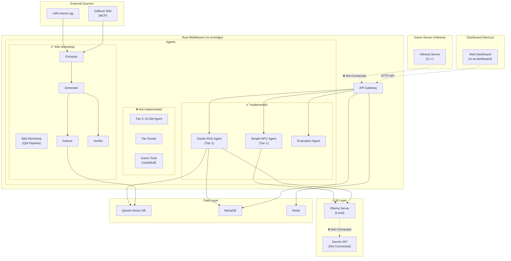
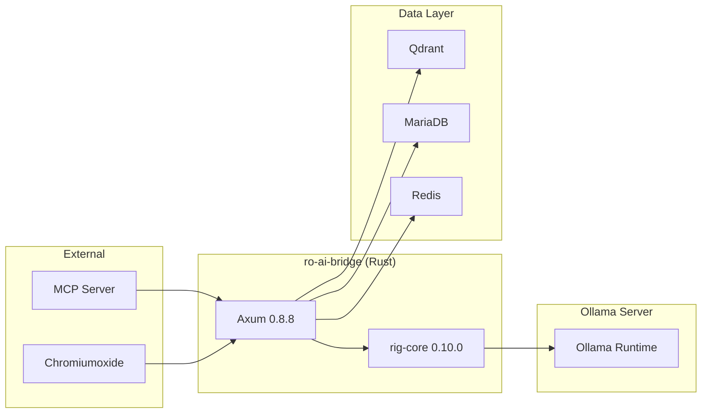
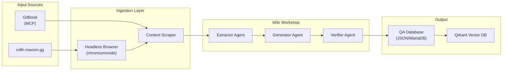
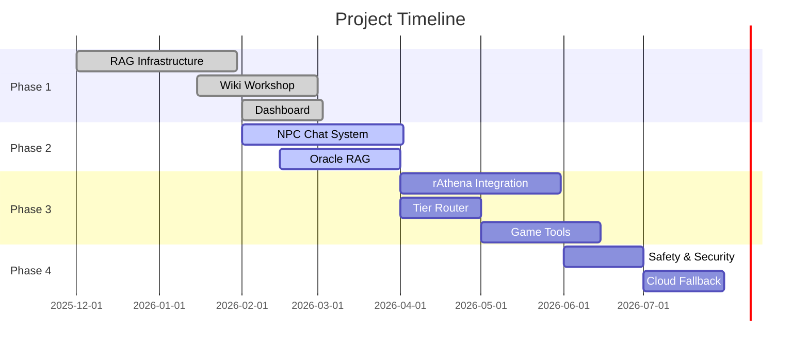

# 📖 Technical Requirement Document (TRD) — ฉบับภาษาไทย
## โปรเจกต์ Project-Mimir (Ragnarok Online: AI-Native Evolution)

| ฟิลด์              | ค่า                                                                                                                                                                                                                                                                                                      |
| ---------------- | ------------------------------------------------------------------------------------------------------------------------------------------------------------------------------------------------------------------------------------------------------------------------------------------------------- |
| **เวอร์ชัน**       | 2.1 (Updated - Wiki Workshop Focus)                                                                                                                                                                                                                                                                     |
| **วันที่**          | 2026-02-20                                                                                                                                                                                                                                                                                              |
| **Framework**    | Rig (rig-core 0.10.0) + Axum 0.8.8                                                                                                                                                                                                                                                                      |
| **เอกสารประกอบ** | [Framework Analysis](file:///Volumes/T7%20Shield/Development/Active_Projects/project/Project-Mimir/docs/01_04_Framework_Analysis_Project-Mimir.md), [Monitoring Plan](file:///Volumes/T7%20Shield/Development/Active_Projects/project/Project-Mimir/docs/02_02_Monitoring_System_Plan_Project-Mimir.md) |

> เอกสารฉบับนี้เป็น **TRD ฉบับปรับปรุง v2.1** สำหรับ Project-Mimir อัปเดตสถานะการพัฒนาจริง ณ วันที่ 2026-02-20

---

## 1. สถาปัตยกรรมระบบ (System Architecture)

### ภาพรวม: Current Implementation Status



### 🔑 Implementation Status Summary

| Tier/Feature             | Status              | File                     |
| ------------------------ | ------------------- | ------------------------ |
| **Tier 1: Simple Agent** | ✅ Implemented       | `agents/simple_npc.rs`   |
| **Tier 2: RAG Agent**    | ✅ Implemented       | `agents/oracle_rag.rs`   |
| **Tier 3: AI GM Agent**  | ❌ Not Implemented   | -                        |
| **Tier Router**          | ❌ Not Implemented   | -                        |
| **Game Tools**           | ❌ Not Implemented   | -                        |
| **Wiki Workshop**        | ✅ Fully Implemented | `agents/wiki_workshop/`  |
| **Evaluation Agent**     | ✅ Implemented       | `agents/eval.rs`         |
| **MCP Client**           | ✅ Implemented       | `services/mcp_client.rs` |
| **Scraper**              | ✅ Implemented       | `services/scraper.rs`    |
| **Dashboard**            | ✅ Fully Implemented | `ro-ai-dashboard/`       |

---

## 2. AI Agent Framework: Rig (rig.rs)

### ทำไมเลือก Rig?

| ความต้องการ      | Rig รองรับ         | รายละเอียด                              |
| --------------- | ----------------- | -------------------------------------- |
| ค้น Qdrant       | ✅ Custom Client   | ใช้ `services/qdrant.rs` แทน rig-qdrant |
| LLM Local       | ✅ Ollama Provider | รันผ่าน Ollama บน Local                  |
| Tool Calling    | ❌ Not Used        | ยังไม่ได้ใช้ในระบบปัจจุบัน                    |
| RAG Pipeline    | ✅ Custom          | ใช้ Qdrant + Custom logic               |
| Agent Loop      | ✅ Partial         | มีใน oracle_rag แต่ไม่มี Tool              |
| Axum Compatible | ✅ Tokio-based     | ทำงานร่วมกับ Axum ได้เลย                   |

### 2.1 Current Tech Stack



**Dependencies (Cargo.toml):**
```toml
rig-core = "0.10.0"
axum = "0.8.8"
sqlx = { version = "0.8.6", features = ["runtime-tokio-rustls", "mysql"] }
chromiumoxide = "0.8.0"
reqwest = { version = "0.12", features = ["json", "rustls-tls"] }
tokio = { version = "1.49.0", features = ["full"] }
```

---

## 3. โครงสร้างโปรเจกต์ (v2.1 - Updated)

```
ro-ai-bridge/
├── Cargo.toml
├── src/
│   ├── main.rs                    # Axum Server bootstrap
│   ├── config.rs                  # Environment + Constants
│   ├── lib.rs
│   ├── agents/                    # ⭐ AI Agents
│   │   ├── mod.rs
│   │   ├── simple_npc.rs         # ✅ Tier 1: NPC Chat (no tools)
│   │   ├── oracle_rag.rs         # ✅ Tier 2: Oracle + RAG
│   │   ├── eval.rs               # ✅ Evaluation Agent
│   │   └── wiki_workshop/        # ✅ Q/A Pipeline
│   │       ├── mod.rs
│   │       ├── pipeline.rs       # Main pipeline orchestration
│   │       ├── generator.rs       # Q/A Generator
│   │       ├── extractor.rs       # Content Extractor
│   │       ├── indexer.rs        # Vector Indexer
│   │       └── verifier.rs        # Quality Verifier
│   ├── services/
│   │   ├── mod.rs
│   │   ├── db.rs                 # MariaDB connection
│   │   ├── qdrant.rs             # Qdrant client
│   │   ├── mcp_client.rs         # ✅ MCP Protocol Client
│   │   ├── scraper.rs            # Web Scraper
│   │   └── table_parser.rs       # Game Data Parser
│   ├── middleware/
│   │   ├── mod.rs                # (placeholder)
│   │   └── ...                   # (not implemented)
│   ├── models/
│   │   ├── mod.rs
│   │   ├── ai.rs                 # AI Response models
│   │   ├── model_config.rs       # Model configuration
│   │   └── persona.rs            # NPC Persona
│   ├── routes/
│   │   ├── mod.rs
│   │   ├── eval.rs               # Evaluation endpoints
│   │   └── ...                   # (other routes)
│   ├── tools/
│   │   ├── mod.rs                # (placeholder)
│   │   └── ...                   # (not implemented)
│   ├── db/
│   │   ├── mod.rs                # (empty)
│   │   └── ...
│   └── utils/
│       ├── mod.rs                # (empty)
│       └── ...
├── bin/                           # ⭐ CLI Tools
│   ├── fetch_wiki.rs              # ✅ Wiki scraping
│   ├── generate_qa.rs             # ✅ Q/A generation
│   ├── index_qa.rs               # ✅ Vector indexing
│   ├── ingest_gamedata.rs         # ✅ Game data ingestion
│   ├── monitor.rs                 # ✅ System monitoring
│   ├── run_eval.rs                # ✅ Evaluation runner
│   ├── test_agent.rs
│   └── test_latency.rs
└── config/
    ├── personas/                  # NPC Persona YAML files
    │   └── ...
    └── safety/
        └── ...

ro-ai-dashboard/                   # ✅ Next.js Dashboard
├── src/
│   ├── app/
│   │   ├── page.tsx              # Home
│   │   ├── runs/                  # Pipeline monitoring
│   │   ├── evaluations/          # Evaluation results
│   │   ├── playground/            # AI testing
│   │   ├── vector/                # Vector DB visualization
│   │   └── steps/                 # Pipeline steps
│   ├── components/
│   ├── lib/
│   │   └── api.ts                # API client
│   └── types/
│       └── pipeline.ts
```

---

## 4. Wiki Workshop Pipeline (Implemented v2.1)

> ⭐ **สิ่งที่เพิ่มใหม่ใน v2.1** — ระบบ Q/A Generation อัตโนมัติ

### 4.1 Architecture



### 4.2 Pipeline Components

| Component     | File                                | Status |
| ------------- | ----------------------------------- | ------ |
| **Extractor** | `agents/wiki_workshop/extractor.rs` | ✅      |
| **Generator** | `agents/wiki_workshop/generator.rs` | ✅      |
| **Indexer**   | `agents/wiki_workshop/indexer.rs`   | ✅      |
| **Verifier**  | `agents/wiki_workshop/verifier.rs`  | ✅      |
| **Pipeline**  | `agents/wiki_workshop/pipeline.rs`  | ✅      |

### 4.3 CLI Tools

| Tool              | File                     | Purpose              |
| ----------------- | ------------------------ | -------------------- |
| `fetch_wiki`      | `bin/fetch_wiki.rs`      | Scrape wiki content  |
| `generate_qa`     | `bin/generate_qa.rs`     | Generate Q/A pairs   |
| `index_qa`        | `bin/index_qa.rs`        | Index to Qdrant      |
| `ingest_gamedata` | `bin/ingest_gamedata.rs` | Ingest game database |
| `monitor`         | `bin/monitor.rs`         | System monitoring    |
| `run_eval`        | `bin/run_eval.rs`        | Run evaluations      |

---

## 5. Dashboard (Implemented)

### 5.1 Pages

| Route          | File                       | Purpose                 |
| -------------- | -------------------------- | ----------------------- |
| `/`            | `app/page.tsx`             | Home dashboard          |
| `/runs`        | `app/runs/[id]/page.tsx`   | Pipeline run details    |
| `/evaluations` | `app/evaluations/page.tsx` | Evaluation results      |
| `/playground`  | `app/playground/page.tsx`  | AI testing playground   |
| `/vector`      | `app/vector/page.tsx`      | Vector DB visualization |
| `/steps`       | `app/steps/[id]/page.tsx`  | Pipeline step details   |

### 5.2 Components

- `pipeline-flow.tsx` — Pipeline visualization
- `coverage-chart.tsx` — Coverage score chart
- `qa-card.tsx` — Q/A pair display
- `status-badge.tsx` — Status indicator

---

## 6. rAthena Integration (Not Connected)

> ❌ **ยังไม่ได้เชื่อมต่อ** — รอ Phase 3

**TRD v2.0 วางแผนไว้:**
- `ai_chat(npc_id, msg)` — ส่งข้อความไปถาม AI
- `ai_action(npc_id, json)` — สั่ง AI ทำ Action ในเกม

**สถานะปัจจุบัน:**
- rAthena Server ทำงานผ่าน Docker
- ยังไม่มี Script Commands ใหม่
- ยังไม่มี HTTP Client integration

---

## 7. Remaining Tasks (Gaps)

### 7.1 Not Started

| Task                | Priority | Description                        |
| ------------------- | -------- | ---------------------------------- |
| Tier 3: AI GM Agent | Medium   | Background AI for log analysis     |
| Tier Router         | High     | Route requests to appropriate tier |
| Game Tools          | Medium   | HealTool, BuffTool, GiveItemTool   |
| Safety Filter       | High     | Content filtering                  |
| Rate Limiter        | High     | Request rate limiting              |
| Economy Limiter     | High     | In-game economy protection         |
| Bot Detection       | Medium   | Detect bot behavior                |
| rAthena Integration | High     | Connect to game server             |
| Cloud Fallback      | Medium   | Gemini API integration             |

### 7.2 Implementation Roadmap



---

## 8. API Endpoints (Current)

### Implemented

| Endpoint            | Method | Status |
| ------------------- | ------ | ------ |
| `/api/eval/run`     | POST   | ✅      |
| `/api/eval/results` | GET    | ✅      |
| `/health`           | GET    | ✅      |

### Not Implemented

| Endpoint               | Method | Status |
| ---------------------- | ------ | ------ |
| `/api/v1/chat`         | POST   | ❌      |
| `/api/v1/action`       | POST   | ❌      |
| `/api/v1/oracle/query` | POST   | ❌      |
| `/internal/gm/*`       | POST   | ❌      |

---

## 9. Database Schema (Implemented Tables)

| Table                | Purpose                    | Status           |
| -------------------- | -------------------------- | ---------------- |
| `pipeline_runs`      | Pipeline execution records | ✅                |
| `pipeline_steps`     | Individual step records    | ✅                |
| `qa_results`         | Generated Q/A pairs        | ✅                |
| `evaluation_reports` | Evaluation results         | ✅                |
| `ai_npc_persona`     | NPC personas               | ✅ (model exists) |
| `ai_models`          | Model configurations       | ✅ (model exists) |

---

## 10. Fallback Strategy (Not Implemented)

> ❌ **ยังไม่ได้ implement** — Local Ollama เท่านั้น

TRD v2.0 วางแผนไว้:
- **L0:** Local Qwen (default)
- **L1:** Reduce RAG context
- **L2:** Fallback to Meditron
- **L3:** Gemini API
- **L4:** Static rAthena scripts

**สถานะปัจจุบัน:** ใช้ Local Ollama เท่านั้น ไม่มี fallback

---

## 11. Summary: v2.0 vs v2.1

| Aspect                  | TRD v2.0      | Actual v2.1 |
| ----------------------- | ------------- | ----------- |
| **Tier 1 NPC**          | Planned       | ✅ Done      |
| **Tier 2 Oracle**       | Planned       | ✅ Done      |
| **Tier 3 GM**           | Planned       | ❌ Not done  |
| **Tier Router**         | Planned       | ❌ Not done  |
| **Wiki Workshop**       | Section 13    | ✅ Done      |
| **Q/A Pipeline**        | Section 13    | ✅ Done      |
| **Evaluation**          | Planned       | ✅ Done      |
| **Dashboard**           | Not mentioned | ✅ Done      |
| **rAthena Integration** | Planned       | ❌ Not done  |
| **Safety/Rate Limiter** | Planned       | ❌ Not done  |
| **Cloud Fallback**      | Planned       | ❌ Not done  |

---

*สิ้นสุดเอกสาร TRD v2.1 — อัปเดตเมื่อ 2026-02-20*
