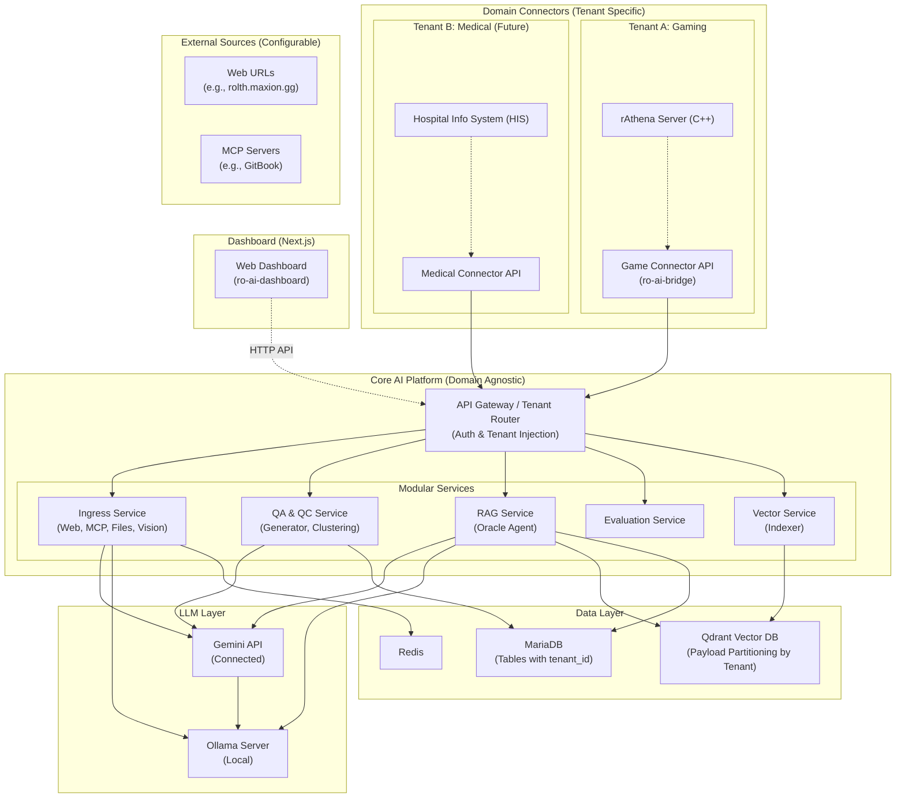
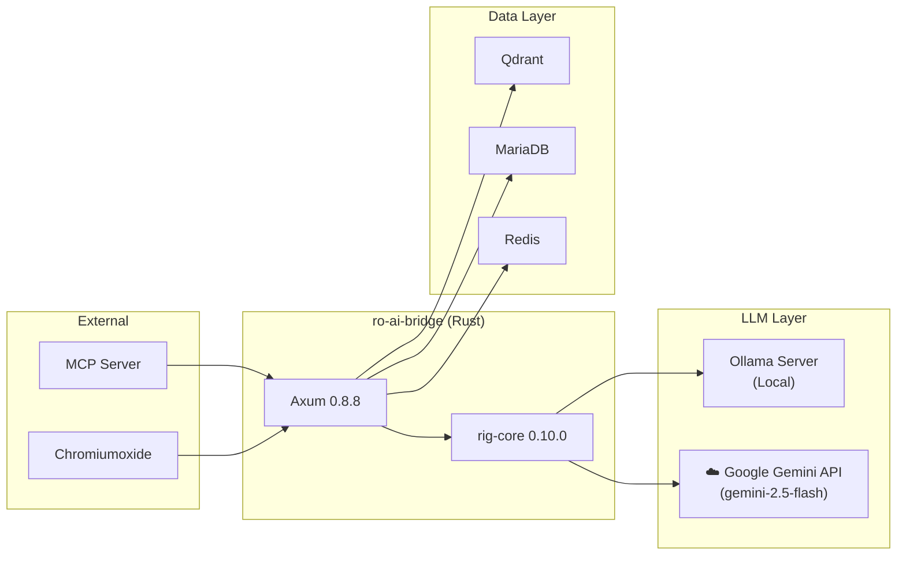
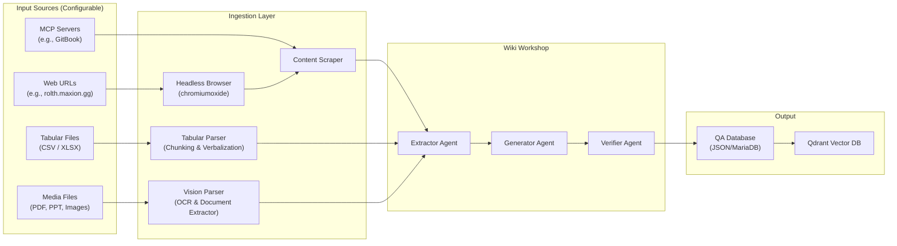
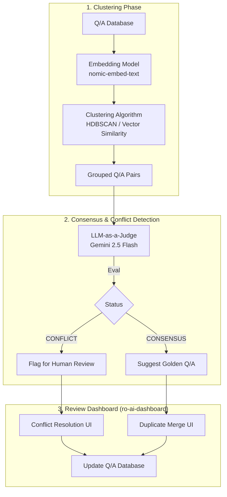
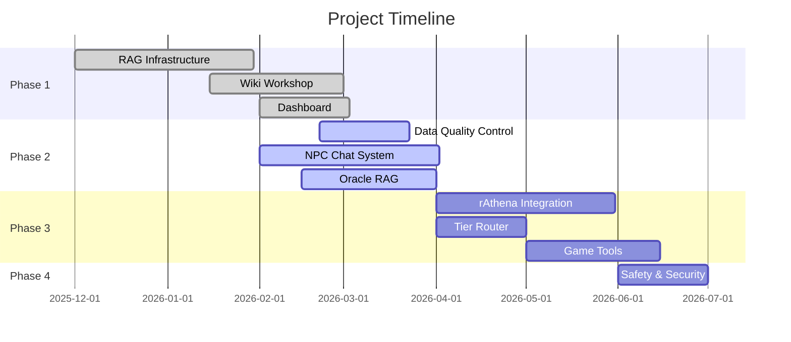

# 📖 Technical Requirement Document (TRD) — ฉบับภาษาไทย
## โปรเจกต์ Project-Mimir (Ragnarok Online: AI-Native Evolution)

| ฟิลด์              | ค่า                                                                                                                                                                                                                                                                                                      |
| ---------------- | ------------------------------------------------------------------------------------------------------------------------------------------------------------------------------------------------------------------------------------------------------------------------------------------------------- |
| **เวอร์ชัน**       | 2.3 (Updated - Multi-Tenant Modular Architecture)                                                                                                                                                                                                                                                       |
| **วันที่**          | 2026-02-21                                                                                                                                                                                                                                                                                              |
| **Framework**    | Rig (rig-core 0.10.0) + Axum 0.8.8                                                                                                                                                                                                                                                                      |
| **เอกสารประกอบ** | [Framework Analysis](file:///Volumes/T7%20Shield/Development/Active_Projects/project/Project-Mimir/docs/01_04_Framework_Analysis_Project-Mimir.md), [Monitoring Plan](file:///Volumes/T7%20Shield/Development/Active_Projects/project/Project-Mimir/docs/02_02_Monitoring_System_Plan_Project-Mimir.md) |

> เอกสารฉบับนี้เป็น **TRD ฉบับปรับปรุง v2.3** สำหรับ Project-Mimir อัปเดตสถานะการพัฒนาจริง ณ วันที่ 2026-02-21 โดยได้ทำการออกแบบสถาปัตยกรรมใหม่ให้เป็น **"Multi-Tenant Modular Architecture"** แยกแกนของระบบ AI กับระบบตัวเกม (Domain) ออกจากกัน เพื่อรองรับการสเกลไปใช้กับอุตสาหกรรมอื่น เช่น การแพทย์ (Healthcare)

---

## 1. สถาปัตยกรรมระบบ (System Architecture)

### ภาพรวม: Multi-Tenant Modular Architecture (v2.3)

> 💡 **Core Concept:** แยกระบบปัญญาประดิษฐ์กลาง (AI Core Platform) ออกจากระบบหน้าที่เฉพาะทาง (Domain Connectors) เพื่อให้สามารถรัน 1 ระบบแต่ให้บริการได้หลายธุรกิจ (Multi-Tenant) เช่น เกม (Ragnarok) และ การแพทย์ (Hospital)



### 🔑 Architectural Design Principles (v2.3)

1. **Decoupled Architecture**: แยกระบบ **Ingress** (ดูดข้อมูล), **QA/QC** (สร้างและตรวจสอบคุณภาพ), **Vector** (จัดการฐานข้อมูล), **RAG** (ตอบคำถาม), และ **Eval** ออกเป็นโมดูล (Module / Crate) ชัดเจน สามารถแยก Deploy บนระบบอื่นๆ ได้
2. **Multi-Tenancy Support**: ทุกข้อมูลที่ถูกเขียนลงทั้ง Database (MariaDB) และ Vector DB (Qdrant) จะมีการกำหนด **`tenant_id`** (เช่น `ragnarok_th`, `med_clinic_a`) ผูกติดไว้ เพื่อป้องกันข้อมูลรั่วไหลข้าม Domain ทำให้ระบบสเกลให้บริการองค์กรอื่นได้พร้อมกัน 
3. **Domain Agnostic AI Core**: ตัวแพลตฟอร์ม AI ตรงกลางจะไม่เข้าใจคำศัพท์เรื่องเกมเลย (ไม่รู้ว่า Zeny หรือ HP คืออะไร) แกนหลักมีหน้าที่รับ Context > ย่อย > ตรรกะ > สร้าง Vector > หาคำตอบ โดย "Domain Connectors" (เช่น ro-ai-bridge สำหรับเกม) จะทำหน้าที่แปลตรรกะเฉพาะทาง (Game Logic) ส่งมาให้แทน

| Tier/Feature             | Status              | Module Layer                      |
| ------------------------ | ------------------- | --------------------------------- |
| **Tier 1: Simple Agent** | ✅ Implemented       | `Domain Connector (ro-ai-bridge)` |
| **Tier 2: RAG Agent**    | ✅ Implemented       | `Core AI (RAG Service)`           |
| **Tier 3: AI GM Agent**  | ❌ Not Implemented   | `Domain Connector`                |
| **Ingress Service**      | ✅ Implemented       | `Core AI (Ingress)`               |
| **QA / QC Service**      | ✅ Implemented       | `Core AI (QA / QC)`               |
| **Data Quality Control** | 📝 Planned           | `Core AI (QA / QC)`               |
| **Evaluation Agent**     | ✅ Implemented       | `Core AI (Evaluation)`            |
| **Vector Indexer**       | ✅ Implemented       | `Core AI (Vector Service)`        |
| **MCP Client**           | ✅ Implemented       | `Core AI (Ingress)`               |
| **Dashboard**            | ✅ Fully Implemented | `ro-ai-dashboard/`                |
| **Gemini API**           | ✅ Implemented       | `Core AI Platform`                |

---

## 2. AI Agent Framework: Rig (rig.rs)

### ทำไมเลือก Rig?

| ความต้องการ      | Rig รองรับ         | รายละเอียด                              |
| --------------- | ----------------- | -------------------------------------- |
| ค้น Qdrant       | ✅ Custom Client   | ใช้ `services/qdrant.rs` แทน rig-qdrant |
| LLM Local       | ✅ Ollama Provider | รันผ่าน Ollama บน Local                  |
| **Cloud LLM**   | ✅ **Gemini**      | **✅ IMPLEMENTED** - ใช้ใน Wiki Workshop |
| Tool Calling    | ❌ Not Used        | ยังไม่ได้ใช้ในระบบปัจจุบัน                    |
| RAG Pipeline    | ✅ Custom          | ใช้ Qdrant + Custom logic               |
| Agent Loop      | ✅ Partial         | มีใน oracle_rag แต่ไม่มี Tool              |
| Axum Compatible | ✅ Tokio-based     | ทำงานร่วมกับ Axum ได้เลย                   |

### 2.1 Current Tech Stack



**Gemini Usage (✅ IMPLEMENTED):**
- `agents/wiki_workshop/pipeline.rs` - Q/A generation pipeline
- `agents/wiki_workshop/generator.rs` - Generator agent
- `agents/wiki_workshop/extractor.rs` - ACU extraction
- `agents/wiki_workshop/verifier.rs` - Coverage verification
- `agents/oracle_rag.rs` - Oracle RAG agent
- `agents/eval.rs` - Evaluation agent
- Default model: `gemini-2.5-flash`

**Dependencies (Cargo.toml):**
```toml
rig-core = "0.10.0"
axum = "0.8.8"
sqlx = { version = "0.8.6", features = ["runtime-tokio-rustls", "mysql"] }
chromiumoxide = "0.8.0"
reqwest = { version = "0.12", features = ["json", "rustls-tls"] }
tokio = { version = "1.49.0", features = ["full"] }
```

---

## 3. โครงสร้างโปรเจกต์ (v2.2 - Updated)

```
ro-ai-bridge/ (Workspace Monorepo)
├── Cargo.toml                     # Workspace definition
├── mimir-core-ai/                 # 🌟 CORE AI PLATFORM (Domain Agnostic)
│   ├── Cargo.toml
│   ├── src/
│   │   ├── ingress/               # ✅ Web, MCP, Tabular, Vision parsing
│   │   ├── qa_qc/                 # ✅ Generator, Verifier, Clustering
│   │   ├── rag_engine/            # ✅ Oracle Agent, Context Retrieval
│   │   ├── evaluation/            # ✅ Benchmarking
│   │   └── vector_svc/            # ✅ Qdrant integration & Routing
├── ro-ai-domain-game/             # 🎮 GAME CONNECTOR (Ragnarok Domain)
│   ├── Cargo.toml
│   ├── src/
│   │   ├── agents/                # Tier 1 NPC, Tier 3 AI GM
│   │   ├── game_tools/            # Heal, Buff tools
│   │   ├── middlewares/           # Gateway routing, Auth
│   │   └── rathena_gateway.rs     # Connection to C++ server
├── medical-domain/                # 🏥 MEDICAL CONNECTOR (Future)
│   └── ...
├── bin/                           # ⭐ CLI Tools
│   ├── system_monitor.rs          # ✅ System monitoring
│   └── ...

ro-ai-dashboard/                   # ✅ Next.js Dashboard
├── src/
│   ├── app/
│   │   ├── page.tsx              # Home
│   │   ├── runs/                  # Pipeline monitoring
│   │   ├── evaluations/          # Evaluation results
│   │   ├── playground/            # AI testing
│   │   ├── vector/                # Vector DB visualization
│   │   ├── steps/                 # Pipeline step details
│   │   └── quality_control/       # ⏳ (New) QA Data Quality Control UI
│   ├── components/
│   ├── lib/
│   │   └── api.ts                # API client
│   └── types/
│       └── pipeline.ts
```

---

## 4. Ingress & QA Workshop Pipeline (Formerly Wiki Workshop)

### 4.1 Architecture

> 💡 **Input Sources Configurability:** ระบบรองรับการตั้งค่า (Configurable) แหล่งข้อมูลนำเข้า ทั้งในรูปแบบของ Web URL (เช่น Wiki, Forum), ไฟล์ตาราง Dataset (CSV/XLSX), โฟลเดอร์เอกสารและรูปภาพ (PDF, PPT, BMP, JPG, PNG) และสามารถเพิ่มการเชื่อมต่อระบบอื่นผ่าน MCP Server ได้อย่างอิสระ เพื่อขยายขอบเขตการดูดซับข้อมูล



### 4.2 Pipeline Components

| Component     | File                                | Status    |
| ------------- | ----------------------------------- | --------- |
| **Extractor** | `agents/wiki_workshop/extractor.rs` | ✅         |
| **Generator** | `agents/wiki_workshop/generator.rs` | ✅         |
| **Indexer**   | `agents/wiki_workshop/indexer.rs`   | ✅         |
| **Verifier**  | `agents/wiki_workshop/verifier.rs`  | ✅         |
| **Pipeline**  | `agents/wiki_workshop/pipeline.rs`  | ✅         |
| **Tabular**   | `services/tabular_parser.rs`        | 📝 Planned |
| **Vision**    | `services/vision_parser.rs`         | 📝 Planned |

### 4.3 CLI Tools

| Tool              | File                     | Purpose              |
| ----------------- | ------------------------ | -------------------- |
| `fetch_wiki`      | `bin/fetch_wiki.rs`      | Scrape wiki content  |
| `generate_qa`     | `bin/generate_qa.rs`     | Generate Q/A pairs   |
| `index_qa`        | `bin/index_qa.rs`        | Index to Qdrant      |
| `ingest_gamedata` | `bin/ingest_gamedata.rs` | Ingest game database |
| `monitor`         | `bin/monitor.rs`         | System monitoring    |
| `run_eval`        | `bin/run_eval.rs`        | Run evaluations      |

---

### 4.4 Data Quality Control (Q/A Clustering & Consensus) - *New in v2.2*

เพื่อแก้ปัญหาคำถามซ้ำซ้อนและคำตอบที่ขัดแย้งกัน (Conflict/Duplicate) สำหรับข้อมูลที่ได้จาก Generator ระบบจะมี Pipeline เพิ่มเติมสำหรับการตรวจสอบคุณภาพข้อมูล Q/A ก่อนที่จะนำไปใช้ใน Vector DB จริง

**Architecture:**


**กระบวนการทำงานหลัก:**
1. **Question Clustering:** นำคำถามจาก Database มาทำ Embedding และใช้ Similarity Search หรือ Clustering Algorithm เพื่อจัดกลุ่มคำถามที่มีความหมาย (Semantic) คล้ายคลึงกันให้อยู่ในกลุ่มเดียวกัน (ระบุเป็น Cluster ID)
2. **Answer Consensus Detection:** ใช้ LLM-as-a-Judge (เช่น Gemini 2.5 Flash) อ่านคำตอบทั้งหมดในกลุ่มเดียวกัน เพื่อวิเคราะห์ว่า "คำตอบเหล่านั้นเสริมกัน/คล้ายคลึงกัน (Consensus) หรือมีส่วนที่ขัดแย้งกัน (Conflict)"
   - หาก **Consensus/Duplicate**: ระบบจะให้ LLM แนะนำ "Golden Answer" ที่เป็นการสรุปรวมข้อมูลที่สมบูรณ์ที่สุด เพื่อลดขนาดและประหยัดพื้นที่ Vector DB 
   - หาก **Conflict**: ระบบจะทำการติด Flag ระบุสาเหตุที่ขัดแย้ง เพื่อรอให้ Staff หรือมนุษย์มารีวิว
3. **Review & Resolution:** จะมีการเพิ่มหน้าจอบนแผงควบคุมหลัก (`ro-ai-dashboard/app/quality_control`) เพื่อแสดงรายการคำถามที่คล้ายกันและการจับคู่ Conflict ให้ผู้ใช้งาน (Admin) สามารถตรวจสอบ, เลือกคำตอบที่ดีที่สุด หรือทำการแก้ไขได้ด้วยตนเองอย่างโปร่งใส

---

## 5. Dashboard (Implemented)

### 5.1 Pages

| Route              | File                           | Purpose                              |
| ------------------ | ------------------------------ | ------------------------------------ |
| `/`                | `app/page.tsx`                 | Home dashboard                       |
| `/runs`            | `app/runs/[id]/page.tsx`       | Pipeline run details                 |
| `/evaluations`     | `app/evaluations/page.tsx`     | Evaluation results                   |
| `/playground`      | `app/playground/page.tsx`      | AI testing playground                |
| `/vector`          | `app/vector/page.tsx`          | Vector DB visualization              |
| `/steps`           | `app/steps/[id]/page.tsx`      | Pipeline step details                |
| `/quality_control` | `app/quality_control/page.tsx` | ⏳ (New Planned) Data QC & Resolution |

### 5.2 Components

- `pipeline-flow.tsx` — Pipeline visualization
- `coverage-chart.tsx` — Coverage score chart
- `qa-card.tsx` — Q/A pair display
- `status-badge.tsx` — Status indicator

---

## 6. rAthena Integration (Not Connected)

> ❌ **ยังไม่ได้เชื่อมต่อ** — รอ Phase 3

**TRD v2.0 วางแผนไว้:**
- `ai_chat(npc_id, msg)` — ส่งข้อความไปถาม AI
- `ai_action(npc_id, json)` — สั่ง AI ทำ Action ในเกม

**สถานะปัจจุบัน:**
- rAthena Server ทำงานผ่าน Docker
- ยังไม่มี Script Commands ใหม่
- ยังไม่มี HTTP Client integration

---

## 7. Remaining Tasks (Gaps)

### 7.1 Not Started

| Task                 | Priority | Description                        |
| -------------------- | -------- | ---------------------------------- |
| Data Quality Control | High     | Q/A Clustering, Conflict detection |
| Tier 3: AI GM Agent  | Medium   | Background AI for log analysis     |
| Tier Router          | High     | Route requests to appropriate tier |
| Game Tools           | Medium   | HealTool, BuffTool, GiveItemTool   |
| Safety Filter        | High     | Content filtering                  |
| Rate Limiter         | High     | Request rate limiting              |
| Economy Limiter      | High     | In-game economy protection         |
| Bot Detection        | Medium   | Detect bot behavior                |
| rAthena Integration  | High     | Connect to game server             |

### 7.2 Implementation Roadmap



---

## 8. API Endpoints (Current)

### Implemented

| Endpoint            | Method | Status |
| ------------------- | ------ | ------ |
| `/api/eval/run`     | POST   | ✅      |
| `/api/eval/results` | GET    | ✅      |
| `/health`           | GET    | ✅      |

### Not Implemented

| Endpoint               | Method | Status |
| ---------------------- | ------ | ------ |
| `/api/v1/chat`         | POST   | ❌      |
| `/api/v1/action`       | POST   | ❌      |
| `/api/v1/oracle/query` | POST   | ❌      |
| `/api/qc/clusters`     | GET    | ❌      |
| `/api/qc/resolve`      | POST   | ❌      |

---

## 9. Database Schema (Implemented Tables)

| Table                | Purpose                    | Multi-Tenant Status              |
| -------------------- | -------------------------- | -------------------------------- |
| `pipeline_runs`      | Pipeline execution records | 📝 Planned: Add `tenant_id`       |
| `pipeline_steps`     | Individual step records    | 📝 Planned: Add `tenant_id`       |
| `qa_results`         | Generated Q/A pairs        | 📝 Planned: Add `tenant_id`       |
| `evaluation_reports` | Evaluation results         | 📝 Planned: Add `tenant_id`       |
| `ai_npc_persona`     | NPC personas               | ❌ Domain Specific (Game Connect) |
| `ai_models`          | Model configurations       | ✅ Global Config                  |
| `qa_clusters`        | Clustered Q/A Mapping      | 📝 Planned: Add `tenant_id`       |

> ⏳ **Multi-Tenant Updates:** ทุกตารางผลลัพธ์จะต้องมีการเพิ่มคอลัมน์ `tenant_id` เป็น Primary/Foreign Key เพื่อรักษากรอบความเป็นส่วนตัวของข้อมูลแต่ละอุตสาหกรรม และ Qdrant จะถูกเปลี่ยนไปใช้เทคนิค **Payload-based Partitioning** Filter ค้นหาเฉพาะกลุ่ม `tenant_id` นั้นๆเสมอ

---

## 10. Fallback Strategy (Partial Implementation)

> ⚠️ **Gemini ถูกใช้ใน Wiki Workshop Pipeline แล้ว** แต่ยังไม่มีระบบ Fallback อัตโนมัติ

TRD v2.0 วางแผนไว้:
- **L0:** Local Qwen (default)
- **L1:** Reduce RAG context
- **L2:** Fallback to Meditron
- **L3:** Gemini API
- **L4:** Static rAthena scripts

**สถานะปัจจุบัน:**
| Level             | Status            | Details            |
| ----------------- | ----------------- | ------------------ |
| L0 Ollama         | ✅ Available       | Local LLM          |
| L1 Reduce Context | ❌ Not implemented |                    |
| L2 Meditron       | ❌ Not configured  |                    |
| **L3 Gemini**     | ✅ **IMPLEMENTED** | ใช้ใน Wiki Workshop |
| L4 Static Scripts | ❌ Not implemented |                    |

---

## 11. Summary: v2.2 vs v2.3

| Aspect                    | TRD v2.2        | Actual v2.3                          |
| ------------------------- | --------------- | ------------------------------------ |
| **Architecture Paradigm** | Monolithic Game | **✅ Multi-Tenant Modular Design**    |
| **Core AI Services**      | Tightly coupled | **✅ Decoupled (Ingress, RAG, Eval)** |
| **Domain Usage**          | Ragnarok Only   | **✅ Any Domain (Medical, SaaS)**     |
| **Tenant Isolation**      | Not planned     | **📝 Payload-based Partitioning**     |
| **Workspace (Monorepo)**  | Single Crate    | **📝 Multi-Crate (mimir-core, etc)**  |

---

## 12. Deployment & Infrastructure Strategy

To support the Multi-Tenant Architectural evolution, the deployment strategy follows an evolutionary path from simple container management to robust orchestration.

### 12.1 Phase 1-3: Containerization (Docker Compose)
During the initial build and validation phases (1-10 Tenants), the system will be deployed using **Docker Compose**.
*   **Architecture:** Separation of concerns via multiple `docker-compose.yml` files (e.g., one for Core AI + Databases, another for Domain Connectors).
*   **Advantages:** Rapid prototyping, simpler CI/CD pipelines, and reduced operational overhead for a small infrastructure team.
*   **Setup:** A single robust Virtual Machine (VM) runs the Docker Engine, orchestrating `mimir-core-ai`, `ro-ai-domain-game`, MariaDB, Qdrant, and Redis containers.

### 12.2 Phase 4+: Orchestration (Kubernetes)
As the system scales beyond 10 Tenants and requires High Availability (HA) across multiple domains (e.g., Medical, Corporate SaaS), the infrastructure will migrate to **Kubernetes (K8s)**.
*   **Auto-scaling:** Horizontally scale Domain Connectors based on traffic (e.g., sudden spikes during a game launch) using HPA (Horizontal Pod Autoscaler).
*   **Resource Isolation:** Enforce strict CPU and Memory limits (Quotas) per Tenant namespace or pod to prevent "Noisy Neighbor" issues.
*   **Zero-Downtime:** Utilize rolling updates to patch the AI models, prompts, or core backend without disrupting active tenant services.
*   **Management:** Use Helm charts for deploying the Core AI and dynamically tearing up/down new Domain Connectors.

---

*สิ้นสุดเอกสาร TRD v2.3 — อัปเดตเมื่อ 2026-02-21*
