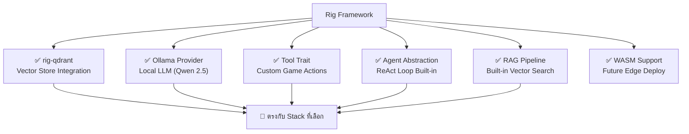
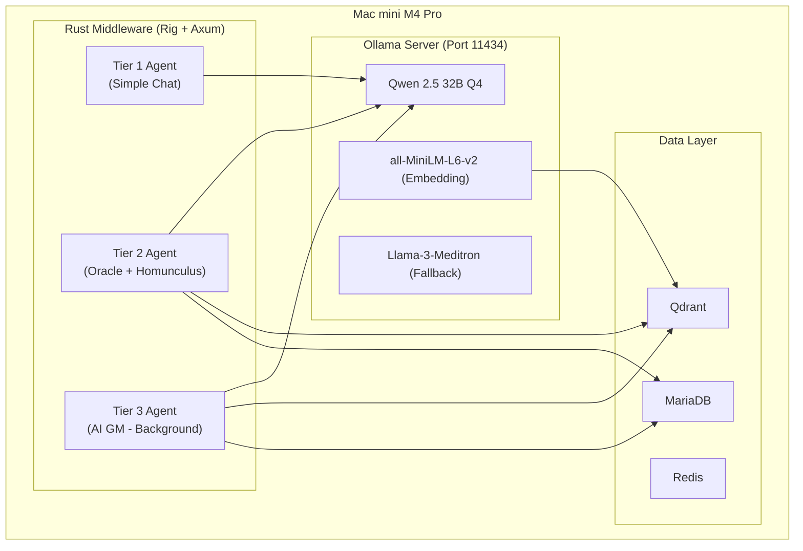

# 🔍 Rust AI Agent Framework Analysis
## สำหรับ Project-Mimir: Hybrid Agent Architecture

> วิเคราะห์ Framework ที่เหมาะสมสำหรับการสร้าง AI Agent Engine ใน Rust สำหรับ NPC / Oracle / AI GM

---

## 1. เกณฑ์การคัดเลือก

| เกณฑ์                        | น้ำหนัก    | เหตุผล                             |
| --------------------------- | ------- | --------------------------------- |
| **Qdrant Integration**      | สูงมาก   | เราใช้ Qdrant เป็น Vector DB หลัก    |
| **Local LLM Support**       | สูงมาก   | รันบน Mac mini (Candle/MLX/Ollama) |
| **Tool Calling**            | สูงมาก   | Agent ต้องเรียก Game Action ได้      |
| **Async / Tokio**           | สูง      | ต้องรองรับ Concurrent requests      |
| **Production Readiness**    | สูง      | ใช้งานจริง ไม่ใช่แค่ PoC               |
| **Community & Maintenance** | ปานกลาง | มีคนดูแล อัพเดทต่อเนื่อง                |
| **WASM Support**            | ต่ำ       | อาจใช้สำหรับ Edge ในอนาคต            |

---

## 2. Framework Comparison

### ⭐ Top Candidates

| Framework      | Stars | Qdrant         | Local LLM     | Tool Calling   | Agent Loop          | Maturity     |
| -------------- | ----- | -------------- | ------------- | -------------- | ------------------- | ------------ |
| **Rig**        | ~4k+  | ✅ `rig-qdrant` | ✅ Ollama      | ✅ Built-in     | ✅ Agentic Workflows | 🟢 Production |
| **swarms-rs**  | ~1k   | ❌ ไม่มี          | ⚠️ ผ่าน API     | ✅ MCP Protocol | ✅ Multi-Agent       | 🟡 Early      |
| **AutoAgents** | ~500  | ❌ ไม่มี          | ✅ Ollama      | ✅ WASM Runtime | ✅ Actor Model       | 🟡 Beta       |
| **Orca**       | ~300  | ✅ มี            | ⚠️ OpenAI only | ⚠️ จำกัด          | ❌ ไม่มี               | 🔴 Stale      |
| **llm-chain**  | ~1k   | ❌ ไม่มี          | ⚠️ จำกัด         | ⚠️ จำกัด          | ❌ ไม่มี               | 🟡 Moderate   |
| **Rustchain**  | <100  | ❌ ไม่มี          | ❌ ไม่มี         | ✅ มี            | ✅ มี                 | 🔴 Early      |

---

## 3. ✅ แนะนำ: Rig (rig.rs)

### ทำไมเลือก Rig?



### 3.1 ฟีเจอร์ที่ตรงกับ Project-Mimir

| ความต้องการภายใน Project | Rig รองรับ            | รายละเอียด                                   |
| ----------------------- | -------------------- | ------------------------------------------- |
| NPC คุยกับผู้เล่น            | ✅ `Agent::chat()`    | สร้าง Agent + Preamble (Persona) + Tools     |
| Oracle ค้น Vector DB     | ✅ `rig-qdrant` + RAG | ค้น Qdrant → ใส่ Context → LLM ตอบ            |
| AI ทำ Action ในเกม       | ✅ `Tool` trait       | สร้าง Custom Tool (HealTool, BuffTool, etc.) |
| ใช้ LLM Local (Qwen)     | ✅ Ollama Provider    | ผ่าน Ollama serve + `rig::providers::ollama` |
| Multi-turn Conversation | ✅ Chat History       | จัดการ Session + Context Window              |
| Agent คิดหลายขั้นตอน       | ✅ Agentic Workflow   | ReAct loop: Think → Act → Observe → Repeat  |

### 3.2 ตัวอย่างโค้ด: NPC Agent ด้วย Rig

```rust
use rig::providers::ollama;
use rig::agent::Agent;
use rig::tool::Tool;

// 1. สร้าง Tool สำหรับ Game Actions
#[derive(Tool)]
#[tool(description = "Heal a player character")]
struct HealTool;

impl Tool for HealTool {
    type Input = HealInput;   // { target: String }
    type Output = HealResult; // { success: bool, hp_restored: i32 }

    async fn call(&self, input: HealInput) -> Result<HealResult> {
        // เรียก rAthena API หรือ MariaDB
        execute_game_action("heal", &input.target).await
    }
}

// 2. สร้าง Agent สำหรับ NPC
let ollama_client = ollama::Client::new("http://localhost:11434");
let model = ollama_client.model("qwen2.5:32b-q4");

let sage_agent = model
    .agent()
    .preamble("You are Sage Ariel, a wise scholar of Rune-Midgarts...")
    .tool(HealTool)
    .tool(BuffTool)
    .tool(GiveItemTool)
    .build();

// 3. ใช้งาน
let response = sage_agent
    .chat("I'm hurt from battle, can you help?")
    .await?;
// Agent อาจ: 1) ตอบ dialogue  2) เรียก HealTool อัตโนมัติ
```

### 3.3 ตัวอย่างโค้ด: Oracle RAG Agent

```rust
use rig::providers::ollama;
use rig_qdrant::QdrantVectorStore;

// 1. เชื่อม Qdrant
let qdrant = QdrantVectorStore::new("http://localhost:6333", "ro_items").await?;

// 2. สร้าง RAG Agent
let oracle_agent = model
    .agent()
    .preamble("You are the Oracle, answer questions using ONLY the provided context...")
    .dynamic_context(qdrant.index(5))  // Top-5 results
    .build();

// 3. ผู้เล่นถามคำถาม
let answer = oracle_agent
    .chat("What's the best card for Knight farming High Orcs?")
    .await?;
// Rig จะ: embed query → ค้น Qdrant → inject context → LLM ตอบ
```

### 3.4 Rig + Ollama + Mac mini Architecture



---

## 4. ทำไมไม่เลือก Framework อื่น

### ❌ swarms-rs
- **ไม่มี Qdrant integration** ต้องเขียนเอง
- ยังอยู่ในช่วง Early Stage ไม่เหมาะกับ Production
- เน้น Multi-Agent Orchestration ซึ่ง Overkill สำหรับ NPC

### ❌ AutoAgents
- ดีสำหรับ Multi-Agent แต่ไม่มี Qdrant built-in
- Actor Model มีความซับซ้อนเกินจำเป็นสำหรับ Use Case นี้
- ยังอยู่ในช่วง Beta

### ❌ Orca
- มี Qdrant support แต่ **โปรเจกต์ไม่ค่อยอัพเดท** (Stale)
- ไม่มี Agent Loop / Agentic Workflow
- รองรับแค่ OpenAI ไม่รองรับ Local LLM ดีพอ

### ❌ llm-chain
- ไม่มี Qdrant integration
- ไม่มี Agent abstraction ที่สมบูรณ์
- เหมาะกับ Chain prompt มากกว่า Agent

---

## 5. สิ่งที่ต้องพัฒนาเองนอกเหนือจาก Rig

| Component                      | เหตุผล                                            | ความยากVBo |
| ------------------------------ | ------------------------------------------------ | ---------- |
| **Game Action Tools**          | Rig มี Tool trait แต่ต้องเขียน Tool สำหรับ rAthena เอง | ปานกลาง    |
| **Economy Limiter Middleware** | ต้องครอบ Tool ด้วย Rate Limiter เฉพาะเกม           | ปานกลาง    |
| **NPC Persona Manager**        | โหลด YAML Persona → สร้าง Agent dynamically       | ง่าย        |
| **Session/Memory Store**       | ใช้ Redis เก็บ Chat History ต่อ Session             | ง่าย        |
| **Circuit Breaker**            | ครอบ Ollama call ด้วย Circuit Breaker Pattern     | ปานกลาง    |
| **Tier Router**                | ตัดสินใจว่า Request ใดควรใช้ Tier 1/2/3              | ปานกลาง    |

---

## 6. Cargo.toml Dependencies (เบื้องต้น)

```toml
[dependencies]
# AI Agent Framework
rig-core = "0.6"          # Core Rig framework
rig-qdrant = "0.2"        # Qdrant vector store integration

# LLM Provider (Local via Ollama)
# rig-core includes ollama provider

# Web Framework
axum = "0.8"
tokio = { version = "1", features = ["full"] }
tower = "0.5"
tower-http = { version = "0.6", features = ["cors", "trace"] }

# Database
sqlx = { version = "0.8", features = ["mysql", "runtime-tokio"] }
qdrant-client = "1.12"
redis = { version = "0.27", features = ["tokio-comp"] }

# Serialization
serde = { version = "1", features = ["derive"] }
serde_json = "1"

# Utilities
uuid = { version = "1", features = ["v4"] }
tracing = "0.1"
tracing-subscriber = "0.3"
anyhow = "1"
```

---

## 7. สรุปคำแนะนำ

> [!TIP]
> **ใช้ Rig เป็น AI Agent Framework หลัก** เพราะ:
> 1. มี Qdrant integration สำเร็จรูป (`rig-qdrant`)
> 2. รองรับ Ollama (Local LLM) ตรงกับ Stack ที่เลือก
> 3. มี Tool Calling trait ที่เขียน Custom Tool ได้ง่าย
> 4. มี RAG Pipeline built-in สำหรับ Oracle Bot
> 5. Production-ready, type-safe, มี Community ดูแล
> 6. ออกแบบมาให้ทำงานร่วมกับ Axum ได้ดี (Tokio-based)

**ข้อพิจารณาเพิ่มเติม:**
- ใช้ **Ollama** เป็น LLM Server (แทน Candle/MLX โดยตรง) เพราะ Rig integrate กับ Ollama ได้สมบูรณ์
- Ollama เองรองรับ MLX backend บน Apple Silicon อยู่แล้ว → ได้ประสิทธิภาพ GPU เต็มที่
- เปลี่ยนจาก "Candle/MLX direct" → "Ollama (ใช้ MLX ภายใน)" ทำให้ Stack เรียบง่ายขึ้นมาก

---

*สิ้นสุดเอกสารวิเคราะห์ Framework*
