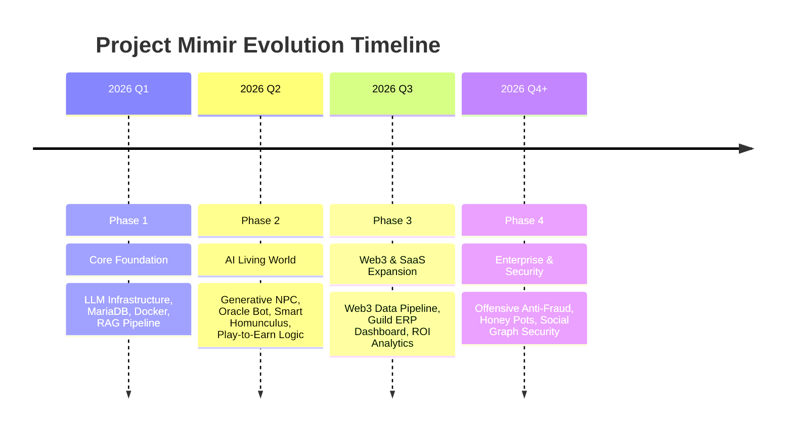

# 🗺️ Product Roadmap: Project Mimir
## Ragnarok Online: AI-Native Evolution & Gaming SaaS

แผนงานพัฒนาโปรเจกต์ Mimir ครบทุกมิติ ตั้งแต่รากฐานระบบ AI NPC ไปจนถึงการขยายขอบเขตสู่ Web3 Infrastructure และ Enterprise Security Solution

---

## 📅 Roadmap Overview

---

## 🚀 Phase Details

### Phase 1: Core Foundation (Current Focus)
**เป้าหมาย:** สร้างรากฐานเทคนิคที่แข็งแกร่งและระบบประมวลผล AI ภายในเครื่อง (Local LLM)
-   [x] Setup rAthena on Docker
-   [x] MariaDB Migration & AI Tables Ingestion
-   [x] Rig.rs Framework Implementation (Rust)
-   [x] Vector Database (Indexing & Search)
-   [ ] Monitoring System for AI Logs

### Phase 2: AI-Native Gameplay (Next Priority)
**เป้าหมาย:** สร้างประสบการณ์ใหม่ให้ผู้เล่นผ่าน NPC และข้อมูลอัจฉริยะ
-   **Generative NPC:** บทสนทนาแบบ Dynamic ตามบุคลิกตัวละคร
-   **Oracle RAG Bot:** ระบบช่วยเหลือผู้เล่น (VIP 1) ที่ดึงข้อมูลจริงจาก Wiki DB
-   **Smart Homunculus:** สัตว์เลี้ยงที่สื่อสารกลยุทธ์ได้ (VIP 2)
-   **Economic Guardrails:** ระบบจำกัดการจ่าย Zeny/Item จาก AI เพื่อป้องกันเงินเฟ้อ

### Phase 3: Web3 Data & SaaS Platform
**เป้าหมาย:** ขยายข้อมูลออกนอกเกมและสร้างรายได้ผ่านแพลตฟอร์มวิเคราะห์
-   **Web3 Connector:** เชื่อมต่อกับ Marketplace API และ DEX (ADAM/ION Coins)
-   **Next.js Dashboard:** แพลตฟอร์ม Web UI แยกต่างหากสำหรับดู Analytics
-   **Guild ERP:** ระบบจัดการกิลด์, บัญชีปันผล และ KPI ลูกกิลด์
-   **ROI Optimizer:** AI คำนวณความคุ้มค่าของการฟาร์มเทียบกับราคา Token ประจำวัน

### Phase 4: Enterprise Security & Anti-Fraud
**เป้าหมาย:** ยกระดับความปลอดภัยสู่มาตรฐานสากลเพื่อขายโซลูชัน B2B
-   **Neural Behavioral Analysis:** ตรวจจับวิถีการเดินและการคลิกของ AI Bots
-   **Market Honey Pots:** สร้างกับดักสำหรับบอท Sniper ใน Marketplace
-   **Social Graph Security:** วิเคราะห์เครือข่ายความสัมพันธ์เพื่อหาจุดฟอกเงิน/OTC
-   **Enterprise Dashboard:** ระบบ Dashboard สำหรับ Global Server Owners

---

## 📈 Success Metrics (KPIs)

-   **Phase 1-2:** Response Time < 2s, 95% Accuracy ใน Oracle Bot
-   **Phase 3:** DAU Subscription สำหรับ SaaS > 20% ของผู้เล่นทั้งหมด
-   **Phase 4:** สกัดกั้น OTC Transactions ได้ > 80%

---

*สร้างโดย: Antigravity AI*
*วันที่: 2026-02-19*
