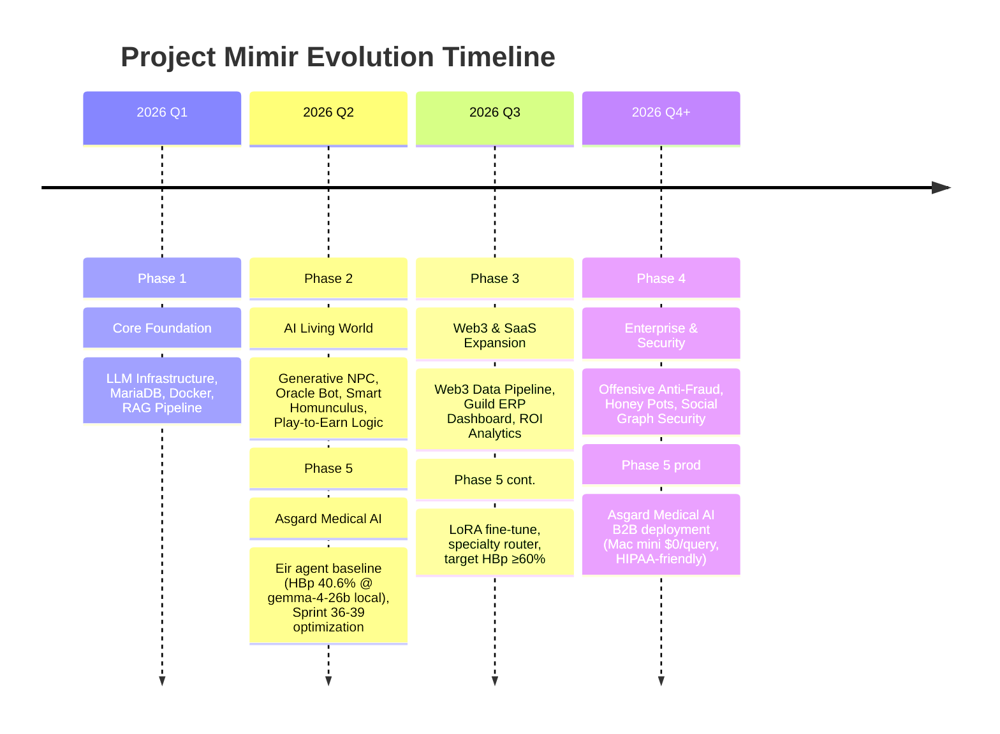

# 🗺️ Product Roadmap: Project Mimir
## Ragnarok Online: AI-Native Evolution & Gaming SaaS

แผนงานพัฒนาโปรเจกต์ Mimir ครบทุกมิติ ตั้งแต่รากฐานระบบ AI NPC ไปจนถึงการขยายขอบเขตสู่ Web3 Infrastructure และ Enterprise Security Solution

---

## 📅 Roadmap Overview

---

## 🚀 Phase Details

### Phase 1: Core Foundation (Current Focus)
**เป้าหมาย:** สร้างรากฐานเทคนิคที่แข็งแกร่งและระบบประมวลผล AI ภายในเครื่อง (Local LLM)
-   [x] Setup rAthena on Docker
-   [x] MariaDB Migration & AI Tables Ingestion
-   [x] Rig.rs Framework Implementation (Rust)
-   [x] Vector Database (Indexing & Search)
-   [ ] Monitoring System for AI Logs

### Phase 2: AI-Native Gameplay (Next Priority)
**เป้าหมาย:** สร้างประสบการณ์ใหม่ให้ผู้เล่นผ่าน NPC และข้อมูลอัจฉริยะ
-   **Generative NPC:** บทสนทนาแบบ Dynamic ตามบุคลิกตัวละคร
-   **Oracle RAG Bot:** ระบบช่วยเหลือผู้เล่น (VIP 1) ที่ดึงข้อมูลจริงจาก Wiki DB
-   **Smart Homunculus:** สัตว์เลี้ยงที่สื่อสารกลยุทธ์ได้ (VIP 2)
-   **Economic Guardrails:** ระบบจำกัดการจ่าย Zeny/Item จาก AI เพื่อป้องกันเงินเฟ้อ

### Phase 3: Web3 Data & SaaS Platform
**เป้าหมาย:** ขยายข้อมูลออกนอกเกมและสร้างรายได้ผ่านแพลตฟอร์มวิเคราะห์
-   **Web3 Connector:** เชื่อมต่อกับ Marketplace API และ DEX (ADAM/ION Coins)
-   **Next.js Dashboard:** แพลตฟอร์ม Web UI แยกต่างหากสำหรับดู Analytics
-   **Guild ERP:** ระบบจัดการกิลด์, บัญชีปันผล และ KPI ลูกกิลด์
-   **ROI Optimizer:** AI คำนวณความคุ้มค่าของการฟาร์มเทียบกับราคา Token ประจำวัน

### Phase 4: Enterprise Security & Anti-Fraud
**เป้าหมาย:** ยกระดับความปลอดภัยสู่มาตรฐานสากลเพื่อขายโซลูชัน B2B
-   **Neural Behavioral Analysis:** ตรวจจับวิถีการเดินและการคลิกของ AI Bots
-   **Market Honey Pots:** สร้างกับดักสำหรับบอท Sniper ใน Marketplace
-   **Social Graph Security:** วิเคราะห์เครือข่ายความสัมพันธ์เพื่อหาจุดฟอกเงิน/OTC
-   **Enterprise Dashboard:** ระบบ Dashboard สำหรับ Global Server Owners

### Phase 5: Asgard Medical AI (Parallel Track — Sprint 36+)
**เป้าหมาย:** ปรับ Mimir/Eir agent ใช้กับงานคลินิกได้จริงบน local hardware (Mac mini)

**Baseline (2026-05-04):** Eir agent บน gemma-4-26b 4-bit @ **40.6% HBp** (HealthBench-Pro,
n=20). ทุบ cloud Gemini ทุกตัว — `gemini-3.1-flash-lite-preview` 37.2%. รายละเอียดที่
[04_03_HealthBench_Pro_Baseline](../04_evaluation_and_testing/04_03_HealthBench_Pro_Baseline_2026-05-04.md)

| Sprint | Theme | Status / Result |
|---|---|---|
| 36 | Quick Wins (CoT + tune + per-model rerank) | ✅ done — +6-7pp validated |
| 37 | Score Multipliers (self-consistency, multi-judge, query expansion) | 🟡 deployed, n≥20 validation pending |
| 38 | Architecture — Specialty Router PoC | 🟢 LIVE — 5/5 routing accuracy |
| 38f | Router validation + 28-specialty expand (B-48..B-55) | 📋 next sprint |
| 39 | ML Pipeline (LoRA fine-tune on medical corpus) | 📋 future, +15-25 HBp% expected |
| 40 | Multi-Benchmark Foundation (UI + DB benchmark-aware) | ✅ done |
| 40f | n=100 scale + native MCQ scoring | 📋 future |
| 41 | Paper-Comparable HealthBench Run + HF Leaderboard | 📋 future, marketing-grade numbers |

**North-star:** Eir HBp% **≥60%** ที่ n≥100 บน Mac mini ($0/query) ใน 8-9 อาทิตย์.
รายละเอียดเต็มที่ [03_14_Local_LLM_Optimization_Sprints](../03_implementation_plans/03_14_Local_LLM_Optimization_Sprints.md).

**Story สำหรับ B2B clinic deployment:** Mac mini ($800-1500) + gemma-4-26b ดีกว่า
cloud Gemini Pro รายละเอียด HIPAA-friendly (data ไม่ออกเครื่อง), $0/query, predictable cost.

---

## 📈 Success Metrics (KPIs)

-   **Phase 1-2:** Response Time < 2s, 95% Accuracy ใน Oracle Bot
-   **Phase 3:** DAU Subscription สำหรับ SaaS > 20% ของผู้เล่นทั้งหมด
-   **Phase 4:** สกัดกั้น OTC Transactions ได้ > 80%
-   **Phase 5 (Medical):** Eir HBp% ≥60% ที่ n≥100, zero per-query cost, n=0 safety regressions

---

*สร้างโดย: Antigravity AI*
*วันที่: 2026-02-19* (rev 2026-05-05 — เพิ่ม Phase 5 Asgard Medical AI track)
