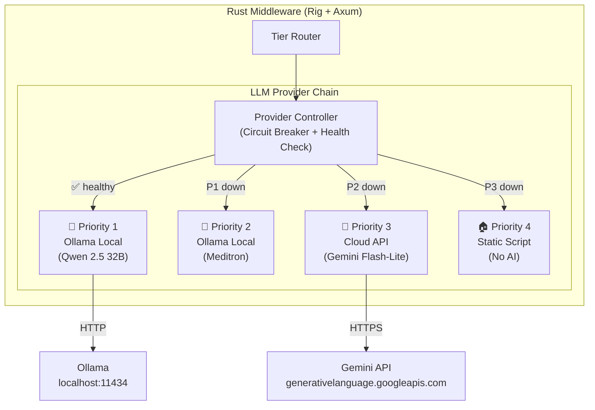

# ☁️ Cloud API Fallback Strategy
## Gemini API / Qwen API เป็นแผนสำรองสำหรับ Local Ollama

| ฟิลด์              | ค่า                                                                                                                                                                                      |
| ---------------- | --------------------------------------------------------------------------------------------------------------------------------------------------------------------------------------- |
| **วันที่**          | 2026-02-17                                                                                                                                                                              |
| **เอกสารประกอบ** | [TRD](file:///Volumes/T7%20Shield/Project-Mimir/docs/TRD_Project-Mimir_TH.md), [Framework Analysis](file:///Volumes/T7%20Shield/Project-Mimir/docs/Framework_Analysis_Project-Mimir.md) |

---

## 1. ทำไมต้องมี Cloud API Fallback?

ปัจจุบัน TRD กำหนด Fallback 4 ระดับ (L0–L4) แต่ทั้งหมดอยู่บน **Mac mini เครื่องเดียว**:

```
L0: Qwen 2.5 32B (Primary)
L1: Qwen + Reduced prompt
L2: Meditron (Fallback model)
L3: Static Script (ไม่ใช้ AI)
```

**ปัญหา:** ถ้า Mac mini ล่มทั้งเครื่อง (ไฟดับ, Hardware failure) → Fallback ทั้ง L0–L2 ใช้ไม่ได้ ต้องตก L3 ทันที

**ทางออก:** เพิ่ม **L2.5: Cloud API** เป็น Fallback ก่อนตกไป Static Script

```
L0: Ollama Local → Qwen 2.5 32B (Primary)
L1: Ollama Local → Reduced prompt mode
L2: Ollama Local → Meditron (Alt model)
L2.5: ☁️ Cloud API → Gemini / Qwen API     ← ใหม่!
L3: Static Script (ไม่ใช้ AI)
```

---

## 2. เปรียบเทียบ Cloud Provider

### 2.1 Gemini API (Google)

| รุ่น                        | Input ($/1M tokens) | Output ($/1M tokens) | Latency | เหมาะกับ             |
| ------------------------- | ------------------- | -------------------- | ------- | ------------------- |
| **Gemini 2.5 Flash-Lite** | $0.10               | $0.40                | ~300ms  | Tier 1: NPC Chat ⭐  |
| **Gemini 2.5 Flash**      | $0.30               | $2.50                | ~500ms  | Tier 2: Oracle      |
| **Gemini 2.5 Pro**        | $1.25               | $10.00               | ~1.5s   | Tier 3: GM (ไม่จำเป็น) |

**ข้อดี:**
- Rig มี **Gemini Provider สำเร็จรูป** (`rig::providers::gemini`) → ไม่ต้องเขียนเพิ่ม
- Free Tier ให้ทดสอบก่อน
- Latency ต่ำ, Infra เสถียร
- Flash-Lite ราคาถูกมากสำหรับ NPC Chat

**ข้อเสีย:**
- ข้อมูลผู้เล่นออกไปนอก (Privacy concern)
- Rate limit Free tier = 15 RPM

### 2.2 Qwen API (Alibaba Cloud)

| รุ่น                  | Input ($/1M tokens) | Output ($/1M tokens) | Latency | เหมาะกับ             |
| ------------------- | ------------------- | -------------------- | ------- | ------------------- |
| **Qwen-Turbo**      | $0.05               | $0.20                | ~400ms  | Tier 1: NPC Chat ⭐  |
| **Qwen-Plus**       | $0.80               | $2.00                | ~600ms  | Tier 2: Oracle      |
| **Qwen3-235B-A22B** | $0.26               | $0.78                | ~800ms  | Tier 2: Complex RAG |

**ข้อดี:**
- **ถูกที่สุด** — Qwen-Turbo แทบไม่มีค่าใช้จ่าย
- Qwen ตระกูลเดียวกับ Local model → พฤติกรรมคล้ายกัน
- Rig ใช้ผ่าน **OpenAI-compatible API** ได้ (Alibaba Cloud รองรับ)

**ข้อเสีย:**
- ต้อง Route ผ่าน Alibaba Cloud Singapore (latency อาจสูงกว่า Gemini)
- Free quota จำกัด 1M tokens
- ข้อมูลผ่าน Alibaba Cloud (Privacy concern)

### 2.3 สรุปเปรียบเทียบ

| เกณฑ์                     | Gemini                   | Qwen API            |
| ------------------------ | ------------------------ | ------------------- |
| **Rig Integration**      | ✅ Native provider        | ⚠️ ผ่าน OpenAI-compat |
| **ราคา (Tier 1)**        | $0.50/1M tokens          | **$0.25/1M tokens** |
| **ราคา (Tier 2)**        | $2.80/1M tokens          | **$2.80/1M tokens** |
| **Latency**              | **~300-500ms**           | ~400-800ms          |
| **Consistency กับ Local** | ปานกลาง                  | **สูง** (ตระกูล Qwen) |
| **Free Tier**            | **15 RPM ฟรี**            | 1M tokens ฟรี        |
| **Reliability**          | **สูงมาก** (Google Infra) | สูง                  |

---

## 3. สถาปัตยกรรมที่แนะนำ: Multi-Provider Fallback

### 3.1 Architecture Diagram



### 3.2 Provider Abstraction Layer

```rust
// แนวคิด: สร้าง Trait ครอบ Provider ทุกตัว
// Rig รองรับ multiple providers อยู่แล้ว — เราแค่ wrap ด้วย fallback logic

use rig::providers::{ollama, gemini};

pub struct ProviderChain {
    providers: Vec<Box<dyn LlmProvider>>,  // เรียงตาม priority
    circuit_breakers: Vec<CircuitBreaker>,
}

impl ProviderChain {
    pub fn new() -> Self {
        Self {
            providers: vec![
                Box::new(OllamaProvider::new("qwen2.5:32b-q4")),    // P1
                Box::new(OllamaProvider::new("meditron")),           // P2
                Box::new(GeminiProvider::new("gemini-2.5-flash-lite")), // P3
            ],
            circuit_breakers: vec![
                CircuitBreaker::new(5, Duration::from_secs(30)),
                CircuitBreaker::new(5, Duration::from_secs(30)),
                CircuitBreaker::new(3, Duration::from_secs(60)),
            ],
        }
    }

    pub async fn chat(&self, prompt: &str) -> Result<String> {
        for (i, provider) in self.providers.iter().enumerate() {
            if self.circuit_breakers[i].is_open() { continue; }
            
            match provider.chat(prompt).await {
                Ok(response) => return Ok(response),
                Err(e) => {
                    self.circuit_breakers[i].record_failure();
                    tracing::warn!("Provider {} failed: {}, trying next", i, e);
                    continue;
                }
            }
        }
        // ทุก Provider ล้มเหลว → Static Script
        Err(anyhow!("All providers failed"))
    }
}
```

### 3.3 Tier-Specific Provider Mapping

| Tier                | Local (P1-P2)           | Cloud (P3)                | เหตุผล                                |
| ------------------- | ----------------------- | ------------------------- | ------------------------------------ |
| **Tier 1** NPC Chat | Qwen 2.5 32B → Meditron | **Gemini 2.5 Flash-Lite** | ถูก+เร็ว, NPC Chat ไม่มี sensitive data  |
| **Tier 2** Oracle   | Qwen 2.5 32B → Meditron | **Gemini 2.5 Flash**      | ต้องการ Tool Calling, Flash รองรับ     |
| **Tier 3** AI GM    | Qwen 2.5 32B เท่านั้น      | **ไม่ใช้ Cloud**            | ข้อมูล Log เป็น sensitive, ทำเบื้องหลังรอได้ |

> [!WARNING]
> **Tier 3 (AI GM) ไม่ควรใช้ Cloud API** เพราะต้องส่ง Player behavior logs ออกไปภายนอก ซึ่งเป็นข้อมูลที่อาจละเอียดอ่อน

---

## 4. การออกแบบเชิงลึก

### 4.1 Privacy Guard — กรองข้อมูลก่อนส่ง Cloud

```rust
// เมื่อ Fallback ไป Cloud API → ต้องกรองข้อมูลก่อน
fn sanitize_for_cloud(req: &ChatRequest) -> CloudSafeRequest {
    CloudSafeRequest {
        // ✅ ส่งได้: NPC persona, game lore, item data
        persona: req.persona.clone(),
        message: req.message.clone(),
        
        // ❌ ไม่ส่ง: player_id จริง, IP, session details
        player_id: anonymize(&req.player_id),
        player_context: PlayerContext {
            level: req.player_context.level,
            job_class: req.player_context.job_class.clone(),
            // ตัด: map position, guild info, inventory
            ..Default::default()
        },
    }
}
```

### 4.2 Cost Control — ป้องกันค่าใช้จ่ายบานปลาย

```yaml
# config/cloud_limits.yaml
cloud_api:
  monthly_budget_usd: 50.00        # งบไม่เกิน $50/เดือน
  daily_budget_usd: 5.00           # ไม่เกิน $5/วัน
  max_requests_per_minute: 30      # จำกัด RPM
  max_tokens_per_request: 500      # จำกัด response length
  alert_threshold_percent: 80      # แจ้งเตือนเมื่อใช้ 80% ของงบ
  
  # ตัด Cloud ถ้าเกินงบ → ตกไป Static Script
  kill_switch: true
```

### 4.3 Config Module Update

```rust
// เพิ่มใน config.rs
pub struct CloudConfig {
    pub gemini_api_key: Option<String>,      // จาก env: GEMINI_API_KEY
    pub qwen_api_key: Option<String>,        // จาก env: QWEN_API_KEY
    pub cloud_enabled: bool,                 // เปิด/ปิด Cloud fallback
    pub monthly_budget_usd: f64,
    pub daily_budget_usd: f64,
    pub max_rpm: u32,
}
```

---

## 5. ประมาณค่าใช้จ่ายรายเดือน

### สมมติฐาน
- Local Ollama ล่มเฉลี่ย **2 ชั่วโมง/เดือน** (99.7% uptime)
- ช่วงล่ม มี ~50 active players ถามคำถามเฉลี่ย 10 ครั้ง/คน/ชม
- แต่ละ request ใช้ ~500 input tokens + ~300 output tokens

### คำนวณ

| Item           | จำนวน                                       |
| -------------- | ------------------------------------------ |
| Requests ช่วงล่ม | 50 players × 10 req × 2 hr = **1,000 req** |
| Input tokens   | 1,000 × 500 = **500K tokens**              |
| Output tokens  | 1,000 × 300 = **300K tokens**              |

| Provider              | ค่าใช้จ่าย/เดือน (Fallback only)                    |
| --------------------- | ----------------------------------------------- |
| **Gemini Flash-Lite** | (0.5M × $0.10 + 0.3M × $0.40) / 1M = **~$0.17** |
| **Gemini Flash**      | (0.5M × $0.30 + 0.3M × $2.50) / 1M = **~$0.90** |
| **Qwen-Turbo**        | (0.5M × $0.05 + 0.3M × $0.20) / 1M = **~$0.09** |

> [!TIP]
> **ค่าใช้จ่าย Cloud แทบไม่มีนัยสำคัญ** เพราะใช้เฉพาะตอน Local ล่มเท่านั้น — ไม่เกิน **$1/เดือน** ในกรณีปกติ

### กรณีเลวร้าย (Mac mini ล่ม 24 ชั่วโมง)

| Provider              | ค่าใช้จ่าย/วัน |
| --------------------- | ---------- |
| **Gemini Flash-Lite** | ~$2.00     |
| **Qwen-Turbo**        | ~$1.10     |

---

## 6. คำแนะนำ: ลำดับ Priority

### แนะนำ: **Gemini 2.5 Flash-Lite เป็น Cloud Fallback หลัก**

| เหตุผล              | รายละเอียด                                    |
| ------------------ | -------------------------------------------- |
| Rig Native Support | `rig::providers::gemini` — ไม่ต้องเขียน adapter |
| ราคาถูก             | ~$0.17/เดือน ในการใช้งานปกติ                    |
| Latency ต่ำ          | ~300ms — เร็วกว่า Qwen API                     |
| Free Tier          | ทดสอบได้ฟรี                                    |
| Google Infra       | Reliability สูงมาก                            |

### Optional: **Qwen-Turbo เป็น Cloud Fallback สำรอง (P4)**

ถ้าต้องการ Fallback อีกชั้น, เพิ่ม Qwen-Turbo หลัง Gemini:

```
P1: Ollama → Qwen 2.5 32B      (Local, Free)
P2: Ollama → Meditron           (Local, Free)
P3: Gemini 2.5 Flash-Lite       (Cloud, ~$0.17/mo)
P4: Qwen-Turbo via OpenAI API   (Cloud, ~$0.09/mo)
P5: Static Script               (No AI)
```

---

## 7. ผลกระทบต่อ Implementation Plan

### ไฟล์ที่ต้องเพิ่ม/แก้ไข

| ไฟล์                              | การเปลี่ยนแปลง                               | Phase   |
| -------------------------------- | ------------------------------------------ | ------- |
| `Cargo.toml`                     | เพิ่ม `rig-core` features: `gemini`          | Phase 1 |
| `src/config.rs`                  | เพิ่ม `CloudConfig`                          | Phase 1 |
| `src/services/provider_chain.rs` | **[NEW]** Provider Chain + Circuit Breaker | Phase 2 |
| `src/services/privacy_guard.rs`  | **[NEW]** Sanitize data ก่อนส่ง Cloud        | Phase 2 |
| `src/services/cost_tracker.rs`   | **[NEW]** ติดตามค่าใช้จ่าย Cloud               | Phase 2 |
| `config/cloud_limits.yaml`       | **[NEW]** Budget + Rate limits             | Phase 1 |
| `docker-compose.yml`             | ไม่กระทบ (Cloud = external)                 | —       |

### เพิ่มเข้า Sprint ไหน?
- **Phase 1 (Sprint 1.2):** เพิ่ม Cloud config + dependency
- **Phase 2 (Sprint 2.3):** สร้าง Provider Chain + Privacy Guard + Cost Tracker
- **Phase 4 (Sprint 4.2):** ทดสอบ Failover scenario: kill Ollama → verify Cloud fallback

---

*สิ้นสุดเอกสาร Cloud API Fallback Strategy*
