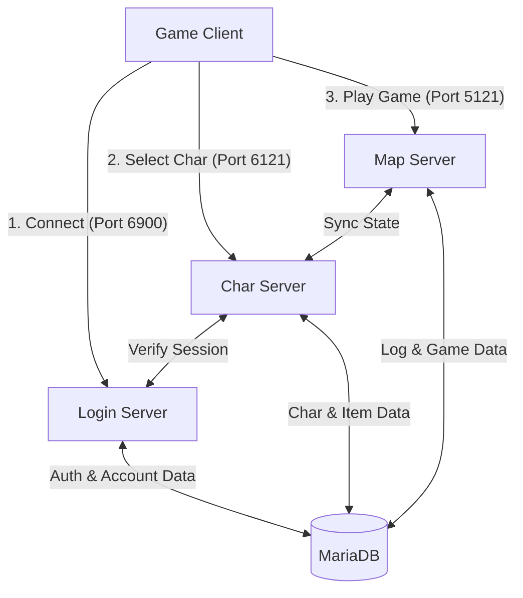

# 🏛️ rAthena System Architecture & Database Schema

เอกสารฉบับนี้สรุปโครงสร้างการทำงานของ rAthena Architecture และความสัมพันธ์ของ Database Tables เพื่อให้ทีมงานเข้าใจ Data Flow ของระบบเกม

---

## 🏗️ 1. System Architecture (3-Tier Structure)

rAthena แบ่งการทำงานออกเป็น 3 Server หลักที่ทำงานประสานกันผ่าน Socket Connection (Inter-server Protocol)

### Server Roles
1.  **Login Server (Port 6900)**
    -   **หน้าที่:** ตรวจสอบ ID/Password, จัดการ Ban, และส่งรายชื่อ Server ให้ Client
    -   **Database:** อ่าน/เขียนตาราง `login`, `ipbanlist`
2.  **Char Server (Port 6121)**
    -   **หน้าที่:** โหลดข้อมูลตัวละคร, สร้าง/ลบตัวละคร, จัดการ Party/Guild เบื้องต้น
    -   **Database:** อ่าน/เขียนตาราง `char`, `inventory`, `memo`, `party`, `guild`
3.  **Map Server (Port 5121)**
    -   **หน้าที่:** คำนวณ Logic เกมทั้งหมด (Move, Attack, Skill, NPC), จัดการ AI มอนสเตอร์
    -   **Connection:** รับข้อมูลตัวละครจาก Char Server เมื่อผู้เล่นเข้าแมพ และส่งข้อมูลกลับไปบันทึกเมื่อ Logout หรือ Save

---

## 🗄️ 2. Database Schema & Relations

rAthena เก็บข้อมูลแบบ Relational Database (MySQL/MariaDB) โดยมี Key Tables ดังนี้:

### 🔑 User & Authentication (`login`)
ตารางหลักสำหรับจัดการ ID ผู้เล่น
-   `account_id` (PK): รหัสอ้างอิงระดับ Account (ใช้เชื่อมโยงกับทุกตาราง)
-   `userid`: ชื่อ ID ที่ใช้ Login
-   `user_pass`: รหัสผ่าน (MD5)
-   `sex`: เพศของ ID (M/F)

### 👤 Character Data (`char`)
เก็บ Status และข้อมูลพื้นฐานของตัวละคร เชื่อมโยงกับ `login` ด้วย `account_id`
-   `char_id` (PK): รหัสระบุตัวละคร
-   `account_id`: เจ้าของตัวละคร (Foreign Key -> login)
-   `name`: ชื่อตัวละคร (Unique)
-   `base_level`, `job_level`: เลเวล
-   `zeny`: เงินในตัว
-   `str`, `agi`, `vit`, ...: ค่า Status
-   `last_map`, `last_x`, `last_y`: พิกัดล่าสุดก่อน Logout

### 🎒 Inventory & Storage
เก็บไอเทมของผู้เล่น โดยแยกตามสถานที่เก็บ
-   **`inventory`**: ของในตัวละคร
    -   `char_id`: ของใคร
    -   `nameid`: รหัสไอเทม (Item ID)
    -   `amount`: จำนวน
    -   `equip`: ตำแหน่งที่สวมใส่ (เช่น หัว, ตัว, มือ)
    -   `card0`-`card3`: การ์ดที่ใส่ใน Slot
-   **`cart_inventory`**: ของในรถเข็น (Merchant)
-   **`storage`**: ของใน Kafra (แชร์ใน Account เดียวกัน)

### 🤝 Community (Guild & Party)
-   **`party`**: ข้อมูลปาร์ตี้เชื่อมโยงด้วย `char_id` ของหัวหน้าและสมาชิก
-   **`guild`**: ข้อมูลกิลด์ (Level, Exp, Emblem)
-   **`guild_member`**: สมาชิกกิลด์และตำแหน่ง (Position)

### 💾 Variables (Persistent Data)
ใช้สำหรับจำค่าของ NPC หรือ Quest
-   `global_reg_value`: ตัวแปรระดับ Account (ใช้ร่วมกันทุกตัวใน ID)
-   `char_reg_num` / `char_reg_str`: ตัวแปรระดับตัวละคร (เช่น ผ่านเควส A หรือยัง)

### 📜 Logs (สำคัญสำหรับ AI GM)
-   `picklog`: ประวัติการเก็บ/โยน/แลกเปลี่ยนไอเทม
-   `zenylog`: ประวัติการเงิน
-   `chatlog`: ประวัติการคุย (ต้องเปิด Config พิเศษ)

---

## 🔄 3. Data Flow Example: Player Login

1.  **Auth:** Client ส่ง ID/Pass -> `Login Server` เช็คตาราง `login` -> ถ้าผ่าน ส่ง Session Key กลับ
2.  **Char Select:** Client ส่ง Session Key -> `Char Server` เช็ค `login` + ดึงข้อมูล `char` ทั้งหมดของ ID นั้นมาแสดง
3.  **Enter Game:** ผู้เล่นเลือกตัวละคร -> `Char Server` ดึง `inventory`, `skill`, `memo` ฯลฯ -> ส่ง Packet ก้อนใหญ่ให้ `Map Server`
4.  **Playing:** `Map Server` จำลองโลกเกม เมื่อมีการเก็บของ/อัพเวล จะอัปเดตใน Memory ก่อน แล้วค่อย Sync ลง DB เป็นระยะ (Autosave Loop) หรือทันทีที่สำคัญ (Trade/Storage)

---

### 💡 For Project Mimir (AI Integration)
-   **AI Agent** ควรอ่านข้อมูลจาก `char` และ `inventory` เพื่อดู State ผู้เล่น
-   **Oracle Bot** ควรอ่าน `item_db` และ `mob_db` (ที่เป็น YAML/SQL) เพื่อตอบคำถาม
-   **Monitoring** ควรจับตาดู `picklog` และ `zenylog` เพื่อหาความผิดปกติ (Anomaly Detection)
