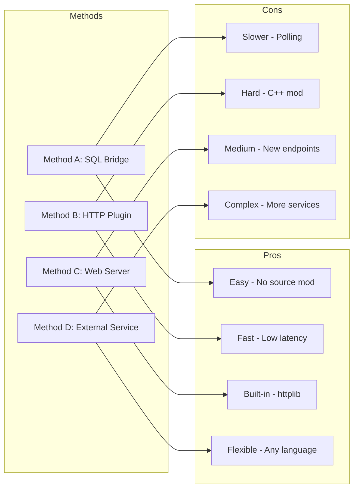

# 🧠 Techniques for AI-Driven NPC Agents

เอกสารนี้สรุปเทคนิคสำคัญ (Best Practices) ในการนำ AI Agent มาใช้ควบคุม NPC ให้มีการตัดสินใจและบทสนทนาที่สมจริง โดยเน้นที่การประยุกต์ใช้ **LLM (Large Language Model)** ร่วมกับ **Game Logic**

---

## 1. Persona & Context Injection (การสร้างตัวตน)
หัวใจสำคัญคือการทำให้ AI รู้ว่า "ฉันคือใคร" และ "สถานการณ์ตอนนี้คืออะไร" ผ่าน System Prompt

### 🎭 Technical Implementation
-   **Static Persona:** ระบุอุปนิสัย (Personality), Tone of Voice, และ Background Story
-   **Dynamic Context:** แทรกข้อมูล Real-time ของผู้เล่นเข้าไปใน Prompt ทุกครั้งที่คุย

**Example System Prompt:**
```text
Role: You are "Kafra Bim", a cheerful and helpful staff member in Prontera.
Tone: Friendly, polite, ends sentences with "Ka~".
Current Context:
- Player Name: "HeroA"
- Player HP: 25% (Critical Condition)
- Player Reputation: High (Hero of the village)

Task: Greet the player based on their condition.
```

---

## 2. Structured Output & Function Calling (การตัดสินใจ)
NPC ต้องไม่เพียงแค่ "คุย" แต่ต้อง "ทำ" (Action) ได้ด้วย เราใช้เทคนิค **JSON Mode** หรือ **Function Calling** เพื่อบังคับให้ LLM ตอบกลับเป็น Format ที่โปรแกรมอ่านรู้เรื่อง

### ⚙️ Mechanism
แทนที่จะตอบ Text ยาวๆ ให้ AI ตอบเป็น JSON:
```json
{
  "thought": "ผู้เล่นเจ็บหนักและเป็นฮีโร่ ฉันควรรีบรักษาเขาและไม่คิดเงิน",
  "speech": "ว้าย! คุณ HeroA บาดเจ็บหนักมาเลย เดี๋ยวบิมรักษาให้นะคะ!",
  "actions": [
    { "type": "EMOTE", "id": "ET_WORRY" },
    { "type": "SKILL", "id": "AL_HEAL", "target": "PLAYER" }
  ]
}
```
*ตัว Backend (Rust) จะ Parse JSON นี้แล้วส่งคำสั่งไปยัง rAthena*

---

## 3. Memory & State Management (ความจำ)
เพื่อให้ NPC ดู "ใส่ใจ" และ "มีความสัมพันธ์" กับผู้เล่น

### 🧠 Techniques
1.  **Short-term Memory (Conversation History):** จำบทสนทนา 5-10 ประโยคล่าสุด เพื่อให้คุยต่อเนื่องได้รู้เรื่อง
2.  **Long-term Memory (Summarization/Vector DB):**
    -   เมื่อจบการสนทนา ให้ AI สรุปใจความสำคัญ (เช่น "ผู้เล่น A ชอบสีแดง") เก็บลง Database
    -   เมื่อเจอหน้าครั้งถัดไป ให้ดึงข้อมูลนี้มาใส่ใน Prompt (เช่น "จำได้ว่าคุณ A ชอบสีแดง วันนี้มีหมวกแดงมาขายนะ")

---

## 4. Retrieval-Augmented Generation (RAG) (คลังความรู้)
สำหรับ NPC ที่ต้องตอบคำถามเกี่ยวกับ Lore หรือข้อมูลเกม (Oracle/Guide NPC)

### 📚 Workflow
1.  **User Query:** "ดาบ Fireblend ดรอปจากตัวอะไร?"
2.  **Retrieve:** ระบบค้นหาข้อมูลใน Vector DB (Wiki Data)
3.  **Augment:** เอาข้อมูลที่เจอแปะไปกับ Prompt
4.  **Generate:** NPC ตอบ "อ๋อ ดาบนั้นดรอปจาก Blender ใน Magma Dungeon จ้ะ"

---

## 5. Chain of Thought (CoT) (การคิดซับซ้อน)
สำหรับ Quest NPC หรือ NPC ที่ต้องแก้ปัญหา ให้ AI "คิดให้เสร็จก่อนตอบ"

### 🧩 Logic
บังคับให้ AI สร้าง `<thought>` block ก่อนสร้าง `<response>`:
-   **Input:** "ขอกุญแจเข้าดันเจี้ยนหน่อย"
-   **AI Thought:** "เช็คเงื่อนไข -> ผู้เล่นเลเวลไม่ถึง 50 -> ถ้าให้ไปจะอันตราย -> ตัดสินใจปฏิเสธแบบเป็นห่วง"
-   **AI Response:** "ไม่ได้หรอกจ้ะ มันอันตรายเกินไปสำหรับเธอตอนนี้ ไปฝึกมาเพิ่มก่อนนะ"

---

## 6. Hybrid System (ผสมผสาน)
ใช้ Rule-Based คู่กับ AI เพื่อความเสถียรและประหยัด
-   **Trigger:** ใช้ Script ปกติเช็คเบื้องต้น (เช่น เงินพอไหม)
-   **Fallback:** ถ้าเป็นเรื่องทั่วไปที่ไม่กระทบ Game Balance -> ให้ AI คุย
-   **Critical:** ถ้าเป็นเรื่องสำคัญ (เปลี่ยนอาชีพ, รับของรางวัล) -> ใช้ Hardcode Script หรือตรวจสอบ Output จาก AI อย่างเคร่งครัด

---

## 7. Client-rAthena-AI Communication (การสื่อสารระหว่าง Client กับ AI)

### 🔌 Communication Architecture

การที่ Game Client จะสื่อสารกับ AI Agent จำเป็นต้องผ่าน rAthena Server เป็นตัวกลาง โดยมีวิธีการหลัก 4 แบบ:



### 📋 Method Comparison

| Method               | Difficulty | Latency    | Reliability | Best For          |
| -------------------- | ---------- | ---------- | ----------- | ----------------- |
| **SQL Bridge**       | ⭐ Easy     | ~200-500ms | ✅ High      | Production, MVP   |
| **HTTP Plugin**      | ⭐⭐⭐ Hard   | ~50-200ms  | ⚠️ Medium    | High-performance  |
| **Web Server**       | ⭐⭐ Medium  | ~100-300ms | ✅ High      | REST API needs    |
| **External Service** | ⭐ Easy     | ~200-500ms | ✅ High      | Python/Node teams |

### 🎯 Recommended: SQL Bridge Method

**Method A: SQL Database Bridge** เป็นวิธีที่แนะนำสำหรับ Project Mimir เพราะ:

1. **ไม่ต้องแก้ไข Source Code** - ใช้ `query_sql()` command ที่มีอยู่แล้ว
2. **ง่ายต่อ Debug** - ดูข้อมูลใน Database ได้โดยตรง
3. **Scale ได้** - AI Bridge รันแยกจาก Game Server
4. **Fallback ง่าย** - ถ้า AI ไม่ตอบ ใช้ static message แทน

### 📝 Implementation Flow

```c
// NPC Script ส่ง Request
query_sql("INSERT INTO ai_npc_request (session_id, message, context) VALUES (...)");

// NPC Script รอ Response (Polling)
while (timeout_not_reached) {
    query_sql("SELECT response FROM ai_npc_response WHERE session_id = ...");
    if (response_found) break;
    sleep2 100;  // รอ 100ms
}

// แสดงผล
mes .@response$;
```

### 🔗 Detailed Documentation

สำหรับรายละเอียดการ Implement แบบเต็ม ดูได้ที่:
- **[rAthena Client-to-AI Communication](./rAthena_Client_AI_Communication.md)** - คู่มือการสื่อสารแบบละเอียด
- **[AI NPC Integration Design](./AI_NPC_Integration_Design.md)** - ตัวอย่าง Healer NPC
- **[rAthena NPC System](./rAthena_NPC_System.md)** - พื้นฐาน NPC Scripting
