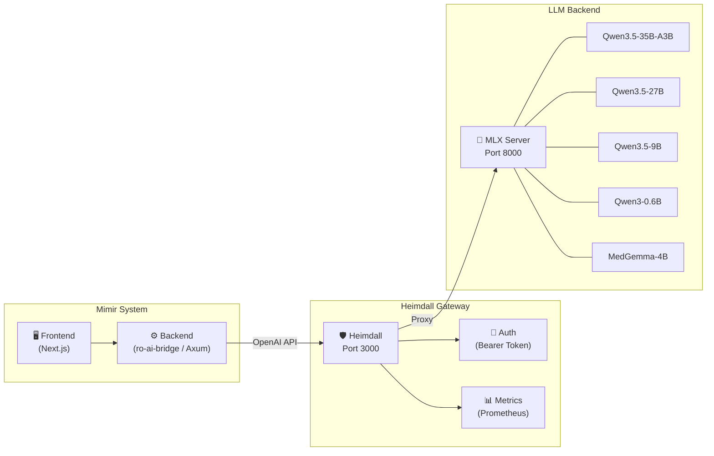
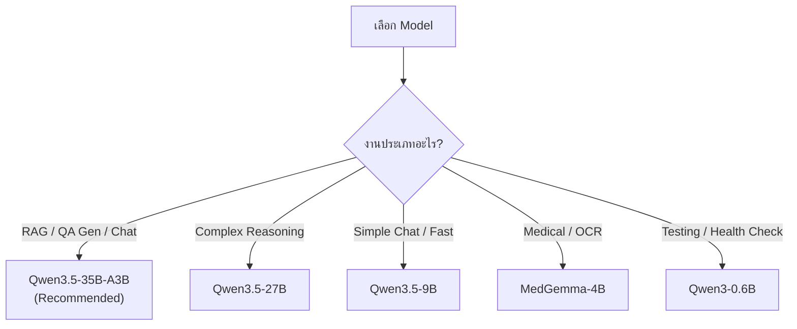
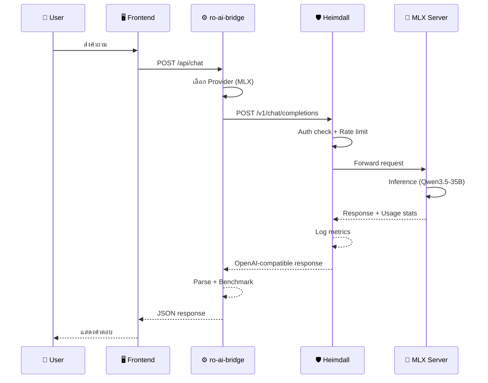

# 🛡️ Heimdall — Self-Hosted LLM Gateway

## สำหรับ Project Mimir

| ฟิลด์            | ค่า                                                                     |
| -------------- | ---------------------------------------------------------------------- |
| **วันที่**        | 2026-03-03                                                             |
| **Version**    | 0.5.0                                                                  |
| **Server URL** | `http://192.168.1.133:3000`                                            |
| **Backend**    | MLX Server (`http://127.0.0.1:8000`)                                   |
| **ภาษาที่พัฒนา**  | Rust                                                                   |
| **คำอธิบาย**     | Guardian of the LLM realm — API Gateway proxy สำหรับ LLM backend engines |

---

## 1. ภาพรวม (Overview)

**Heimdall** คือ API Gateway ที่พัฒนาด้วย Rust ทำหน้าที่เป็นตัวกลางระหว่าง Mimir กับ LLM backend engines โดยรองรับ:

- **MLX Server** — สำหรับ Apple Silicon (M1/M2/M3/M4)
- **llama.cpp** — สำหรับ CPU/GPU inference
- **Ollama** — สำหรับ container-based LLM serving

Heimdall แปลง requests ให้อยู่ในรูปแบบ **OpenAI-compatible API** ทำให้ Mimir สามารถเรียกใช้ LLM ได้โดยไม่ต้องสนใจว่า backend เป็น engine ตัวไหน

### Architecture Diagram



---

## 2. โมเดลที่โหลดอยู่ (Available Models)

| #   | Model ID                                     | ขนาด                   | เหมาะสำหรับ                                  | หมายเหตุ                   |
| --- | -------------------------------------------- | ---------------------- | ------------------------------------------ | ------------------------- |
| 1   | `mlx-community/Qwen3.5-35B-A3B-4bit`         | 35B (Sparse 3B Active) | **Primary** — งาน RAG, Chat, QA Generation | MoE model, ประสิทธิภาพสูงมาก |
| 2   | `mlx-community/Qwen3.5-27B-4bit`             | 27B                    | งานทั่วไปที่ต้องการ reasoning สูง                | Dense model               |
| 3   | `mlx-community/Qwen3.5-9B-MLX-4bit`          | 9B                     | งานเบาๆ, ทดสอบ, latency ต่ำ                  | เร็วที่สุดในกลุ่ม Qwen          |
| 4   | `mlx-community/Qwen3-0.6B-4bit`              | 0.6B                   | Smoke test, health check, embedding เบื้องต้น | เล็กมาก ใช้ RAM น้อย         |
| 5   | `lmstudio-community/medgemma-4b-it-MLX-4bit` | 4B                     | Medical domain, OCR verification           | Google MedGemma fine-tune |

### Model Selection Guide



---

## 3. API Endpoints

### 3.1 Gateway Endpoints (ไม่ต้อง Auth)

| Endpoint    | Method | คำอธิบาย                                       | ตัวอย่าง                                    |
| ----------- | ------ | -------------------------------------------- | ----------------------------------------- |
| `/`         | `GET`  | ข้อมูลพื้นฐานของ Heimdall                        | `curl http://192.168.1.133:3000/`         |
| `/health`   | `GET`  | ตรวจสอบสถานะ Gateway + Backend               | `curl http://192.168.1.133:3000/health`   |
| `/ready`    | `GET`  | Readiness probe สำหรับ container orchestration | `curl http://192.168.1.133:3000/ready`    |
| `/metrics`  | `GET`  | Prometheus metrics (request counts, latency) | `curl http://192.168.1.133:3000/metrics`  |
| `/docs`     | `GET`  | Scalar interactive API documentation (UI)    | เปิดใน browser                             |
| `/api-spec` | `GET`  | OpenAPI 3.1 spec (JSON)                      | `curl http://192.168.1.133:3000/api-spec` |

### 3.2 OpenAI-Compatible Endpoints (ต้อง Auth ถ้าตั้งค่า API Key)

| Endpoint               | Method | คำอธิบาย                                              |
| ---------------------- | ------ | --------------------------------------------------- |
| `/v1/chat/completions` | `POST` | **Chat Completions** — รองรับ JSON และ SSE streaming |
| `/v1/completions`      | `POST` | **Text Completions** — legacy format                |
| `/v1/embeddings`       | `POST` | **Create Embeddings** — สร้าง vector จากข้อความ       |
| `/v1/models`           | `GET`  | **List Models** — แสดงรายการโมเดลที่พร้อมใช้            |

### 3.3 Authentication

Heimdall ใช้ **Bearer Token** authentication:

```bash
curl -H "Authorization: Bearer $HEIMDALL_API_KEY" \
  http://192.168.1.133:3000/v1/models
```

> [!CAUTION]
> **อย่าเก็บ API Key ใน source code หรือ docs ที่ commit ขึ้น git!**

#### การจัดการ API Key ผ่าน Vault

API Key ของ Heimdall ถูกเก็บใน **HashiCorp Vault** ที่ path:

```
secret/mimir → heimdall_api_key
```

**วิธีเก็บ key ผ่าน Vault Web UI:**
1. เปิด Vault UI: `http://localhost:8200`
2. Login ด้วย Token: `mimir-dev-token` (dev mode)
3. ไปที่ **Secrets Engines** → `secret/`
4. เปิด path `mimir` (หรือสร้างใหม่ถ้ายังไม่มี)
5. เพิ่ม key: `heimdall_api_key` พร้อมใส่ค่า API key

**วิธีเก็บ key ผ่าน CLI:**
```bash
export VAULT_ADDR=http://localhost:8200
export VAULT_TOKEN=mimir-dev-token

vault kv put secret/mimir heimdall_api_key="hml-mimir-xxxx..."
```

**วิธีดึง key มาใช้:**
```bash
vault kv get -field=heimdall_api_key secret/mimir
```

Mimir จะใช้ `resolve_secret("HEIMDALL_API_KEY", ...)` ซึ่งจะดึงจาก Vault อัตโนมัติ (fallback ไปใช้ env var ถ้า Vault ไม่พร้อม)

> [!NOTE]
> ถ้าไม่มี API key ตั้งค่าบน Heimdall server → authentication จะถูก disabled อัตโนมัติ (เหมาะสำหรับ local network)

---

## 4. ตัวอย่างการใช้งาน (Usage Examples)

### 4.1 ตรวจสอบ Health

```bash
curl -s http://192.168.1.133:3000/health | jq
```

**Response:**
```json
{
  "status": "healthy",
  "gateway": "healthy",
  "backend": {
    "url": "http://127.0.0.1:8000",
    "status": "healthy",
    "models": { "data": [...], "object": "list" }
  },
  "timestamp": "2026-03-03T16:44:11.889903+00:00"
}
```

### 4.2 List Models

```bash
curl -s http://192.168.1.133:3000/v1/models | jq '.data[].id'
```

**Response:**
```
"lmstudio-community/medgemma-4b-it-MLX-4bit"
"mlx-community/Qwen3.5-35B-A3B-4bit"
"mlx-community/Qwen3.5-27B-4bit"
"mlx-community/Qwen3-0.6B-4bit"
"mlx-community/Qwen3.5-9B-MLX-4bit"
```

### 4.3 Chat Completions (Non-Streaming)

```bash
curl -X POST http://192.168.1.133:3000/v1/chat/completions \
  -H "Content-Type: application/json" \
  -d '{
    "model": "mlx-community/Qwen3.5-35B-A3B-4bit",
    "messages": [
      {"role": "system", "content": "คุณเป็น AI ผู้ช่วยตอบคำถามภาษาไทย"},
      {"role": "user", "content": "สวัสดี ช่วยแนะนำตัวหน่อย"}
    ],
    "max_tokens": 512,
    "temperature": 0.7
  }'
```

**Response:**
```json
{
  "id": "chatcmpl-xxx",
  "object": "chat.completion",
  "model": "mlx-community/Qwen3.5-35B-A3B-4bit",
  "choices": [
    {
      "index": 0,
      "message": {
        "role": "assistant",
        "content": "สวัสดีครับ! ผมเป็น AI ผู้ช่วย..."
      },
      "finish_reason": "stop"
    }
  ],
  "usage": {
    "prompt_tokens": 25,
    "completion_tokens": 80,
    "total_tokens": 105
  }
}
```

### 4.4 Chat Completions (Streaming / SSE)

```bash
curl -X POST http://192.168.1.133:3000/v1/chat/completions \
  -H "Content-Type: application/json" \
  -d '{
    "model": "mlx-community/Qwen3.5-35B-A3B-4bit",
    "messages": [
      {"role": "user", "content": "อธิบาย RAG ให้ฟังหน่อย"}
    ],
    "stream": true,
    "max_tokens": 256
  }'
```

**Response (SSE):**
```
data: {"id":"chatcmpl-xxx","choices":[{"delta":{"content":"RAG"}}]}
data: {"id":"chatcmpl-xxx","choices":[{"delta":{"content":" ย่อ"}}]}
data: {"id":"chatcmpl-xxx","choices":[{"delta":{"content":"มาจาก"}}]}
...
data: [DONE]
```

### 4.5 Create Embeddings

```bash
curl -X POST http://192.168.1.133:3000/v1/embeddings \
  -H "Content-Type: application/json" \
  -d '{
    "model": "mlx-community/Qwen3.5-9B-MLX-4bit",
    "input": "ระบบ RAG สำหรับตอบคำถาม"
  }'
```

**Response:**
```json
{
  "object": "list",
  "data": [
    {
      "object": "embedding",
      "index": 0,
      "embedding": [0.0123, -0.0456, ...]
    }
  ],
  "model": "mlx-community/Qwen3.5-9B-MLX-4bit",
  "usage": { "prompt_tokens": 12, "total_tokens": 12 }
}
```

---

## 5. การเชื่อมต่อกับ Mimir (Integration)

### 5.1 Provider Config ฝั่ง Mimir

Mimir ใช้ `llm_provider.rs` (`mimir-core-ai`) ในการเชื่อมต่อกับ LLM ผ่าน OpenAI-compatible format:

```rust
// ProviderConfig สำหรับเชื่อมต่อ Heimdall
ProviderConfig {
    provider: LlmProvider::MLX,
    endpoint: "http://192.168.1.133:3000".to_string(),
    api_key: None,  // ไม่จำเป็นถ้า Heimdall ไม่ได้ตั้ง API key
    model: "mlx-community/Qwen3.5-35B-A3B-4bit".to_string(),
    max_tokens: 512,
    temperature: 0.7,
}
```

### 5.2 ตัวแปร Environment (.env)

เมื่อเชื่อมต่อกับ Heimdall ให้ตั้งค่าใน `.env` ของ `ro-ai-bridge`:

```env
# Heimdall LLM Gateway
OLLAMA_API_URL=http://192.168.1.133:3000/v1/
LOCAL_MODEL=mlx-community/Qwen3.5-35B-A3B-4bit
# HEIMDALL_API_KEY → เก็บใน Vault (secret/mimir/heimdall_api_key)
# หรือตั้งค่าใน .env เฉพาะ local dev: HEIMDALL_API_KEY=hml-mimir-xxx...

# Generator Provider
GENERATOR_PROVIDER=ollama
```

> [!IMPORTANT]
> `OLLAMA_API_URL` ใช้ชี้ไปที่ Heimdall ได้โดยตรง เนื่องจาก Heimdall เป็น OpenAI-compatible gateway — Mimir จะเรียกใช้ได้เหมือน Ollama ปกติ

### 5.3 Fallback Strategy

Heimdall เป็นส่วนหนึ่งของ Provider Chain ใน Mimir ตาม [Cloud API Fallback Strategy](./02_03_Cloud_API_Fallback_Strategy_Project-Mimir.md):

```
P1: Heimdall → MLX Local (Qwen3.5-35B)      ← Primary
P2: Heimdall → MLX Local (Qwen3.5-9B)       ← Lightweight fallback
P3: Gemini 2.5 Flash                         ← Cloud fallback
P4: Static Script                            ← No AI
```

### 5.4 Flow Diagram



---

## 6. Monitoring & Observability

### 6.1 Health Check

ใช้ `/health` endpoint เพื่อตรวจสอบสถานะ:

| Status     | ความหมาย                            |
| ---------- | ----------------------------------- |
| `healthy`  | Gateway + Backend ทำงานปกติ           |
| `degraded` | Gateway ทำงาน แต่ Backend มีปัญหา (503) |

### 6.2 Prometheus Metrics

Heimdall expose metrics ที่ `/metrics` ในรูปแบบ Prometheus:

- **Request counts** — จำนวน requests ต่อ endpoint
- **Latency histograms** — ระยะเวลาในการ process request
- **Auth counters** — จำนวนการ auth สำเร็จ/ล้มเหลว

### 6.3 Readiness Probe

ใช้ `/ready` สำหรับ container orchestration (Docker, K8s):

```yaml
# docker-compose.yml
healthcheck:
  test: ["CMD", "curl", "-f", "http://localhost:3000/ready"]
  interval: 30s
  timeout: 10s
  retries: 3
```

---

## 7. Request/Response Schema Reference

### ChatCompletionRequest

```json
{
  "model": "string (required)",
  "messages": [
    {
      "role": "system | user | assistant (required)",
      "content": "string (required)"
    }
  ],
  "max_tokens": 512,
  "temperature": 0.7,
  "top_p": 1.0,
  "stream": false,
  "frequency_penalty": 0.0,
  "presence_penalty": 0.0
}
```

### ChatCompletionResponse

```json
{
  "id": "string",
  "object": "chat.completion",
  "model": "string",
  "created": 1234567890,
  "choices": [
    {
      "index": 0,
      "message": { "role": "assistant", "content": "string" },
      "finish_reason": "stop | length"
    }
  ],
  "usage": {
    "prompt_tokens": 0,
    "completion_tokens": 0,
    "total_tokens": 0
  }
}
```

### EmbeddingRequest

```json
{
  "model": "string (required)",
  "input": "string | string[] (required)"
}
```

---

## 8. Troubleshooting

| ปัญหา                | สาเหตุ               | วิธีแก้                                            |
| ------------------- | ------------------- | ----------------------------------------------- |
| `502 Bad Gateway`   | MLX Server ไม่ทำงาน   | ตรวจสอบว่า MLX Server รันอยู่ที่ port 8000            |
| `401 Unauthorized`  | API key ไม่ถูกต้อง     | ตรวจสอบ Bearer token หรือ disable auth           |
| Health = `degraded` | Backend unreachable | ตรวจสอบ network/firewall ระหว่าง Heimdall กับ MLX |
| Response ช้า         | Model ใหญ่เกินไป      | ลองเปลี่ยนไปใช้โมเดลเล็กกว่า (9B หรือ 0.6B)           |
| Model not found     | โมเดลไม่ได้โหลด       | ตรวจสอบ `/v1/models` ว่ามีโมเดลที่ต้องการอยู่          |

---

## 9. Quick Reference Card

```
┌─────────────────────────────────────────────────────┐
│  🛡️  HEIMDALL LLM GATEWAY v0.5.0                    │
│                                                     │
│  URL:    http://192.168.1.133:3000                  │
│  Docs:   http://192.168.1.133:3000/docs             │
│  Health: http://192.168.1.133:3000/health            │
│                                                     │
│  ── OpenAI-Compatible Endpoints ──                  │
│  Chat:   POST /v1/chat/completions                  │
│  Models: GET  /v1/models                            │
│  Embed:  POST /v1/embeddings                        │
│                                                     │
│  ── Recommended Model ──                            │
│  mlx-community/Qwen3.5-35B-A3B-4bit                │
│                                                     │
│  ── Mimir .env Config ──                            │
│  OLLAMA_API_URL=http://192.168.1.133:3000/v1/       │
│  LOCAL_MODEL=mlx-community/Qwen3.5-35B-A3B-4bit    │
│  GENERATOR_PROVIDER=ollama                          │
└─────────────────────────────────────────────────────┘
```

---

*สิ้นสุดเอกสาร Heimdall Self-Hosted LLM Server*
