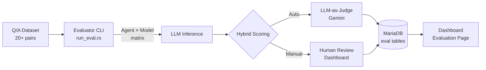

# Agent Evaluation System — Implementation Plan

ระบบประเมิน Agent ทุกตัว × Model ทุกตัว โดยใช้ Q/A Dataset + Hybrid Evaluation (LLM-as-Judge + Human Review)

## Background & Context

### สิ่งที่มีอยู่แล้ว

| Component       | Details                                                                                                                                                        |
| --------------- | -------------------------------------------------------------------------------------------------------------------------------------------------------------- |
| **Agents**      | `simple_npc` (Tier 1), `oracle_rag` (Tier 2 RAG), `wiki_workshop` (pipeline)                                                                                   |
| **Models**      | `ai_models` table: `qwen2.5:32b`, `llama3.2:1b`, `llama3.2:3b` (Ollama) + `gemini-2.5-flash`, `gemini-2.5-pro` (Google) + `bge-m3` (embedding)                 |
| **QA Dataset**  | [qa_dataset.json](file:///Volumes/T7%20Shield/Development/Active_Projects/project/Project-Mimir/ro-ai-bridge/data/qa_dataset.json) — 3 pairs (needs expansion) |
| **QA Pipeline** | [generate_qa.rs](file:///Volumes/T7%20Shield/Development/Active_Projects/project/Project-Mimir/ro-ai-bridge/src/bin/generate_qa.rs) — multi-agent pipeline     |
| **DB Tables**   | `qa_results`, `evaluation_reports`, `pipeline_runs`, `pipeline_steps`                                                                                          |
| **Dashboard**   | Next.js at `ro-ai-dashboard` with pages: playground, runs, steps, vector                                                                                       |
| **Backend**     | Rust + Axum + SQLx (MariaDB) + rig-core 0.10.0                                                                                                                 |

### What We're Building



## User Review Required

> [!IMPORTANT]
> **Rubric Design Decision**: The plan proposes 4 scoring dimensions (Accuracy, Completeness, Relevance, Speed). Each dimension is scored 1-5 by the LLM-as-Judge, and humans can override any score via the dashboard. Is this rubric suitable, or do you want different/additional dimensions?

> [!IMPORTANT]
> **Agent × Model Scope**: Not all agent-model combinations make equal sense. `simple_npc` can work with any Ollama model but not Gemini (it uses `ollama::Client` directly). `oracle_rag` supports both Ollama and Gemini. Should we refactor agents to accept any provider, or only evaluate compatible combinations?

> [!WARNING]
> **QA Dataset Expansion**: Current dataset has only 3 pairs. We need ~20-30 for meaningful evaluation. The plan includes running `generate_qa` on more wiki files. This requires active Ollama + Gemini API key.

---

## Proposed Changes

### Phase 1 — Database Schema

New migration to create evaluation-specific tables with a flexible rubric system.

#### [NEW] [202602200000_eval_system.sql](file:///Volumes/T7%20Shield/Development/Active_Projects/project/Project-Mimir/ro-ai-bridge/migrations/202602200000_eval_system.sql)

```sql
-- Evaluation Run (one per "evaluate all" batch)
CREATE TABLE IF NOT EXISTS eval_runs (
    id VARCHAR(36) PRIMARY KEY,
    name VARCHAR(255),
    status VARCHAR(20) NOT NULL DEFAULT 'PENDING',  -- PENDING, RUNNING, COMPLETED, FAILED
    total_combinations INT DEFAULT 0,
    completed_combinations INT DEFAULT 0,
    started_at TIMESTAMP DEFAULT CURRENT_TIMESTAMP,
    finished_at TIMESTAMP NULL,
    config JSON COMMENT 'rubric config, dataset version, etc.',
    INDEX idx_status (status)
) CHARACTER SET utf8mb4 COLLATE utf8mb4_unicode_ci;

-- Individual eval result: one row per (agent, model, question)
CREATE TABLE IF NOT EXISTS eval_scores (
    id BIGINT AUTO_INCREMENT PRIMARY KEY,
    run_id VARCHAR(36) NOT NULL,
    agent_name VARCHAR(50) NOT NULL,
    model_id VARCHAR(100) NOT NULL,
    question TEXT NOT NULL,
    expected_answer TEXT NOT NULL,
    actual_answer TEXT,
    -- Rubric Scores (1-5 scale)
    accuracy_score TINYINT,
    completeness_score TINYINT,
    relevance_score TINYINT,
    latency_ms INT,
    -- LLM-as-Judge
    judge_model VARCHAR(100),
    judge_reasoning TEXT,
    -- Human Override
    human_accuracy_score TINYINT,
    human_completeness_score TINYINT,
    human_relevance_score TINYINT,
    human_notes TEXT,
    reviewed_by VARCHAR(100),
    reviewed_at TIMESTAMP NULL,
    -- Meta
    created_at TIMESTAMP DEFAULT CURRENT_TIMESTAMP,
    FOREIGN KEY (run_id) REFERENCES eval_runs(id) ON DELETE CASCADE,
    FOREIGN KEY (model_id) REFERENCES ai_models(model_id),
    INDEX idx_run (run_id),
    INDEX idx_agent_model (agent_name, model_id),
    INDEX idx_reviewed (reviewed_at)
) CHARACTER SET utf8mb4 COLLATE utf8mb4_unicode_ci;

-- Aggregated summary per (agent, model) combination
CREATE TABLE IF NOT EXISTS eval_summary (
    id BIGINT AUTO_INCREMENT PRIMARY KEY,
    run_id VARCHAR(36) NOT NULL,
    agent_name VARCHAR(50) NOT NULL,
    model_id VARCHAR(100) NOT NULL,
    total_questions INT DEFAULT 0,
    avg_accuracy FLOAT,
    avg_completeness FLOAT,
    avg_relevance FLOAT,
    avg_latency_ms FLOAT,
    overall_score FLOAT COMMENT 'Weighted composite',
    created_at TIMESTAMP DEFAULT CURRENT_TIMESTAMP,
    FOREIGN KEY (run_id) REFERENCES eval_runs(id) ON DELETE CASCADE,
    UNIQUE KEY uk_run_agent_model (run_id, agent_name, model_id)
) CHARACTER SET utf8mb4 COLLATE utf8mb4_unicode_ci;
```

---

### Phase 2 — Evaluator CLI Binary

New Rust binary that runs the Agent × Model matrix evaluation.

#### [NEW] [run_eval.rs](file:///Volumes/T7%20Shield/Development/Active_Projects/project/Project-Mimir/ro-ai-bridge/src/bin/run_eval.rs)

**Logic flow:**
1. Load Q/A dataset from `data/qa_dataset.json`
2. Load active LLM models from `ai_models` table
3. Define agent list: `["simple_npc", "oracle_rag"]` (wiki_workshop is a pipeline, not a chat agent)
4. Create `eval_runs` row
5. For each `(agent, model)` × `question`:
   - Instantiate agent with the model
   - Send question, measure latency
   - Store `actual_answer` + `latency_ms`
6. For each result, call **LLM-as-Judge** (Gemini) to score accuracy/completeness/relevance
7. Compute and insert `eval_summary` aggregates
8. Update `eval_runs.status = 'COMPLETED'`

**Key design decisions:**
- Sequential execution per combination to avoid GPU contention on Ollama
- LLM-as-Judge uses Gemini (cloud) for consistent, high-quality scoring
- Judge prompt will include: question, expected answer, actual answer, scoring rubric

#### [MODIFY] [mod.rs](file:///Volumes/T7%20Shield/Development/Active_Projects/project/Project-Mimir/ro-ai-bridge/src/agents/mod.rs)

Add a trait or helper function so agents can be instantiated generically with a model name:

```rust
/// Unified evaluation interface
pub async fn evaluate_agent(
    agent_name: &str,
    model_id: &str,
    question: &str,
    db: &DbPool,
    qdrant: &QdrantService,
) -> Result<(String, u64)>  // (answer, latency_ms)
```

---

### Phase 3 — API Endpoints

New route module for evaluation data.

#### [NEW] [eval.rs](file:///Volumes/T7%20Shield/Development/Active_Projects/project/Project-Mimir/ro-ai-bridge/src/routes/eval.rs)

| Endpoint                      | Method | Description                                                  |
| ----------------------------- | ------ | ------------------------------------------------------------ |
| `/api/eval/runs`              | GET    | List all evaluation runs                                     |
| `/api/eval/runs/:id`          | GET    | Get run detail + summary                                     |
| `/api/eval/runs/:id/scores`   | GET    | Get individual scores (paginated, filterable by agent/model) |
| `/api/eval/runs/:id/matrix`   | GET    | Get Agent×Model heatmap data                                 |
| `/api/eval/scores/:id/review` | PATCH  | Submit human review score override                           |

#### [MODIFY] [main.rs](file:///Volumes/T7%20Shield/Development/Active_Projects/project/Project-Mimir/ro-ai-bridge/src/main.rs)

Register new eval routes on the Axum router.

---

### Phase 4 — Dashboard Evaluation Page

New Next.js page for viewing and managing evaluations.

#### [NEW] [page.tsx](file:///Volumes/T7%20Shield/Development/Active_Projects/project/Project-Mimir/ro-ai-dashboard/src/app/evaluations/page.tsx)

**UI Components:**

1. **Matrix Heatmap** — Agent (rows) × Model (columns), cells colored by `overall_score`
2. **Run Selector** — Dropdown to pick which evaluation run to view
3. **Detail Table** — Expandable rows showing per-question scores with:
   - Question / Expected / Actual answer
   - LLM-Judge scores (accuracy, completeness, relevance)
   - Latency
   - Human override inputs (editable scores + notes)
4. **Summary Cards** — Best agent-model combo, avg latency, total questions evaluated

---

### Phase 5 — Expand Q/A Dataset

#### [MODIFY] [qa_dataset.json](file:///Volumes/T7%20Shield/Development/Active_Projects/project/Project-Mimir/ro-ai-bridge/data/qa_dataset.json)

Run `generate_qa` pipeline on remaining wiki files to grow from 3 → 20-30 pairs. This is a prerequisite for meaningful evaluation but can be done independently.

---

## Verification Plan

### Automated Tests

1. **Database migration**: Run `sqlx migrate run` and verify tables exist
```bash
cd /Volumes/T7\ Shield/Development/Active_Projects/project/Project-Mimir/ro-ai-bridge
cargo sqlx migrate run
```

2. **Evaluator smoke test** (single agent, single model, single question):
```bash
TEST_RUN=1 cargo run --bin run_eval
```

3. **API test**: Use `curl` to test eval endpoints:
```bash
curl http://localhost:3000/api/eval/runs
curl http://localhost:3000/api/eval/runs/{run_id}/matrix
```

4. **Dashboard build**:
```bash
cd /Volumes/T7\ Shield/Development/Active_Projects/project/Project-Mimir/ro-ai-dashboard
npm run build
```

### Manual Verification

1. **Dashboard visual check**: Open `http://localhost:3001/evaluations` in browser, verify the heatmap renders correctly with test data
2. **Human review workflow**: Click a score row, enter override scores and notes, verify they persist via the API
3. **Full evaluation run**: Execute `cargo run --bin run_eval` with real Ollama + Gemini running, verify all combinations complete and scores are reasonable

> [!TIP]
> ขอให้ user ช่วย verify ว่า: Ollama server กำลังรันอยู่, Gemini API key ยังใช้ได้, และ MariaDB พร้อม
