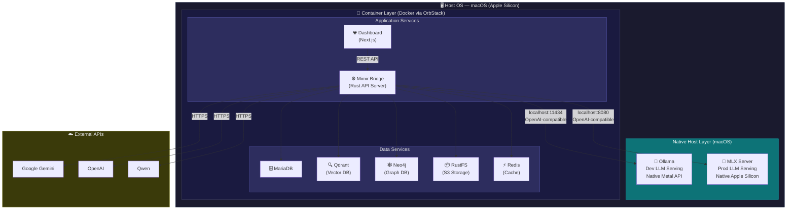
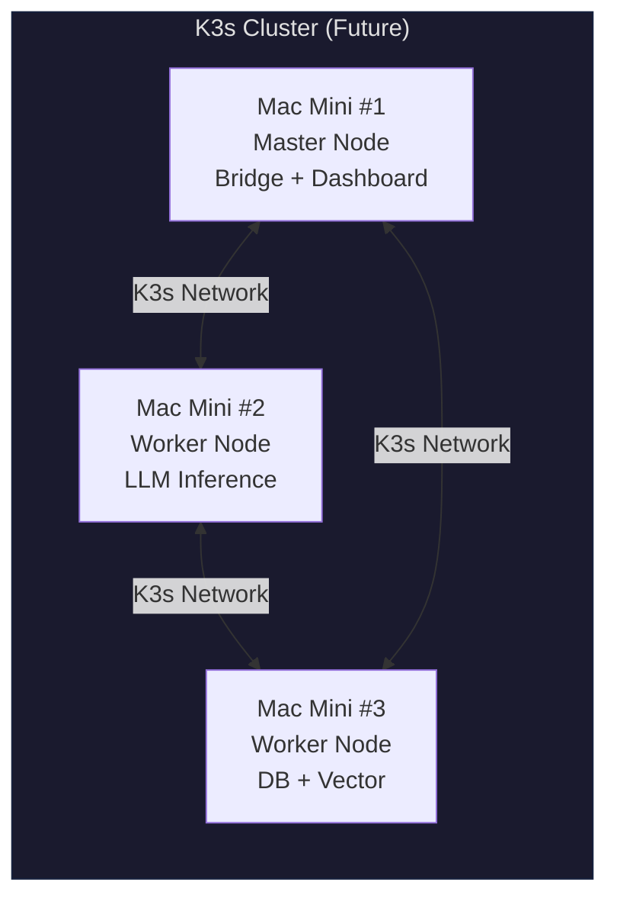

# SI-02: Software Design Document (SDD)
**Project Name:** Project Mimir

## 1. System Architecture (สถาปัตยกรรมระบบ)
- **Frontend:** Next.js พร้อม TailwindCSS และ shadcn/ui สำหรับส่วน Dashboard (Management UI)
- **Backend (Rust Workspace Monorepo):** 
  - `mimir-core-ai`: Domain-Agnostic Core Platform (จัดการ Ingress, RAG, QA/QC, Vector, Auth)
  - `ro-ai-domain-game`: Game Connector สำหรับเชื่อมต่อกับ rAthena
- **Database:** MariaDB สำหรับ Relational Data และ Qdrant สำหรับ Vector Database
- **Graph Database:** Neo4j Community Edition (Docker) สำหรับ Knowledge Graph
- **Graph Visualization:** Sigma.js + graphology (WebGL, ForceAtlas2 layout)
- **AI/LLM Provider:** รองรับ Ollama (dev), MLX (Mac prod), vLLM (GPU/cloud), Google Gemini, OpenAI, Qwen — all OpenAI-compatible API
- **Model Serving:** Ollama (dev) + MLX (Apple Silicon prod) + vLLM (NVIDIA GPU/cloud) — phased: Phase 1 Sprint 11a, Phase 2 Sprint 14b
- **Embedding Models:** Configurable (nomic-embed-text / text-embedding-004 / bge-m3) พร้อม pipeline lock

### Pipeline Architecture (Sprint 9-16):
```
Sources ─┬→ File  → Extract → Chunk ─┬→ Embed → Qdrant (Vector Search)
         │                            └→ Entity → Neo4j  (Graph Search)
         ├→ Web   → Crawl → Extract → Chunk → (same)
         ├→ SQL/DB → Schema Sync → MariaDB     (SQL Search)
         └→ MCP   → Protocol → (varies)

Query → Router Agent ─┬→ Vector Agent (Qdrant)
                       ├→ SQL Agent    (MariaDB)
                       └→ Graph Agent  (Neo4j)
                       → Synthesis Agent → Answer
```

### Deployment Architecture (Host vs Container):

> **Design Principle:** LLM Engine รันแบบ Native บน macOS เพื่อใช้ Metal API + Unified Memory 100%
> Application layer รันใน Container (Docker/OrbStack) เพื่อ isolation + reproducibility



### Future Scaling — K3s Cluster (Phase 2):

> ⏳ **ยังไม่อยู่ใน Roadmap ปัจจุบัน** — สำรองไว้เมื่อต้องการ High Availability หรือ Distributed LLM



### Navigation Structure (Sprint 9+):
```
Overview · Sources · Knowledge · Quality · Playground · Coverage · ⚙️ Admin
```

## 2. Database Design (การออกแบบฐานข้อมูล)
- **Tables (RDBMS MariaDB):** `users`, `tenants`, `tenant_users`, `qa_results`, `pipeline_runs`, `pipeline_steps`, `qa_clusters`, `evaluation_reports`, `data_sources` (ทุกตารางข้อมูลต้องมี `tenant_id` ยกเว้น config กลาง)
- **Sprint 8+ Tables:** `crawled_pages` (web link discovery), `content_fingerprints` (cross-source dedup), `chunks` (chunked content), `embeddings_config` (pipeline lock), `agents` (Agent Studio config), `agent_conversations` (audit log), `training_datasets` (dataset configs + export), `model_registry` (fine-tuned model versions)
- **Sprint 12+ Tables:** `llm_usage_logs` (model_id, provider, input_tokens, output_tokens, total_tokens, latency_ms, status, endpoint, tenant_id, created_at) — LLM Observability per-call logging
- **Vector DB (Qdrant):** ใช้ Per-Tenant Collection เป็น default, รองรับ per-source metadata filter ผ่าน Agent/Search config
- **Graph DB (Neo4j):** Entities (Drug, Symptom, Person, etc.) + Relations (treats, causes, contains) แยก per tenant via property `tenant_id`
- [ER Diagram Placeholder - รอสร้างและนำภาพมาแนบ]

## 3. Subsystem Design (การออกแบบระบบย่อยจาก Sprint 1-16)
- **IAM Module:** จัดการ `tenant_auth_middleware` (Sprint 1)
- **Vector & Pipeline Module:** จัดการ Data Ingestion และ Semantic Search (Sprint 2)
- **Tenant Configuration Module:** จัดการ Settings และ Provisioning Workflow แบบ Centralized (Sprint 3)
- **Quality Control Module:** Background Worker จัดการ Data Clustering (Sprint 4)
- **Ingress Module:** WebSocket/SSE รันสถานะของ Data Crawler (Sprint 5)
- **Evaluation Module:** รันระบบให้คะแนนปัญญาประดิษฐ์อัตโนมัติ (LLM-as-a-judge) ผ่านการเทียบฐานข้อมูลและสร้างสรุป Heatmap (Sprint 6)
- **Pipeline UI/UX Module:** ปรับปรุง Flow การทำงานหลักทั้งหมดให้รองรับ Multi-tenancy ทบสอบระบบโดยรวม และตรวจสอบความถูกต้อง (Traceability) ของผลลัพธ์ (Sprint 7)
- **Upload & Smart Ingress Module:** File/Folder Upload ผ่าน S3, Smart Upload (auto-detect source_type), SQL Import dual-mode (Sprint 8)
- **Extraction & Chunking Module:** Real extraction (PDF/CSV/HTML), Configurable chunking (fixed/recursive/semantic), Web link discovery, Cross-source deduplication, Settings Tabs (General/AI Models/Pipeline/KG/Search/Security) (Sprint 9)
- **Embedding & Vector Store Module:** Multi-model embedding service (Ollama/Gemini/Qwen) with pipeline lock, Qdrant per-tenant collection, SQL Schema Registry, Knowledge Base page (Sprint 10)
- **Knowledge Graph Module (KG Foundation):** Neo4j entity/relation storage, LLM-based entity extraction, LLM Provider Abstraction Phase 1 (Ollama + Gemini + OpenAI), Graph Storage (Sprint 11a)
- **Knowledge Graph Module (GraphRAG Features):** Sigma.js graph visualization (ForceAtlas2), Knowledge Search (entity + path finding), Hybrid Search (Vector + Graph + SQL → merged context) (Sprint 11b)
- **Multi-Agent Module:** Tool Registry, Router Agent, Synthesis Agent, ACU Coverage per source, Blind-spot detection, Closed-loop pipeline actions, **LLM Usage Logging** (llm_usage_logs table, instrument all LLM calls), **LLM Analytics Dashboard** (token in/out per model, latency tracking, cost estimation, usage trends), **Web Hierarchy Loader** (site hierarchy discovery via sitemap/BFS, selective page import with checkbox tree, duplicate detection via content_hash, New/Updated/Unchanged/Duplicate status badges) (Sprint 12)
- **Agent Studio Module:** Visual agent builder (no-code), Agent CRUD config, Test Chat, Agent Templates, API endpoint + widget deployment, Conversation logging (Agent Studio + Playground), Chat history per user, **LLM Performance Evaluation** (quality scoring per model, A/B model comparison, user feedback thumbs up/down), **Advanced Analytics** (daily token budget enforcement, usage alerts, model benchmark reports) (Sprint 13)
- **Production Core Module:** Scheduled re-sync (Cron), OCR integration (Tesseract/PaddleOCR), External DB connectors (MySQL/PostgreSQL/SQLite), MCP real implementation, Performance optimization, Reversible DB Migrations (.down.sql), Feedback & Bug Report (in-app), E2E Test Suite (full pipeline), Structured logging & request tracing, Secrets Management (HashiCorp Vault — API key rotation, audit log) (Sprint 14a)
- **Deploy & Docs Module:** Setup & Deployment (Docker Compose prod, .env templates, setup scripts), Deployment Test (M3→M4 Pro), Update & Rollback (update.sh + rollback.sh + GHCR + auto-backup), API documentation (OpenAPI/Swagger), Backup & DR, MLX + vLLM Providers Phase 2 (add + benchmark on M4 Pro) (Sprint 14b)
- **Dataset Studio Module:** Dataset CRUD (config-based), Data Source Selector (QA/KG/chunks/conversations), Filter & Transform (quality score, dedup, language), Format Converter (Alpaca/ShareGPT/DPO/Raw/Custom), Export (JSONL/Parquet + HuggingFace push), Data Augmentation (LLM paraphrase) (Sprint 15)
- **Training Integration Module:** Training Config UI (base model, hyperparameters, LoRA rank), Axolotl/Unsloth Integration (Docker), MLflow Tracking (metrics, loss curves), Model Registry (version + A/B test in Playground), ISO Final Documentation (SI-05 User Manual, SI-06 Release Notes) (Sprint 16)
