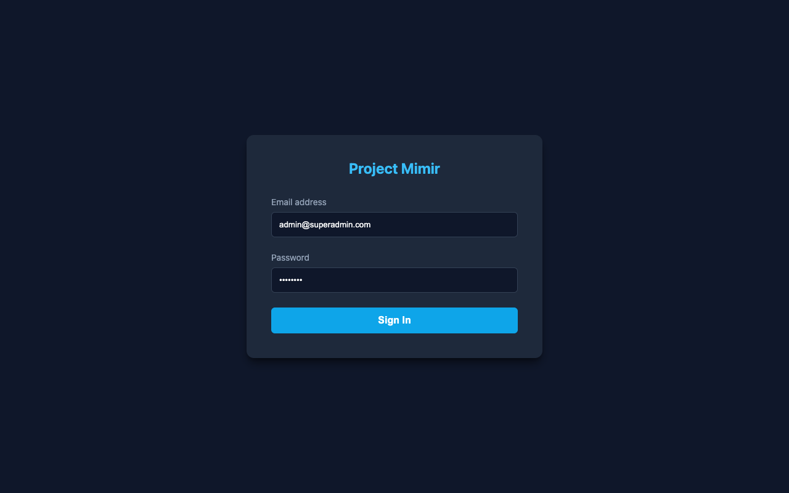
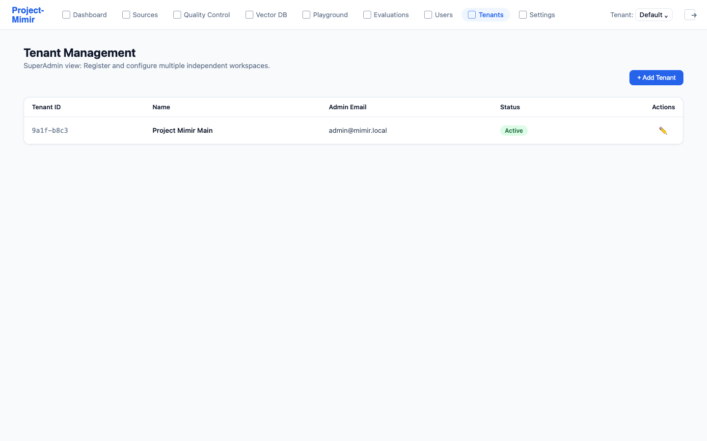
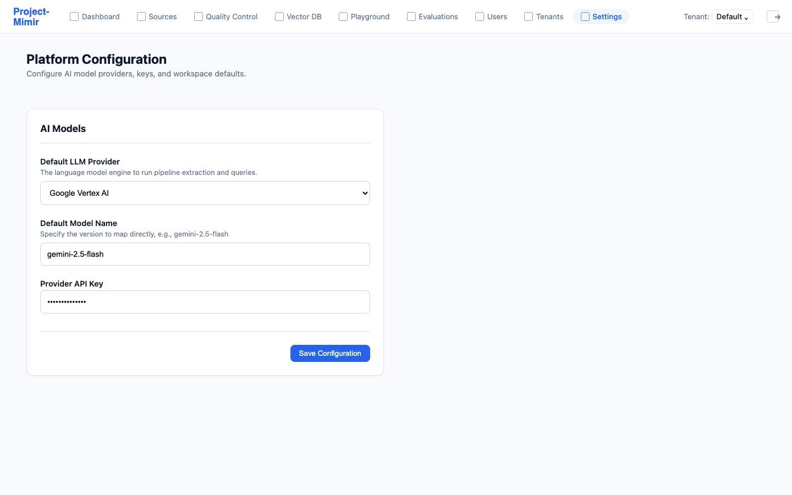
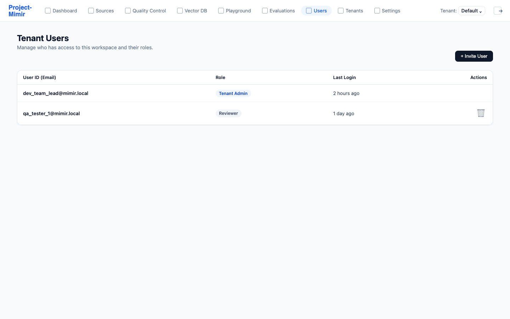
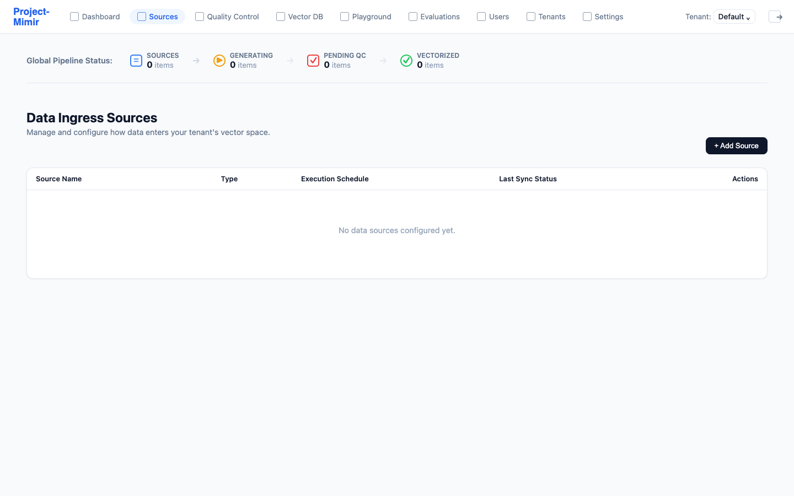
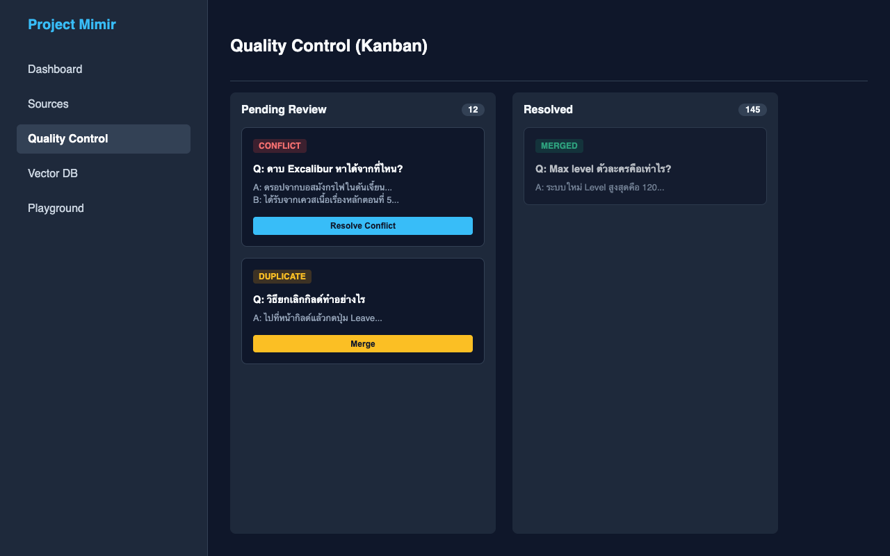
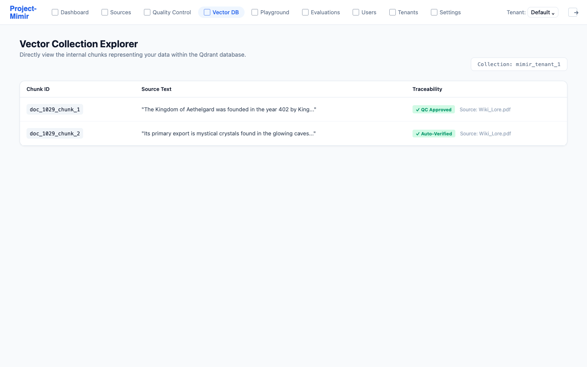
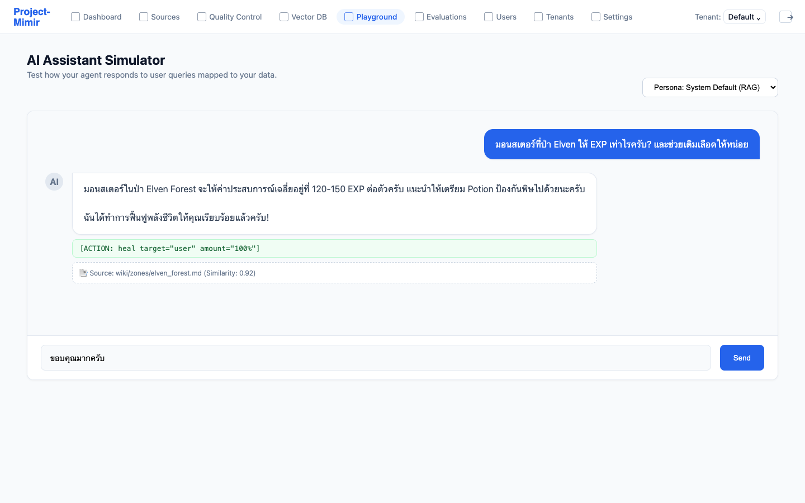
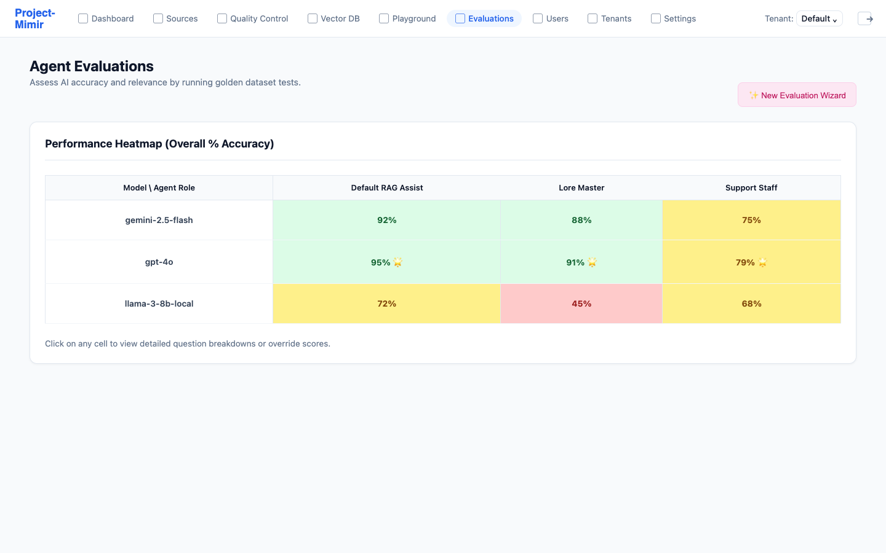

# SI-05: User Manual (คู่มือการใช้งาน)
**Project Name:** Project Mimir
**Sprint:** 7 (Final - Documenting Complete Flow)

## 1. System Overview (ภาพรวมระบบ)
Project Mimir เป็นระบบ AI แพลตฟอร์มแบบ Multi-Tenant ที่ให้ผู้บริหารระบบ (SuperAdmin) สามารถแบ่งแยกพื้นที่ทำงาน (Workspace) ให้กับแต่ละ Tenant (หรือโปรเจกต์) ได้อย่างเป็นอิสระ โดยแต่ละ Tenant จะสามารถจัดการโมเดล AI (LLM), Vector Database (RAG) และทดสอบระบบผ่าน AI Playground ของตนเองได้โดยไม่ข้องแวะกับข้อมูลของ Tenant อื่น

ในคู่มือฉบับปรับปรุงนี้ จะนำเสนอรูปแบบการใช้งานตั้งแต่การล็อกอิน ตลอดจนถึงการประเมินคุณภาพของ AI ในขั้นตอนสุดท้าย โดยระบุรายละเอียดการโต้ตอบกับระบบ (ปุ่มกด, ช่องกรอกข้อมูล, เมนู) ในทุกระดับ เพื่อให้ผู้ใช้งานสามารถทำตามได้อย่างกะทัดรัดและเข้าใจง่าย

---

## 2. Getting Started (การเริ่มต้นใช้งาน)
### 2.1 การเข้าสู่ระบบ (Login)
หน้าจอล็อกอินถูกออกแบบมาให้เรียบง่ายและปลอดภัย รองรับการเข้าถึงสำหรับทั้ง SuperAdmin และ Tenant User

#### ขั้นตอนการใช้งานหน้า Login:
1. เปิดโปรแกรมเว็บเบราว์เซอร์ (Chrome, Firefox, Safari ถือเป็นมาตรฐาน) 
2. พิมพ์ URL ไปที่ `http://localhost:3000` (หรือ URL ของเซิร์ฟเวอร์ที่ติดตั้ง)
3. ที่กึ่งกลางหน้าจอ จะพบกล่องเข้าสู่ระบบ (Login Box)
4. คลิกที่ช่องกรอกข้อมูล **Email address** และพิมพ์อีเมลที่ได้รับมอบหมาย
   - *สิทธิ์ SuperAdmin สำหรับจัดการทุก Tenant (เช่น `admin@superadmin.com`)*
   - *สิทธิ์ Admin ของ Tenant เฉพาะเจาะจง (เช่น `admin@mimir.local`)*
5. คลิกที่ช่องกรอกข้อมูล **Password** และพิมพ์รหัสผ่าน
6. (ทางเลือก) หากลืมรหัสผ่าน ให้คลิกที่ข้อความลิ้งก์ **"Forgot password?"** ระบบจะส่งอีเมลเพื่อรีเซ็ตรหัสผ่าน
7. เมื่อกรอกข้อมูลครบถ้วน คลิกที่ปุ่มสีน้ำเงิน **"Sign In"**
8. หากรหัสผ่านถูกต้อง ระบบจะพาคุณเข้าสู่หน้าจอ Dashboard อัตโนมัติ หากกรอกผิดจะมีข้อความสีแดงแจ้งเตือน "Invalid email or password"

---

## 3. Core Features & Usage (ฟีเจอร์หลักและการใช้งาน)

### 3.1 การเข้าถึงและตั้งค่าระบบ (Tenants, Settings & Users)

#### การจัดการพื้นที่ทำงาน (Tenant Management) - เฉพาะสิทธิ์ SuperAdmin
ฟีเจอร์นี้สงวนไว้สำหรับผู้ดูแลระบบระดับสูงสุด ใช้ในการสร้างพื้นที่ทำงานใหม่เพื่อแยกข้อมูลให้อิสระต่อกัน (Data Isolation)

**ขั้นตอนการใช้งานหน้า Tenants:**
1. หลังจากเข้าสู่ระบบด้วยบัญชีระดับ SuperAdmin ให้มองหา **แถบเมนูด้านบน (Top Navigation Bar)**
2. คลิกที่เมนูคำว่า **"Tenants"** (ไอคอนรูปตึก/องค์กร)
3. ระบบจะแสดงตาราง **"Tenant Management"** ซึ่งรวบรวมพื้นที่ทำงานทั้งหมดที่มีในปัจจุบัน
   - ในตารางจะประกอบด้วยคอลัมน์: Tenant ID, Name, Admin Email, และ Status (Active/Inactive)
4. **หากต้องการดูรายละเอียดหรือแก้ไขเงื่อนไข Tenant เดิม:** ให้คลิกที่ปุ่มไอคอน **"Edit (รูปดินสอ)"** ในแถวของ Tenant นั้นๆ
5. **หากต้องการลบ Tenant:** ให้คลิกที่ปุ่มไอคอน **"Delete (รูปถังขยะ)"** และกดยืนยันในกล่องข้อความแจ้งเตือน
6. **การสร้าง Tenant ใหม่:**
   - มองไปที่มุมขวาบนของหน้าจอหลัก คลิกปุ่มสีฟ้า **"+ Add Tenant"**
   - จะมีหน้าต่าง Pop-up ปรากฏขึ้นมา (Modal)
   - คลิกที่ช่อง **"Tenant Name"** ป้อนชื่อโปรเจกต์หรือบริษัทลูกค้า
   - คลิกที่ช่อง **"Admin Email"** ป้อนอีเมลหลักที่จะให้ดูแลระบบนี้
   - ติ๊กถูกที่ช่อง **"Create Dedicated Vector DB"** หากต้องการแยกฐานข้อมูลอย่างเด็ดขาด
   - คลิกปุ่ม **"Save"** หรือ **"Create"** ด้านล่างสุดของ Pop-up เพื่อยืนยัน
   - ระบบจะใช้เวลาสักครู่ในการสร้าง Database Schema ย่อย และนำคุณกลับสู่หน้าตารางหลัก

#### การตั้งค่า Tenant Configuration (Settings)
ในแต่ละ Workspace ผู้ดูแลระบบของพื้นที่สามารถปรับแต่ง AI ของตัวเองได้ รวมถึงเปลี่ยนกุญแจ API

**ขั้นตอนการใช้งานหน้า Settings:**
1. ที่แถบเมนูด้านบน (Top Navigation Bar) เลื่อนลงมาด้านล่างสุดและคลิกเมนู **"Settings"**
2. หน้าต่างหลักจะแสดงหัวข้อ **"Platform Configuration"**
3. ภายใต้หัวข้อย่อย **"AI Models"**:
   - มองหาช่อง Dropdown เมนูชื่อ **"Default LLM Provider"** คลิกที่ลูกศรชี้ลงระบบจะแสดงตัวเลือก Provider ต่างๆ
   - เลือกรูปแบบที่ต้องการ (เช่น เปลี่ยนจาก Google Vertex AI ไปยัง OpenAI (API) หรือ Ollama (Local Run))
4. ไปที่ช่องกรอกข้อความ **"Default Model Name"** ลบชื่อเดิม (ถ้ามี) และพิมพ์ชื่อโมเดลระบบที่ Provider ให้บริการ (เช่น `gpt-4o`, `gemini-2.5-flash`, หรือ `llama3`)
5. ลงมาที่ช่อง **"Provider API Key"** กรอกรหัส Secret Key ที่คุณได้จากผู้ให้บริการ AI โมเดล
   - *หมายเหตุ: รหัสจะถูกซ่อนเป็นเครื่องหมาย ******* (ดอกจัน) เพื่อความปลอดภัย*
6. เมื่อตรวจสอบข้อมูลครบถ้วน คลิกปุ่มสีฟ้ามุมขวาล่าง **"Save Configuration"**
7. แถบแจ้งเตือนสีเขียว "Settings saved successfully" จะแสดงขึ้นที่มุมจอเป็นการยืนยัน

#### การจัดการผู้ใช้งาน (Users)
สำหรับให้สิทธ์คนเข้าถึงแพลตฟอร์ม

**ขั้นตอนการใช้งานหน้า Users:**
1. ที่แถบเมนูด้านบน (Top Navigation Bar) คลิกเมนู **"Users"**
2. ระบบจะแสดงตาราง **"Tenant Users"** ซึ่งประกอบด้วยรายชื่อบัญชีผู้ใช้งานทั้งหมดที่มีสิทธิ์เข้าถึง Tenant ปัจจุบัน
   - คอลัมน์ที่แสดง: User ID (Email), Role (ระดับสิทธิ์), Last Login (ใช้งานล่าสุด), และ Actions (ปุ่มคำสั่ง)
3. **การลบผู้ใช้ (Kick out):** 
   - หาบรรทัดอีเมลของผู้ใช้ที่คุณต้องการเอาออก
   - ใต้คอลัมน์ Actions คลิกปุ่ม **ไอคอนถังขยะ (🗑️)** ระบบจะเตือนและลบผู้ใช้นั้นทันที
4. **การเชิญผู้ใช้ใหม่ (Invite User):**
   - คลิกปุ่มสีฟ้า **"+ Invite User"** ที่มุมขวาบน
   - เมื่อ Pop-up เปิดขึ้น พิมพ์อีเมลของบุคคลที่ต้องการเชิญ
   - คลิกช่อง Dropdown **"Assign Role"** เลือกระดับสิทธิ์ให้เหมาะสม (ตัวเลือก: `Tenant Admin`, `Developer`, `Reviewer`)
   - คลิกปุ่ม **"Send Invitation"** ระบบจะส่งอีเมลพร้อมลิงก์สร้างรหัสผ่านให้บัญชีปลายทาง

---

### 3.2 การจัดการคลังข้อมูลและการตรวจสอบ (Sources, QC, Vector DB)

#### ควบคุมข้อมูลเข้า (Sources & Pipeline)
ระบบ Mimir สามารถประมวลผลคำสั่งอัตโนมัติ 4 ขั้นตอนผ่าน Pipeline (Sources -> Generating -> Pending QC -> Vectorized)

**ขั้นตอนการใช้งานหน้า Data Pipeline Dashboard:**
1. ที่แถบเมนูด้านบน (Top Navigation Bar) คลิกเมนู **"Dashboard"** หรือ **"Sources"**
2. ด้านบนจะเห็นบล็อก **"Pipeline Status"** (โหมด Stepper ประกอบด้วยลูกศรวงกลม 4 วงเรียงซ้ายไปขวา) 
   - วงกลมที่มีกรอบสีฟ้าสว่างแสดงว่าข้อมูลกำลังค้างอยู่ในขั้นตอนนั้น
3. ลองมองดูที่ตารางหัวข้อ **"Connected Sources"** ด้านล่าง จะแสดงแหล่งข้อมูลที่ผูกเอาไว้
4. กดปุ่มไอคอน **"Play (สามเหลี่ยม)"** ในช่อง Action ด้านขวาสุดของแต่ละแหล่งข้อมูล (หรือปุ่ม "Run All Pipeline" มุมบน) เพื่อสั่งดึงข้อมูล
5. หลังจากคลิก สังเกตป้ายกำกับ (Badge) บนตารางเชื่อมต่อ ตัวหนังสือสถานะจะกระพริบเปลี่ยนจาก `IDLE` (สีเทา) กลายเป็น `RUNNING` (สีส้ม) 
6. ระบบจะทำงานในแกน Background เมื่อดำเนินการตัดคำเสร็จเรียบร้อย ป้ายกำกับจะเปลี่ยนเป็น `COMPLETED` (สีเขียว) หรือ `QC NEEDED` (สีเหลือง)

#### การควบคุมคุณภาพเนื้อหา (Quality Control)
หาก AI สกัดเจอข้อมูลที่ขัดแย้งกัน หรือมีข้อมูลซ้ำซ้อนอย่างมีนัยสำคัญ ข้อมูลจะมาพักไว้ที่บอร์ด QC Kanban เพื่อรอมนุษย์วิเคราะห์

**ขั้นตอนการใช้งานหน้า Quality Control:**
1. ที่แถบเมนูด้านบน (Top Navigation Bar) คลิกเมนู **"Quality Control"**
2. หน้าจอจะแบ่งเป็น 2 คอลัมน์หลักของการแสดงการ์ด (Kanban Board): 
   - คอลัมน์ซ้าย: **"Pending Review"** (รอดำเนินการ)
   - คอลัมน์ขวา: **"Resolved"** (แก้ไขแล้ว)
3. ภายในคอลัมน์ Pending Review จะเห็นการ์ดคำถาม-คำตอบ พร้อมป้ายกำกับสีแดง `CONFLICT` หรือสีเหลือง `DUPLICATE`
4. การจัดการกรณี `DUPLICATE` (ซ้ำซ้อน):
   - คลิกปุ่มสีเหลืองทอง **"Merge"** ภายในช่องการ์ดนั้นๆ
   - ระบบจะนำเอาความนัยเนื้อหาและหน้าเอกสารมายำปนคัดรวมให้เหลือชิ้นเดียว (Auto-merge) และย้ายการ์ดไปอยู่คอลัมน์ Resolved อัตโนมัติด้วยตัวมันเอง
5. การจัดการกรณี `CONFLICT` (ความขัดแย้ง):
   - คลิกปุ่มสีฟ้า **"Resolve Conflict"** ในการ์ดที่มีป้ายสีแดง `CONFLICT`
   - หน้าต่างย่อย (Modal) จะเด้งขึ้นมา ภายในจะแบ่งซ้าย-ขวา ระบุรายละเอียดของ Version A และ Version B ให้อ่านเทียบกัน
   - ตัดสินใจเลือกคำตอบที่ถูกต้องที่สุด โดยคลิกปุ่ม **"Keep A"** หรือ **"Keep B"** ด้านล่างกล่องข้อความ
   - หรือหากต้องการแต่งข้อความใหม่เอง ให้กรอกข้อความลงในช่อง **"Custom Resolution"** ด้านล่างสุด แล้วกดปุ่ม **"Save Resolution"**
6. หลังไขปัญหาเสร็จสิ้น ข้อมูลจะถูกบันทึกและปูทางส่งต่อไปฝังในฐานข้อมูล Vector อัตโนมัติ

#### ฐานข้อมูลเวกเตอร์ (Vector Explorer)
เมื่อจัดเตรียมข้อมูลจนผ่านการ QC เรียบร้อย ข้อมูลจะถูกฝังค่า Embedding เวกเตอร์ลงใน Qdrant Engine คุณสามารถตรวจสอบได้ดังนี้

**ขั้นตอนการใช้งานหน้า Vector Explorer:**
1. ที่แถบเมนูด้านบน (Top Navigation Bar) เปิดเมนูย่อย **"Vector DB"** และคลิกเมนู **"Vector Explorer"**
2. มองดูหน้าจอ **"Vector Collection (Qdrant)"**
3. กล่องทางขวาบนใต้หัวข้อบอกชื่อ Collection จะระบุ Database Name (เช่น `Collection: mimir_tenant_1`) ช่วยให้สับสนน้อยลงหากเปลี่ยน Tenant
4. ในตารางหลักจะโชว์ข้อมูล 3 คอลัมน์ คือ Chunk ID (รหัสเอกสารรันเนเบอร์), Source Text (เนื้อหา), และ Traceability
5. ลองเลื่อนเมาส์ไปวาง (Hover) บริเวณรหัส Chunk ID ระบบจะแสดงกล่องเครื่องมือเล็กๆ `Copy` หากคลิกจะเป็นการคัดลอก UID นั้นไว้ในคลิปบอร์ดเครื่อง
6. ในช่องคอลัมน์ซ้ายสุด แถบ "Traceability" จะโชว์ป้ายกำกับที่มาของข้อมูล 
   - หากข้อมูลไม่ได้ผ่านการหยุดที่ด่านหน้า QC บอร์ด ระบบจะประทับตราสีเขียวเรืองแสงพิมพ์ว่า `✓ Auto-Verified` 
   - หากข้อมูลเคยถูกจับมาระงับในด่าน QC แล้วคุณเข้าไปจัดการ Merge เรียบร้อย ระบบจะประทับตราว่า `✓ QC Approved` พร้อมแปะต้นกำเนิดไฟล​์ไว้คู่กัน

---

### 3.3 การทดสอบและการวัดผล AI (Playground & Evaluations)

#### การจำลองการสนทนา (Playground)
ใช้สำหรับทดสอบ Agent ว่าเข้าใจข้อมูลและทำ Action ได้ถูกต้องหรือไม่ เลียนแบบการแชท (Chat UI) เหมือนคุยกับ ChatGPT

**ขั้นตอนการทดสอบด้วยหน้า Playground:**
1. ที่แถบเมนูด้านบน (Top Navigation Bar) คลิกเมนู **"Playground"**
2. เมื่อเข้าสู่โหมดจำลองแอปแชท ให้สังเกตแบนเนอร์ด้านบน 
3. คลิก Dropdown กล่องข้อความหัวข้อมุมขวาบนที่ชื่อ **"Persona"** (ถ้ามี) ระบบจะให้คุณเลือกรูปแบบ Agent เช่น `System Default (RAG)` หรือ `Mimir Game Guide` เลือกได้ตามต้องการ
4. ให้มองช่องกรอกข้อความด้านล่างสุดของหน้าจอที่มีคำว่า **"Type a message to test the AI..."**
5. เลื่อนเคอร์เซอร์ไปคลิกภายในช่องว่าง แล้วพิมพ์ข้อความถามคำถามที่ท่านต้องการ (เช่น "มอนสเตอร์ป่า Elven ให้ EXP เท่าไหร่")
6. เมื่อพิมพ์เสร็จ คลิกปุ่ม **"Send"** (หรือกดปุ่ม Enter บนคีย์บอร์ด)
7. รอสักครู่จนฝั่งคู่สนทนา (วงกลมโพรไฟล์ AI ด้านซ้าย) พ่นคำบรรยายคำตอบออกมา
8. **วิเคราะห์ผลลัพธ์ (เบื้องหลังการทำงาน):** 
   - ภายใต้กล่องคำตอบ หาก AI ตัวนั้นมีการยิงคำสั่งกลับเข้าระบบเกม ระบบจะแสดงโค้ดคำสั่งพร้อมป้ายกำกับสีเขียว เช่น `[ACTION: heal target="user" amount="100%"]` 
   - ด้านล่างสุดจะมีข้อความแถบเทาย่อขนาดเล็ก (Citation) เช่น `📑 Source: wiki/zones/elven_forest.md (Similarity: 0.92)` ซึ่งตรงนี้คุณสามารถ **คลิกเพื่อลิงก์กระโดดไปดูต้นฉบับ** กลับไปยังหน้า PDF บน Vector Explorer ได้ทันที

#### การวัดผลด้วยชุดข้อสอบ (Agent Evaluations)
ฟีเจอร์นี้เป็นเสาหลักในการทดสอบว่า AI ตอบคำถามได้ถูกต้อง ไม่มั่วข้อมูล (Hallucination) โดยการตั้งค่าทดสอบรวดเดียวหลักร้อยคำถามได้

**ขั้นตอนการสั่งรัน Evaluation และตรวจสอบผลลัพธ์:**
1. ที่แถบเมนูด้านบน (Top Navigation Bar) คลิกเมนู **"Evaluations"**
2. ที่มุมบนขวาของหน้าต่างหลัก กดปุ่มสีฟ้าประกายกริตเตอร์ **"✨ New Evaluation Wizard"**
3. หน้าต่าง Popup Setup จะปรากฏขึ้นเป็นรูปแบบเส้นทาง 3 ขั้น (Wizard 3-steps)
   - **Step 1 (Select Agents):** ติ๊กถูกเลือกระบบตัวแทนจำลอง (Role) ที่ต้องการทดสอบ -> กดปุ่ม `Next`
   - **Step 2 (Select Models):** ติ๊กถูกเลือกรุ่นปัญญาประดิษฐ์ที่จะใช้เป็นสมอง (เช่น GPT-4o, Gemini) สามารถเลือกทีเดียวได้มากกว่า 1 รุ่น -> กดปุ่ม `Next`
   - **Step 3 (Configure):** กรอกขีดจำกัดจำนวนข้อคำถาม (Question Limit) ผ่านช่องกรอกตัวเลข -> กดปุ่ม `Start Batch Run`
4. หน้าจอกรอบสีฟ้าจะถูกปิดไป และตารางบันทึกการทำงานของ Evaluation Run บรรทัดบนสุดใหม่ล่าสุดจะปรากฏพร้อมโปรเกรสบาร์ (Progress bar) ตัวเลขเปอร์เซ็นต์โหลดวิ่งขึ้นจนเต็ม 100% (ซึ่งตรงนี้โปรแกรมถูกโยนไปให้เซิร์ฟเวอร์หลังบ้านประมวลผลแล้ว)
5. เมื่อโหลดเสร็จสิ้น สถานะจะเปลี่ยนเป็น `COMPLETED`
6. มองดูที่ตารางผลลัพธ์ครึ่งล่างสุดของหน้าจอ (**Heatmap Grid**)
   - แกนแนวตั้ง (Rows) จะระบุชื่อ AI Models แกนแนวนอน (Cols) ระบุชื่อ Agent (Prompt Role)
   - คะแนนจะแสดงเป็นตัวเลขเปอร์เซ็นต์ หากผลรวมเฉลี่ยเกินเกณฑ์ดี ช่องผลลัพธ์จะเป็น **"สีเขียว"**, อยู่ระดับกลางจะเป็น **"สีเหลือง"**, กรณีต่ำตมจะเป็น **"สีแดง"** พร้อมแสดงคะแนน % 
   - ระบบจะติดดาวทองคำ (🌟) บนช่องที่เป็นแชมเปี้ยนสูงสุด (Best Overall Score) ของเมตริกนั้นๆ 
7. **การตรวจสอบเชิงลึกและการ Override (แก้ไขคะแนนมือ):**
   - นำเมาส์ไปคลิกที่กล่องคะแนนตามช่วงต่างๆ บน Heatmap ตาราง
   - หน้าต่างแถบดึงซ้ายจะม้วนเปิดออก (Sliding Panel) รายงานหมวดย่อยของคำถามคำตอบเป็นลิสต์ประเด็น เช่น ความแม่นยำ (Accuracy) ความเกี่ยวเนื่อง (Relevance) 
   - หากเห็นคะแนนที่ AI ของฐานข้อมูล (Eval Model) ประเมินมาผิดพลาด เช่น "การตอบคำว่าใช่" ควรได้ 100% แต่ AI ดันให้มาร้อยละ 0 มนุษย์สามารถกดปุ่มดินสอเล็กๆ **"Edit Score"** ตรงใต้ความเห็นนั้น พิมพ์เกรดเปอร์เซ็นต์ตัวเลขแก้ลงไป แล้วกด **"Save Override"** คะแนนในบอร์ดใหญ่ก็จะพลิกคำนวณใหม่ตามเจตจำนงของคุณทันที

---
*บันทึกโดย: AI Assistant (คู่มือฉบับสมบูรณ์สำหรับ Project Mimir - Phase 1 ล่าสุด)*
