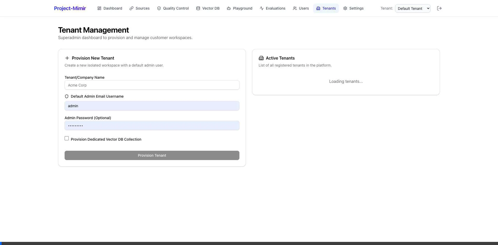
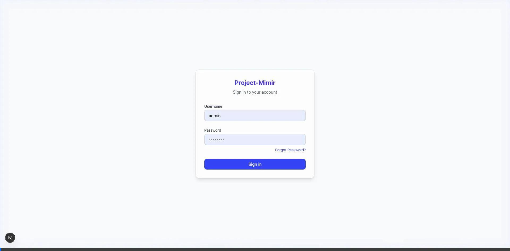

# SI-05: User Manual (คู่มือการใช้งาน)
**Project Name:** Project Mimir
**Sprint:** 3 (Tenant Configuration & Provisioning)

## 1. System Overview (ภาพรวมระบบ)
Project Mimir เป็นระบบ AI แพลตฟอร์มแบบ Multi-Tenant ที่ให้ผู้บริหารระบบ (SuperAdmin) สามารถแบ่งแยกพื้นที่ทำงาน (Workspace) ให้กับแต่ละ Tenant (หรือโปรเจกต์) ได้อย่างเป็นอิสระ โดยแต่ละ Tenant จะสามารถจัดการโมเดล AI (LLM), Vector Database (RAG) และทดสอบระบบผ่าน AI Playground ของตนเองได้โดยไม่ข้องแวะกับข้อมูลของ Tenant อื่น

## 2. Getting Started (การเริ่มต้นใช้งาน)
### การเข้าสู่ระบบ
1. เปิดเบราว์เซอร์และเข้าไปที่ `http://localhost:3000` (หรือ URL ของเซิร์ฟเวอร์ที่ติดตั้ง)
2. หากยังไม่ได้ล็อกอิน ระบบจะพากลับมาที่หน้า `/login`
3. กรอก **Email** และ **Password** ที่ได้รับมอบหมาย
   - *สิทธิ์ SuperAdmin สำหรับจัดการทุก Tenant (เช่น `admin@superadmin.com`)*
   - *สิทธิ์ Admin ของ Tenant เฉพาะเจาะจง (เช่น `admin@mimir.local`)*
4. กด **Sign In** เพื่อเข้าสู่แดชบอร์ด

## 3. Features & Usage (ฟีเจอร์และการใช้งาน)

### 3.1 การตั้งค่าระบบและการจัดการผู้ใช้งาน (Sprint 2 & 3)
ระบบของ Project Mimir มีการแบ่งสิทธิ์ผู้ใช้งาน (Role-Based Access Control - RBAC) อย่างชัดเจน:
- **Superadmin:** สิทธิ์สูงสุด สามารถจัดการผู้ดูแลและพื้นที่ทำงานทั้งหมด
- **Tenant Admin:** ผู้ดูแลระดับโปรเจกต์ สามารถตั้งค่าโมเดล AI และ Persona สำหรับ Tenant ตนเอง
- **User:** ผู้ใช้งานทั่วไป (เช่น ผู้เล่นเกม) ที่เข้ามาคุยกับ AI

#### การจัดการ Tenant (สำหรับ SuperAdmin)
ฟีเจอร์นี้สงวนไว้สำหรับผู้ดูแลระบบระดับสูงสุด ใช้ในการสร้างพื้นที่ทำงานใหม่ให้กับลูกค้าหรือโปรเจกต์ใหม่:
1. ล็อกอินด้วยบัญชีระดับ SuperAdmin
2. ที่แถบเมนูด้านซ้ายมือให้คลิก **Tenants**
3. ระบบจะแสดงตารางพื้นที่ทำงานทั้งหมดที่มีในหน้าต่าง
4. **การสร้าง Tenant ใหม่ (Provisioning):**
   - ใส่ชื่อ Tenant เช่น "Sword & Magic Server"
   - ใส่อีเมลสำหรับผู้ดูแล Tenant นี้
   - เลือกตัวเลือก **Provision Dedicated Vector DB Collection** หากต้องการแยกระบบฐานข้อมูลจำเพาะ
   - กดปุ่มเพื่อสร้าง 
   - ระบบจะดำเนินการสร้าง Tenant, สร้างบัญชีผู้ใช้เริ่มต้น, แจกจ่ายตั้งค่าฐาน และสร้างฐานข้อมูลเวกเตอร์ให้ทันที
5. **การลบ Tenant (Deprovisioning):**
   - หากต้องการลบ กดที่ไอคอน "ถังขยะ" หลังชื่อ Tenant
   - ระบบจะทำการลบข้อมูลที่เกี่ยวข้อง (รวมถึงบัญชีผู้ใช้, Config, และข้อมูลใน Vector DB) อย่างหมดจด

#### การตั้งค่า Tenant Configuration (สำหรับ Tenant Admin)
ในแต่ละ Workspace ผู้ดูแลระบบของพื้นที่สามารถปรับแต่ง AI ของตัวเองได้:
1. ที่แถบเมนูด้านซ้ายคลิก **Settings**
2. เลือก Default Provider ว่าต้องการเชื่อมต่อผ่าน Engine ใด (เช่น `ollama`, `google`, `openai`)
3. ระบุ Default Model (เช่น `gemini-2.5-flash` หรือ `llama3.2`) ซึ่งจะส่งผลให้ระบบ Pipeline ทั้งหมดเรียกใช้โมเดลนี้แบบอัตโนมัติหากไม่ได้เจาะจง
4. บันทึกข้อมูลและคีย์ API (API Key) อื่นๆ
5. กด **Save Settings** มุมขวาล่าง 

#### การจัดการผู้ใช้งานในระบบ (Users) (สำหรับ Tenant Admin)
ผู้ดูแลแต่ละระบบสามารถเพิ่ม/ลด และจัดการผู้ใช้งาน (Users) ที่อยู่ภายใต้ Tenant ของตนได้:
1. ที่แถบเมนูด้านซ้ายคลิก **Users**
2. ระบบจะแสดงรายชื่อผู้ใช้งานทั้งหมดที่มีสิทธิ์เข้าถึง Tenant นี้
3. **การเชิญผู้ใช้ใหม่:** กดปุ่มสำหรับเพิ่มผู้ใช้ กรอกอีเมลและกำหนด Role (เช่น `admin` หรือ `user`)
4. **การลบผู้ใช้งาน:** สามารถกดปุ่มลบ (ถังขยะ) เพื่อถอดสิทธิ์ผู้ใช้รายนั้นออกจาก Tenant ได้ทันที

---

### 3.2 การจัดการคลังข้อมูล AI (Data Pipeline) (Sprint 1)
ระบบ Mimir สามารถประมวลผลข้อมูลเอกสารหรือข้อมูลเกมเพื่อสอน AI อัตโนมัติ:

#### การประมวลผลข้อมูล (Dashboard & Pipeline)
1. ที่แถบเมนูด้านซ้ายคลิก **Dashboard**
2. กดปุ่ม **Run Pipeline** เพื่อเริ่มการอ่านไฟล์ข้อมูลดิบ, ทำ Chunking, และ Q/A Generation
3. ติดตามสถานะได้ที่ตาราง **Recent Runs** ด้านล่าง หากสถานะเป็น `Completed` แปลว่าข้อมูลพร้อมใช้งาน

#### การจัดการแหล่งข้อมูล (Sources)
เมนูนี้ใช้สำหรับตรวจสอบและอัปโหลดไฟล์/โฟลเดอร์ที่เป็นคลังความรู้ (Knowledge Base) สำหรับ AI:
1. ที่แถบเมนูด้านซ้ายคลิก **Sources**
2. ระบบจะแสดงรายการแพ็กเกจข้อมูล เช่นข้อมูลจาก Database เกม หรือคู่มือ PDF ต่างๆ
3. สามารถดูรายละเอียดของแหล่งข้อมูลแต่ละชุดได้ เพื่อให้มั่นใจว่า AI จะรัน Pipeline จาก Source ที่ถูกต้อง

#### การตรวจสอบฐานข้อมูลเวกเตอร์ (Vector DB)
หลังจาก Pipeline รันเสร็จ สามารถเข้าไปดูผลลัพธ์ที่แปลงเป็นเวกเตอร์แล้วได้:
1. ที่แถบเมนูด้านซ้ายคลิก **Vector DB**
2. ระบบจะแสดงรายการเวกเตอร์ (Points) ที่สร้างเสร็จและถูกจัดเก็บอยู่ใน Qdrant
3. สามารถกรองดูข้อมูลและ Payload ของแต่ละ Chunk เพื่อดูว่า AI สกัดข้อมูลออกมาถูกต้องหรือไม่

---

### 3.3 การใช้งานและทดสอบ AI (Playground, QC, Evaluations) (Sprint 2 & 3)

#### การจำลองการสนทนา (Playground)
ทดสอบความสามารถของ AI ในการเรียกใช้ข้อมูล RAG หรือการส่งคำสั่ง Action:
1. ที่แถบเมนูด้านซ้ายคลิก **Playground**
2. เลือก Role-play จากแบนเนอร์หรือ Dropdown **Persona Selection** (เช่น **Mimir**, **Sage Ariel**)
3. พิมพ์ข้อความสอบถามทางแชท (เช่น "ช่วย heal ฉันหน่อย")
4. หาก AI ได้รับอนุญาตให้สั่งการในเกม จะเห็นโครงสร้างคำสั่งสีเขียวใต้ข้อความ (เช่น `[ACTION: heal]`)
5. หากใช้ข้อมูลอ้างอิง ระบบจะแสดงกล่อง **"Source Citation"** ดึงพิกัดเอกสารที่ใช้อ้างอิงมาแสดงด้านล่าง

#### การควบคุมคุณภาพข้อมูล (Quality Control)
ใช้สำหรับตรวจสอบและแก้ไขคำถาม-คำตอบ (Q/A) ที่ AI สกัดออกมาก่อนนำไปใช้งานจริง:
1. ที่แถบเมนูด้านซ้ายคลิก **Quality Control**
2. ระบบจะแสดงคู่คำถาม-คำตอบที่สกัดได้จาก Data Pipeline
3. ผู้ดูแลสามารถตรวจสอบความถูกต้อง หาก AI สร้างคำถามที่ผิดพลาด สามารถปฏิเสธ (Reject) หรือกดแก้ไขข้อความด้วยตนเองได้อย่างอิสระ

#### การประเมินประสิทธิภาพ AI (Evaluations)
การดูสถิติและวัดผลประสิทธิภาพการตอบคำถามของตัวแบบ (Model Metrics):
1. ที่แถบเมนูด้านซ้ายคลิก **Evaluations**
2. ระบบจะแสดงตัวชี้วัด เช่น ความแม่นยำ (Accuracy), ภาพหลอน (Hallucination Rate), ตลอดจนเวลาที่ใช้ในการตอบ เพื่อใช้ประกอบการตัวสินใจสลับใช้ LLM ตัวอื่นๆ ใน Settings
