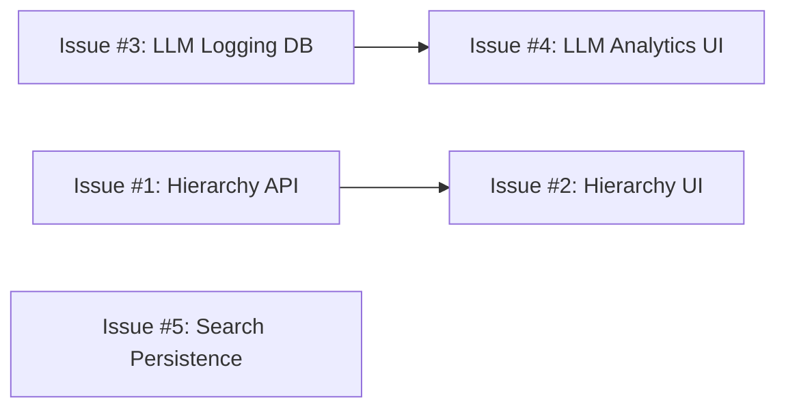

# Sprint 12 Session Prompt — Web Hierarchy & LLM Observability

**Sprint:** 12 | **Theme:** Multi-Agent & Coverage Intelligence (Phase 1)
**Duration:** Week 9-10 | **Date:** 2026-02-27

---

## 🎯 Sprint Goal

Sprint 12 focuses on **Web Hierarchy Loader** and **LLM Observability** — two foundational features that unlock coverage intelligence and cost management. The Multi-Agent system (Tool Registry, Router Agent, Synthesis Agent) is deferred to Sprint 12b to keep scope manageable.

---

## 📋 Sprint 12 Issues

### Issue #1: Web Hierarchy Loader — Backend API
**Label:** `enhancement`, `sprint-12`, `backend`
**Priority:** High

**Description:**
Implement backend API endpoints for discovering and managing web page hierarchies from a given root URL.

**Requirements:**
- `POST /api/v1/sources/:id/discover-hierarchy` — Crawl root URL, discover all linked pages via sitemap.xml or BFS (max depth configurable, default 3)
- Return hierarchy tree: `{ url, title, depth, status, children[] }`
- `status` badge: **New** / **Updated** (content_hash changed) / **Unchanged** / **Duplicate** (content_hash matches another source)
- Compare against existing `crawled_pages` table using `content_fingerprints` for dedup
- Configurable max pages limit (default 100)
- `POST /api/v1/sources/:id/import-pages` — Accept selected URLs from hierarchy, create individual crawled_pages entries

**TDD Test Cases:**
```
UT-012a: discover_hierarchy — single page site → returns 1 node
UT-012b: discover_hierarchy — sitemap.xml → parses all URLs
UT-012c: discover_hierarchy — BFS fallback when no sitemap
UT-012d: discover_hierarchy — max_depth=2 limits crawl depth
UT-012e: discover_hierarchy — duplicate detection via content_hash
UT-012f: import_pages — creates crawled_pages entries
```

---

### Issue #2: Web Hierarchy Loader — Frontend UI
**Label:** `enhancement`, `sprint-12`, `frontend`
**Priority:** High

**Description:**
Add hierarchy discovery UI to the Web Scraper source type in the Add Source wizard.

**Requirements:**
- "Discover Pages" button on web source configuration (Step 2)
- Loading spinner during hierarchy crawl
- Checkbox tree component showing discovered pages with:
  - Page title + URL
  - Depth indentation
  - Status badges: 🆕 New, 🔄 Updated, ✅ Unchanged, 🔁 Duplicate
  - Select All / Deselect All
- "Import Selected" button → calls `import-pages` API
- Show count: "5 of 23 pages selected"

**Mockup Reference:** See `web_hierarchy_design.md`

---

### Issue #3: LLM Usage Logging — Backend
**Label:** `enhancement`, `sprint-12`, `backend`
**Priority:** Medium

**Description:**
Create `llm_usage_logs` table and instrument all LLM API calls to track token usage, latency, and cost.

**Requirements:**
- DB Migration: Create `llm_usage_logs` table:
  ```sql
  CREATE TABLE llm_usage_logs (
    id BIGINT AUTO_INCREMENT PRIMARY KEY,
    tenant_id BIGINT NOT NULL,
    model_id VARCHAR(100) NOT NULL,
    provider VARCHAR(50) NOT NULL,
    endpoint VARCHAR(255),
    input_tokens INT DEFAULT 0,
    output_tokens INT DEFAULT 0,
    total_tokens INT DEFAULT 0,
    latency_ms INT DEFAULT 0,
    status ENUM('success', 'error', 'timeout') DEFAULT 'success',
    error_message TEXT,
    created_at TIMESTAMP DEFAULT CURRENT_TIMESTAMP,
    FOREIGN KEY (tenant_id) REFERENCES tenants(id)
  );
  ```
- Instrument `call_llm_api()` in `sources.rs` to log every LLM call
- `GET /api/v1/llm-usage` — paginated log query with filters (tenant, model, date range)
- `GET /api/v1/llm-usage/summary` — aggregated stats (total tokens, total calls, avg latency, estimated cost)

**TDD Test Cases:**
```
UT-012g: log_llm_usage — inserts record with all fields
UT-012h: get_llm_usage — returns paginated results
UT-012i: get_llm_usage_summary — aggregates correctly
UT-012j: call_llm_api — auto-logs after each call
```

---

### Issue #4: LLM Analytics Dashboard — Frontend
**Label:** `enhancement`, `sprint-12`, `frontend`
**Priority:** Medium

**Description:**
Create an LLM Analytics page showing usage statistics, cost estimation, and trends.

**Requirements:**
- New page: `/analytics/llm` (or Settings → LLM Usage tab)
- KPI Cards: Total Calls, Total Tokens (in/out), Avg Latency, Est. Cost
- Token Usage chart (bar chart by model, over time)
- Model comparison table: model_id, provider, total_calls, avg_latency, total_tokens, est_cost
- Date range filter (Today, 7d, 30d, All)
- Cost estimation: input/output token prices per model (configurable)

---

### Issue #5: Search Settings Backend Persistence
**Label:** `enhancement`, `sprint-12`, `backend`
**Priority:** Low

**Description:**
Persist search settings configured in Sprint 10's Search Settings tab to the database.

**Requirements:**
- `GET /api/v1/settings/search` — retrieve current search config
- `PUT /api/v1/settings/search` — save search config (embedding_model, top_k, similarity_threshold, search_mode)
- Store in `tenant_settings` table or new `search_config` table
- Wire frontend Save button to actual API

---

## 🏗️ Implementation Order



**Phase 1 (parallel):**
- Issue #1 (Hierarchy Backend) + Issue #3 (LLM Logging Backend)

**Phase 2 (depends on Phase 1):**
- Issue #2 (Hierarchy UI) + Issue #4 (LLM Analytics UI)

**Phase 3 (independent):**
- Issue #5 (Search Persistence)

---

## ✅ Definition of Done
- [ ] All TDD tests pass
- [ ] Frontend builds without errors
- [ ] Browser E2E verification
- [ ] ISO docs updated (SI-03 traceability, SI-04 test cases)
- [ ] PR merged + issues closed

---

## 📌 Rules
1. **TDD first** — write test, then implement
2. **ISO compliance** — update SI-03, SI-04 for every feature
3. **No breaking changes** — existing API routes must keep working
4. **One PR per issue** (preferred) or grouped by dependency
5. **LibreOffice required** for legacy format testing (install: `brew install --cask libreoffice`)

---
*Generated: 2026-02-27 | ตามมาตรฐาน ISO/IEC 29110*
