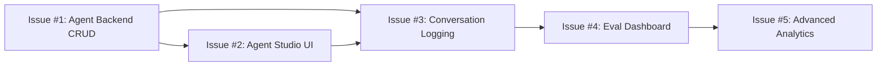

# Sprint 13 Session Prompt — Agent Studio & LLM Performance

**Sprint:** 13 | **Theme:** Agent Studio & Performance Intelligence
**Duration:** Week 11-12 | **Date:** 2026-02-28

---

## 🎯 Sprint Goal

Sprint 13 builds the **Agent Studio** — a visual no-code agent builder with CRUD configuration, test chat, agent templates, and API deployment. It also introduces **Conversation Logging** (Playground + Agent Studio), **LLM Performance Evaluation** (quality scoring + A/B model comparison), and **Advanced Analytics** (daily token budget enforcement + usage alerts).

### What Already Exists (from previous sprints):
- `agents/eval.rs` — `evaluate_agent()`, `judge_response()` (LLM-as-Judge), `JudgeScores` struct
- `Persona` struct (persona config with system_prompt, personality_traits, model_id)
- Playground page — full RAG chat with model selection, confidence scores, source citations
- `llm_usage_logs` table — per-call token/latency logging (Sprint 12)
- LLM Analytics Dashboard — KPI cards, model comparison, date filter (Sprint 12)
- DB tables: `agents`, `agent_conversations` (defined in SI-02 but not yet created)

---

## 📋 Sprint 13 Issues

### Issue #1: Agent Studio — Backend CRUD API
**Label:** `enhancement`, `sprint-13`, `backend`
**Priority:** High

**Description:**
Implement Agent Studio backend: CRUD for agent configurations, conversation storage, and agent deployment endpoints.

**Requirements:**
- DB Migration: Create `agent_configs` table:
  ```sql
  CREATE TABLE agent_configs (
    id BIGINT AUTO_INCREMENT PRIMARY KEY,
    tenant_id VARCHAR(50) NOT NULL,
    name VARCHAR(100) NOT NULL,
    display_name VARCHAR(200),
    description TEXT,
    system_prompt TEXT NOT NULL,
    model_id VARCHAR(100) NOT NULL,
    provider VARCHAR(50) NOT NULL DEFAULT 'ollama',
    temperature DECIMAL(3,2) DEFAULT 0.7,
    max_tokens INT DEFAULT 2048,
    top_k INT DEFAULT 5,
    use_rag BOOLEAN DEFAULT TRUE,
    use_knowledge_graph BOOLEAN DEFAULT FALSE,
    tools JSON COMMENT 'Array of enabled tool names',
    personality_traits JSON COMMENT 'Array of trait strings',
    greeting TEXT,
    avatar_url VARCHAR(500),
    template_id VARCHAR(50) COMMENT 'Template used to create this agent',
    is_published BOOLEAN DEFAULT FALSE,
    api_key VARCHAR(100) COMMENT 'Generated API key for external access',
    created_at TIMESTAMP DEFAULT CURRENT_TIMESTAMP,
    updated_at TIMESTAMP DEFAULT CURRENT_TIMESTAMP ON UPDATE CURRENT_TIMESTAMP,
    FOREIGN KEY (tenant_id) REFERENCES tenants(id),
    UNIQUE KEY unique_agent_name (tenant_id, name)
  );
  ```
- DB Migration: Create `agent_conversations` table:
  ```sql
  CREATE TABLE agent_conversations (
    id BIGINT AUTO_INCREMENT PRIMARY KEY,
    tenant_id VARCHAR(50) NOT NULL,
    agent_config_id BIGINT,
    session_id VARCHAR(100) NOT NULL,
    user_id BIGINT,
    role ENUM('user', 'assistant', 'system') NOT NULL,
    content TEXT NOT NULL,
    model_id VARCHAR(100),
    latency_ms INT,
    input_tokens INT DEFAULT 0,
    output_tokens INT DEFAULT 0,
    confidence_score DECIMAL(5,2),
    sources JSON COMMENT 'Source citations used',
    tools_used JSON COMMENT 'Tools invoked in this turn',
    feedback ENUM('thumbs_up', 'thumbs_down') NULL,
    created_at TIMESTAMP DEFAULT CURRENT_TIMESTAMP,
    FOREIGN KEY (tenant_id) REFERENCES tenants(id),
    FOREIGN KEY (agent_config_id) REFERENCES agent_configs(id) ON DELETE SET NULL,
    FOREIGN KEY (user_id) REFERENCES users(id) ON DELETE SET NULL,
    INDEX idx_session (session_id),
    INDEX idx_agent_conv (agent_config_id, created_at)
  );
  ```
- REST API Endpoints:
  - `GET /api/v1/agents` — list agent configs (with pagination)
  - `POST /api/v1/agents` — create agent config
  - `GET /api/v1/agents/:id` — get agent config
  - `PUT /api/v1/agents/:id` — update agent config
  - `DELETE /api/v1/agents/:id` — delete agent config
  - `POST /api/v1/agents/:id/publish` — generate API key, set `is_published = true`
  - `POST /api/v1/agents/:id/chat` — send message, use agent config to invoke LLM, log conversation
  - `GET /api/v1/agents/:id/conversations` — list conversations for agent
  - `GET /api/v1/conversations/:session_id` — get full conversation by session
  - `POST /api/v1/conversations/:id/feedback` — submit thumbs up/down on a message
- Agent Templates (seed data or config):
  - `general_assistant` — General Q&A with RAG
  - `knowledge_expert` — Deep knowledge retrieval + KG
  - `data_analyst` — SQL query + data interpretation
  - `customer_support` — Polite, structured response with FAQ context

**TDD Test Cases:**
```
UT-013a: create_agent — inserts agent_config with all fields
UT-013b: get_agent — returns correct agent by id
UT-013c: update_agent — updates mutable fields, keeps immutable
UT-013d: delete_agent — soft-deletes or removes agent
UT-013e: publish_agent — generates API key, sets is_published
UT-013f: agent_chat — uses agent config to call LLM, returns response
UT-013g: agent_chat — logs conversation to agent_conversations
UT-013h: list_conversations — returns paginated conversation list
UT-013i: submit_feedback — saves thumbs_up/thumbs_down on message
```

---

### Issue #2: Agent Studio — Frontend UI
**Label:** `enhancement`, `sprint-13`, `frontend`
**Priority:** High

**Description:**
Build the Agent Studio page — a visual no-code agent builder with live test chat.

**Requirements:**
- New page: `/agents` (Agent Studio)
- Agent List View:
  - Card grid showing all configured agents
  - Each card: avatar, display_name, model badge, status (Draft/Published), last updated
  - "Create Agent" button → opens builder
- Agent Builder (create/edit):
  - **Basic Info:** Name, display name, description, avatar upload
  - **Model Config:** Model selector (from available models), provider, temperature slider, max_tokens
  - **Behavior:** System prompt textarea (with character count), greeting message, personality traits (tag input)
  - **RAG Config:** Toggle RAG, Toggle Knowledge Graph, top_k slider
  - **Tools:** Checkboxes for available tools (QueryMobDb, QueryItemDb, etc.)
  - **Template Gallery:** Quick-start from predefined templates
  - Save (draft) / Publish button
- Test Chat Panel (right sidebar):
  - Live chat with the agent using its current config
  - Shows model/provider used, latency, confidence score
  - Thumbs up/down feedback per message
  - "Clear Chat" button
- NavBar: Add "Agents" nav item with Bot icon

---

### Issue #3: Conversation Logging — Playground & Agent Studio
**Label:** `enhancement`, `sprint-13`, `backend`, `frontend`
**Priority:** Medium

**Description:**
Log all conversations from Playground and Agent Studio to `agent_conversations` table. Add conversation history UI.

**Requirements:**
- **Backend:**
  - `POST /api/v1/playground/chat` — refactor existing playground chat to log conversations
  - `GET /api/v1/conversations` — list all conversations (paginated, filterable by agent/user/date)
  - `GET /api/v1/conversations/stats` — conversation stats (total, by agent, by user)
  - Auto-generate `session_id` per chat session (UUID)
  - Store model, latency, token counts, sources, tools per message
- **Frontend:**
  - Playground: persist chat history across page reloads (session-based)
  - Agent Studio: test chat panel logs conversations
  - **Conversation History page** (or tab in Analytics):
    - List sessions with agent name, user, message count, timestamp
    - Click to view full conversation transcript
    - Filter by agent, user, date range

**TDD Test Cases:**
```
UT-013j: playground_chat — logs both user and assistant messages
UT-013k: list_conversations — filters by agent_config_id
UT-013l: conversation_stats — returns correct aggregation
```

---

### Issue #4: LLM Performance Evaluation Dashboard
**Label:** `enhancement`, `sprint-13`, `frontend`, `backend`
**Priority:** Medium

**Description:**
Build an evaluation dashboard for comparing LLM model quality using the existing `judge_response()` system.

**Requirements:**
- **Backend:**
  - `POST /api/v1/evaluations/run` — run evaluation batch (agent, model, question set)
  - `GET /api/v1/evaluations/results` — get evaluation results (paginated)
  - `GET /api/v1/evaluations/compare` — A/B comparison between two models
  - Store results in `evaluation_reports` table (extend existing schema if needed)
  - Use existing `evaluate_agent()` + `judge_response()` from `agents/eval.rs`
- **Frontend:**
  - New tab in Evaluations page: "Model Performance"
  - Quality Scoring Table: model_id, avg(accuracy), avg(completeness), avg(relevance), total_evals
  - A/B Comparison View: side-by-side model comparison with radar chart
  - User Feedback Summary: thumbs_up/thumbs_down ratio per agent/model
  - Trigger "Run Evaluation" from UI (select agent + models + question set)

**TDD Test Cases:**
```
UT-013m: run_evaluation_batch — runs multiple Q/A, scores all
UT-013n: compare_models — returns side-by-side comparison data
UT-013o: feedback_summary — aggregates user feedback correctly
```

---

### Issue #5: Advanced Analytics — Budget & Alerts
**Label:** `enhancement`, `sprint-13`, `backend`, `frontend`
**Priority:** Low

**Description:**
Add daily token budget enforcement, usage alerts, and model benchmark reports to the existing LLM Analytics Dashboard.

**Requirements:**
- **Backend:**
  - `GET /api/v1/settings/llm-budget` — get budget config
  - `PUT /api/v1/settings/llm-budget` — save budget config (daily_token_limit per model, alert_threshold_percentage)
  - `GET /api/v1/llm-usage/alerts` — get alerts (budget exceeded, latency spike, error rate increase)
  - Enhance daily token limit from Sprint 12: per-model limits + configurable via API
  - `GET /api/v1/llm-usage/benchmark` — benchmark report (avg latency, p95 latency, error rate, cost per 1k tokens)
- **Frontend:**
  - Analytics → Budget Settings tab: set daily token limit per model, alert threshold
  - Alert Banner: show warning when approaching budget (80%+), block when exceeded (100%)
  - Model Benchmark Report card: latency distribution, p95 vs p50, cost efficiency ranking
  - Export analytics as CSV

**TDD Test Cases:**
```
UT-013p: save_budget — persists per-model budget config
UT-013q: check_budget — returns alert when threshold exceeded
UT-013r: benchmark_report — calculates p50, p95 latency correctly
```

---

## 🏗️ Implementation Order



**Phase 1 (foundation):**
- Issue #1 (Agent Backend CRUD — migrations + all API endpoints)

**Phase 2 (depends on Phase 1):**
- Issue #2 (Agent Studio UI) + Issue #3 (Conversation Logging)

**Phase 3 (depends on Phase 2):**
- Issue #4 (LLM Eval Dashboard)

**Phase 4 (independent):**
- Issue #5 (Advanced Analytics)

---

## ✅ Definition of Done
- [ ] All TDD tests pass (`cargo test`, `npm test`)
- [ ] Frontend builds without errors (`npm run build`)
- [ ] Browser E2E verification (agent CRUD, test chat, conversation history)
- [ ] ISO docs updated: SI-02 (design), SI-03 (traceability), SI-04 (test script)
- [ ] PR merged + issues closed
- [ ] Sprint 13 Report (PM-02.13) completed

---

## 📌 Rules
1. **TDD first** — write test, then implement
2. **ISO compliance** — update SI-03, SI-04 for every feature
3. **No breaking changes** — existing API routes & Playground must keep working
4. **Reuse existing code** — build on `agents/eval.rs`, `Persona`, `call_llm_api()`
5. **One PR per issue** (preferred) or grouped by dependency
6. **Conversation logging** must not impact latency (async insert preferred)

---
*Generated: 2026-02-28 | ตามมาตรฐาน ISO/IEC 29110*
