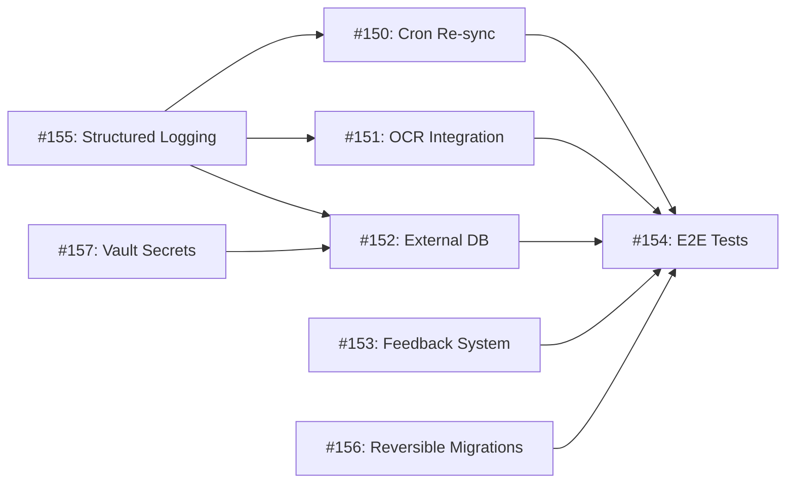

# Sprint 14 Session Prompt — Production Core & Operational Readiness

**Sprint:** 14 | **Theme:** Production Core & Ops
**Duration:** Week 13-14 | **Date:** 2026-03-01

---

## 🎯 Sprint Goal

Sprint 14 prepares Project Mimir for **production deployment** by adding operational infrastructure: **Scheduled Re-sync** (cron-based data source refresh), **OCR Integration** (scanned document extraction), **External DB Connectors** (MySQL/PostgreSQL/SQLite import), **Feedback & Bug Report** (in-app user reporting), **E2E Testing** (full pipeline validation), **Structured Logging** (tracing + request correlation), **Reversible DB Migrations** (.down.sql for rollback safety), and **Secrets Management** (HashiCorp Vault for API key rotation).

### What Already Exists (from previous sprints):
- **Data Pipeline:** Sources → Extract → Chunk → Embed → Qdrant (Vector) + Neo4j (Graph) — fully wired end-to-end
- **Extraction Worker:** `extraction.rs` — PDF/CSV/HTML extraction, configurable chunking (Sprint 9)
- **Ingress System:** `sources.rs`, `ingress.rs` — Source CRUD, BFS web crawl, selective import, status tracking
- **LLM Providers:** Ollama, Gemini, OpenAI, Qwen — all abstracted behind `call_llm_api()` (Sprint 11a)
- **LLM Usage Logging:** `llm_usage_logs` table — per-call token/latency/cost logging (Sprint 12)
- **Agent Studio:** Agent CRUD, Chat, Templates, Conversations, Evaluations (Sprint 13)
- **Budget & Alerts:** Daily token budgets, usage alerts, benchmark reports (Sprint 13)
- **Migration System:** SQLx migrations (`.up.sql` only) — no `.down.sql` reversibility yet
- **Logging:** Basic `println!` / `tracing::info!` — no structured JSON, no request correlation
- **Docker Compose:** MariaDB, Qdrant, Neo4j, Redis, RustFS — running but no health checks

---

## 📋 Sprint 14 Issues

### Issue #150: Scheduled Re-sync — Cron-based Source Refresh
**Label:** `enhancement`, `sprint-14`, `backend`
**Priority:** High

**Description:**
Implement automatic periodic re-crawl/re-import for data sources. Users configure refresh intervals per source.

**Requirements:**
- DB Migration: Add scheduling columns to `data_sources`:
  ```sql
  ALTER TABLE data_sources
    ADD COLUMN refresh_interval_hours INT NULL COMMENT 'Auto-refresh every N hours (null = disabled)',
    ADD COLUMN last_refreshed_at TIMESTAMP NULL,
    ADD COLUMN next_refresh_at TIMESTAMP NULL,
    ADD COLUMN refresh_status ENUM('idle', 'running', 'failed') DEFAULT 'idle';
  ```
- Background Cron Worker:
  - On app startup, spawn `tokio::spawn` background task with configurable tick interval (default: 60s)
  - Each tick: query sources where `next_refresh_at <= NOW()` and `refresh_status = 'idle'`
  - For each due source: set `refresh_status = 'running'`, run extraction pipeline, update `last_refreshed_at`, calculate `next_refresh_at`, set `refresh_status = 'idle'`
  - On failure: set `refresh_status = 'failed'`, log error, retry on next tick
- REST API:
  - `PUT /api/v1/sources/:id/schedule` — set `refresh_interval_hours` (0 = disable)
  - `GET /api/v1/sources/:id/schedule` — get schedule status
  - `GET /api/v1/cron/status` — get cron worker health (last tick, active jobs, queue size)
- Frontend:
  - Sources page: "Auto Refresh" toggle + interval selector (1h/6h/12h/24h/custom) per source
  - Show `last_refreshed_at` and `next_refresh_at` on source card
  - Cron status indicator in admin Settings

**TDD Test Cases:**
```
UT-014a: set_schedule — persists refresh_interval_hours on source
UT-014b: cron_tick — picks up due sources, runs pipeline
UT-014c: cron_tick — skips sources with refresh_status='running'
UT-014d: cron_failure — sets refresh_status='failed', logs error
UT-014e: disable_schedule — sets refresh_interval_hours to null
```

---

### Issue #151: OCR Integration — Scanned Document Extraction
**Label:** `enhancement`, `sprint-14`, `backend`
**Priority:** High

**Description:**
Add OCR capability to extract text from scanned PDFs and images using Tesseract (local) with PaddleOCR as future option.

**Requirements:**
- Install Tesseract OCR in Docker container (add to Dockerfile)
- Extraction pipeline enhancement:
  - Detect if PDF page has extractable text (pdftotext output length < threshold)
  - If scanned: convert page to image (pdftoppm), run Tesseract OCR
  - Support image files directly: `.png`, `.jpg`, `.jpeg`, `.tiff`, `.bmp`
  - New source_type: `image` (alongside existing `file`, `web`, `sql`, `mcp`)
- OCR configuration in Settings:
  - Language selection (tha, eng, tha+eng)
  - DPI setting (150/300/600)
  - Pre-processing toggles: deskew, denoise, contrast enhancement
- REST API:
  - `POST /api/v1/ocr/extract` — standalone OCR endpoint (upload image → get text)
  - Integrate into existing extraction pipeline (auto-detect scanned pages)
- Add `ocr_metadata` JSON column to `chunks` table:
  ```sql
  ALTER TABLE chunks
    ADD COLUMN ocr_metadata JSON NULL COMMENT '{"engine":"tesseract","lang":"tha+eng","confidence":0.92,"dpi":300}';
  ```

**TDD Test Cases:**
```
UT-014f: ocr_extract_image — extracts text from .png image
UT-014g: ocr_extract_scanned_pdf — detects scanned page, runs OCR
UT-014h: ocr_thai_text — correctly extracts Thai language text
UT-014i: ocr_skip_native_pdf — skips OCR for text-native PDFs
UT-014j: ocr_confidence — returns confidence score in metadata
```

---

### Issue #152: External DB Connectors — MySQL/PostgreSQL/SQLite
**Label:** `enhancement`, `sprint-14`, `backend`, `frontend`
**Priority:** Medium

**Description:**
Allow users to connect external databases as data sources. Query tables, import schema + data as chunks for RAG.

**Requirements:**
- New source_type: `database` with sub-types: `mysql`, `postgresql`, `sqlite`
- DB Connection config:
  ```json
  {
    "db_type": "postgresql",
    "host": "db.example.com",
    "port": 5432,
    "database": "product_db",
    "username": "readonly_user",
    "password": "encrypted_via_vault",
    "tables": ["products", "categories"],
    "query_mode": "schema_only|full_data|custom_query",
    "custom_query": "SELECT * FROM products WHERE active = true"
  }
  ```
- Backend:
  - `POST /api/v1/sources/db/test-connection` — test DB connectivity
  - `POST /api/v1/sources/db/discover-schema` — list tables/columns
  - Import modes:
    - `schema_only` — import table schema as chunks (for Text-to-SQL agent)
    - `full_data` — import rows as markdown chunks (for RAG)
    - `custom_query` — run user-defined SELECT, import results
  - Use read-only connections, enforce LIMIT, log all queries
- Frontend:
  - New wizard step for `database` source type:
    - Connection form (host, port, database, credentials)
    - "Test Connection" button
    - Table selector (checkbox list from schema discovery)
    - Import mode selector
- Security:
  - Credentials encrypted at rest (Vault integration, Issue #8)
  - Read-only connection enforcement
  - Query sandboxing: no DDL/DML, SELECT only, LIMIT 10000

**TDD Test Cases:**
```
UT-014k: test_connection_mysql — validates MySQL connectivity
UT-014l: test_connection_postgresql — validates PostgreSQL connectivity
UT-014m: discover_schema — returns tables and columns
UT-014n: import_schema_only — creates chunks from table DDL
UT-014o: import_full_data — creates chunks from row data
UT-014p: custom_query — executes SELECT and imports results
UT-014q: reject_ddl — rejects DROP/ALTER/INSERT queries
```

---

### Issue #153: Feedback & Bug Report — In-App Reporting
**Label:** `enhancement`, `sprint-14`, `backend`, `frontend`
**Priority:** Medium

**Description:**
Add in-app feedback and bug reporting system for end users.

**Requirements:**
- DB Migration:
  ```sql
  CREATE TABLE feedback_reports (
    id BIGINT AUTO_INCREMENT PRIMARY KEY,
    tenant_id VARCHAR(50) NOT NULL,
    user_id BIGINT,
    report_type ENUM('bug', 'feedback', 'feature_request') NOT NULL,
    title VARCHAR(200) NOT NULL,
    description TEXT,
    page_url VARCHAR(500),
    browser_info JSON COMMENT '{"userAgent":"...","viewport":"1920x1080"}',
    screenshot_url VARCHAR(500) COMMENT 'Optional screenshot stored in S3',
    priority ENUM('low', 'medium', 'high', 'critical') DEFAULT 'medium',
    status ENUM('open', 'in_progress', 'resolved', 'closed') DEFAULT 'open',
    resolution TEXT,
    created_at TIMESTAMP DEFAULT CURRENT_TIMESTAMP,
    updated_at TIMESTAMP DEFAULT CURRENT_TIMESTAMP ON UPDATE CURRENT_TIMESTAMP,
    FOREIGN KEY (tenant_id) REFERENCES tenants(id),
    FOREIGN KEY (user_id) REFERENCES users(id) ON DELETE SET NULL
  );
  ```
- REST API:
  - `POST /api/v1/feedback` — submit feedback/bug report
  - `GET /api/v1/feedback` — list reports (paginated, filterable)
  - `PUT /api/v1/feedback/:id` — update status/resolution (admin)
  - `POST /api/v1/feedback/:id/screenshot` — upload screenshot to S3
- Frontend:
  - Floating "Feedback" button (bottom-right corner, collapsible)
  - Report form: type selector, title, description, priority
  - Auto-capture: current page URL, browser info
  - Optional screenshot capture (html2canvas)
  - Admin view: feedback list with status management

**TDD Test Cases:**
```
UT-014r: submit_feedback — creates report with all fields
UT-014s: list_feedback — filters by type and status
UT-014t: update_feedback — admin changes status and resolution
UT-014u: auto_capture — includes page_url and browser_info
```

---

### Issue #154: E2E Test Suite — Full Pipeline Validation
**Label:** `enhancement`, `sprint-14`, `testing`
**Priority:** High

**Description:**
Create automated end-to-end tests that validate the complete data pipeline from ingestion to query response.

**Requirements:**
- Test Framework: Rust integration tests (`tests/` directory) + browser automation
- Test Scenarios:
  1. **File Upload → Chunk → Embed → Query:** Upload PDF → verify chunks created → verify vectors in Qdrant → query returns relevant results
  2. **Web Crawl → Extract → Chunk → Embed → Query:** Add web source → crawl → verify full pipeline
  3. **Agent Chat E2E:** Create agent → send message → verify response uses RAG context → verify conversation logged
  4. **Multi-tenant Isolation:** Create data in Tenant A → verify Tenant B cannot access it
  5. **OCR Pipeline:** Upload scanned PDF → verify OCR extraction → verify chunks contain OCR text
  6. **External DB Import:** Connect test DB → import schema → verify chunks
- Test Data:
  - Sample PDF, CSV, HTML files in `tests/fixtures/`
  - Test MariaDB with known data
  - Test Qdrant collection
- CI Integration:
  - `cargo test --test e2e` — run all E2E tests
  - Requires Docker Compose services running

**TDD Test Cases:**
```
UT-014v: e2e_file_to_query — full pipeline from file upload to RAG query
UT-014w: e2e_web_to_query — full pipeline from web crawl to RAG query
UT-014x: e2e_agent_chat — agent creation through conversation
UT-014y: e2e_tenant_isolation — cross-tenant data isolation
UT-014z: e2e_ocr_pipeline — scanned document through full pipeline
```

---

### Issue #155: Structured Logging & Request Tracing
**Label:** `enhancement`, `sprint-14`, `backend`
**Priority:** Medium

**Description:**
Replace ad-hoc logging with structured JSON logs and add request-level correlation IDs.

**Requirements:**
- Replace `println!` / basic `tracing::info!` with structured JSON output:
  ```json
  {"timestamp":"2026-03-01T12:00:00Z","level":"INFO","request_id":"abc-123","tenant_id":"mega_care","module":"agents","message":"Agent created","agent_id":42,"latency_ms":15}
  ```
- Request Correlation:
  - Generate UUID `request_id` for every incoming HTTP request (middleware)
  - Propagate `request_id` through all log entries, DB queries, LLM calls
  - Return `X-Request-Id` header in response
- Log Levels: ERROR, WARN, INFO, DEBUG (configurable via env `RUST_LOG`)
- Middleware:
  - Log request: method, path, tenant_id, user_id, request_id
  - Log response: status_code, latency_ms, request_id
  - Log LLM calls: model, provider, tokens, latency_ms, request_id
- Output: JSON to stdout (for Docker log collection)
- Admin Dashboard (optional):
  - Error rate widget on Overview page
  - Recent errors list with request_id correlation

**TDD Test Cases:**
```
UT-014aa: request_id_middleware — generates and propagates request_id
UT-014ab: structured_log_format — outputs valid JSON log entries
UT-014ac: response_header — returns X-Request-Id in response
UT-014ad: log_level_filter — respects RUST_LOG env config
```

---

### Issue #156: Reversible DB Migrations (.down.sql)
**Label:** `enhancement`, `sprint-14`, `backend`
**Priority:** Medium

**Description:**
Add rollback (`.down.sql`) scripts for all existing migrations to enable safe database rollback during failed deployments.

**Requirements:**
- Create `.down.sql` for every existing migration:
  - Sprint 1-4: `users`, `tenants`, `tenant_users`, `qa_results`, `pipeline_runs`, `pipeline_steps`, `qa_clusters`
  - Sprint 5-8: `data_sources`, `crawled_pages`, `content_fingerprints`, `chunks`, `embeddings_config`
  - Sprint 9-12: `llm_usage_logs`, hierarchy fields, search_settings
  - Sprint 13: `agent_configs`, `agent_conversations`, `evaluation_reports`, `llm_budget_configs`
  - Sprint 14: new tables from this sprint
- Migration rollback helper script:
  - `scripts/migrate_rollback.sh <migration_number>` — runs corresponding `.down.sql`
  - Pre-flight check: confirm target migration, show affected tables
  - Auto-backup before rollback
- Test: run up → verify → run down → verify clean state

**TDD Test Cases:**
```
UT-014ae: migration_up_down — each migration can be applied and rolled back
UT-014af: rollback_preserves_data — rollback of later migrations doesn't affect earlier tables
UT-014ag: rollback_script_validation — .down.sql scripts are syntactically valid
```

---

### Issue #157: Secrets Management (HashiCorp Vault)
**Label:** `enhancement`, `sprint-14`, `backend`, `infrastructure`
**Priority:** Low

**Description:**
Integrate HashiCorp Vault for secure API key storage, rotation, and audit logging. Replace `.env` file secrets.

**Requirements:**
- Vault Setup:
  - Add HashiCorp Vault to Docker Compose (dev mode for local, production mode guide)
  - KV secrets engine v2 for key-value storage
- Secrets to migrate from `.env`:
  - `GEMINI_API_KEY`, `OPENAI_API_KEY`, `QWEN_API_KEY`
  - `DATABASE_URL` (DB credentials)
  - Agent `api_key` values (generated in Sprint 13)
  - External DB connector credentials (Issue #3)
- Backend Integration:
  - `VaultClient` service: connect to Vault, read/write secrets
  - On app startup: fetch secrets from Vault instead of `.env`
  - Fallback: if Vault unavailable, fall back to `.env` (dev mode)
  - API key rotation: `POST /api/v1/admin/rotate-keys` — regenerate LLM provider keys
- Audit:
  - Vault audit log enabled — records all secret access
  - Admin view: recent secret access log

**TDD Test Cases:**
```
UT-014ah: vault_read — reads secret from Vault KV store
UT-014ai: vault_fallback — falls back to env when Vault unavailable
UT-014aj: key_rotation — rotates API key and updates Vault
UT-014ak: audit_log — records secret access event
```

---

## 🏗️ Implementation Order



**Phase 1 (foundation — no dependencies):**
- Issue #155 (Structured Logging — enables better debugging for all other features)
- Issue #156 (Reversible Migrations — safety net before adding more tables)

**Phase 2 (core features — depends on Phase 1):**
- Issue #150 (Cron Re-sync)
- Issue #151 (OCR Integration)
- Issue #152 (External DB Connectors)
- Issue #153 (Feedback & Bug Report)

**Phase 3 (integration — depends on Phase 2):**
- Issue #157 (Vault Secrets — secures DB connector credentials)

**Phase 4 (validation — depends on all):**
- Issue #154 (E2E Test Suite — validates entire pipeline including new features)

---

## ✅ Definition of Done
- [ ] All TDD tests pass (`cargo test`, `npm test`)
- [ ] Frontend builds without errors (`npm run build`)
- [ ] E2E test suite passes (at least 5 scenarios)
- [ ] Structured JSON logging active on all API endpoints
- [ ] Reversible migrations verified (up + down for all)
- [ ] ISO docs updated: SI-02 (design), SI-03 (traceability), SI-04 (test script)
- [ ] PR merged + issues closed
- [ ] Sprint 14 Report (PM-02.14) completed

---

## 📌 Rules
1. **TDD first** — write test, then implement
2. **ISO compliance** — update SI-03, SI-04 for every feature
3. **No breaking changes** — existing Agent Studio, Playground, Analytics must keep working
4. **Structured logging everywhere** — every new endpoint must have request_id correlation
5. **Security by default** — read-only DB connections, query sandboxing, credential encryption
6. **Reversibility** — every new migration must have a corresponding `.down.sql`
7. **One PR per issue** (preferred) or grouped by dependency
8. **Drop `ro_landverse` DB** — complete Issue #102 (existing tech debt)

---
*Generated: 2026-02-28 | ตามมาตรฐาน ISO/IEC 29110*
